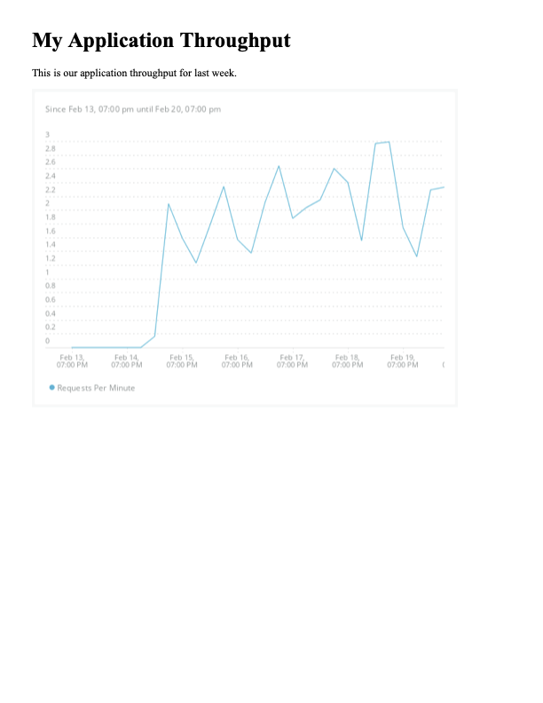

# New Relic Reports

[](https://opensource.newrelic.com/oss-category/#new-relic-community)


## Overview

New Relic Reports is an engine for automating the generation of custom reports
built using telemetry in the New Relic Telemetry Data Platform and the delivery
of those reports via a variety of channels.

### Report Types

The New Relic Reports engine supports several different report types.

#### Template Reports

Template reports provide a mechanism for building custom reports using
[templates](#templates). Templates are text-based, user-defined documents that
can contain both content and logic. Templates are processed when a template
report is run to produce text-based output. Special bits of logic called
[extensions](#template-extensions) are provided that make it easy to use New
Relic data in template reports. By default, the output is rendered in a browser
to produce PDF output, but it is just as easy to disable rendering and deliver
the template output in a variety of ways.

#### Dashboard Reports

Dashboard reports use Nerdgraph to collect snapshot URLs from one or more user
specified dashboard GUIDs. Snapshot URLs are downloaded as PDFs. When more than
one dashboard is specified, the PDFs can optionally be concatenated into a
single PDF.

#### Query Reports

Query reports provide a mechanism to export the results of running a
NRQL query by simply specifying a query and one or more account IDs to run the
query against. No additional configuration is required. By default, query
results are exported to CSV but query results can also be formatted using a
[Nunjucks](https://mozilla.github.io/nunjucks/) template.

### Channel Types

A variety of mechanisms are supported for delivering report output. These
mechanisms are referred to as channels. The following types of channels are
supported.

* File: Report output is saved to a file and copied to a destination directory
  on the local filesystem. Mostly meant for development and testing purposes.
* Email: Report output is included inline or as attachments to an email using a
  user defined email template and sent via SMTP.
* S3: Report output is saved to a file and uploaded to an S3 bucket.
* Slack: Report output is posted to a Slack channel via a
  [Slack webhook](https://api.slack.com/messaging/webhooks).

### Running Reports

There are three ways to run reports.

1. Using the command line interface (CLI)

   Ad-hoc reports can be run directly from a terminal after cloning or
   downloading the repository and installing dependencies. This is useful
   primarily for testing and debugging reports.

1. Packaged as a Docker image

   `Dockerfile`s are provided to package the reporting engine, along with your
   [templates](#templates) and [manifest files](#manifest-file) as a docker
   image that runs reports on a schedule using `CRON` or that provides a CLI
   based `ENTRYPOINT` that can be run via external scheduled task mechanisms
   such as [AWS ECS Scheduled Tasks](https://docs.aws.amazon.com/AmazonECS/latest/developerguide/scheduled_tasks.html).

1. Packaged as an AWS Lambda function

   [A Dockerfile](./nr-reports-lambda/Dockerfile) is provided to package the
   reporting engine, along with your [templates](#templates) and
   [manifest files](#manifest-file) as an AWS Lambda function. The Lambda can be
   deployed with[the provided CloudFormation template](./nr-reports-lambda/cf-template.yaml)
   and [the provided helper scripts](./nr-reports-lambda/scripts).

## Prerequisites

To develop reports and run them locally, you will need the following.

* Node >= 14.0.0
* A terminal application that supports Bash scripts
* Your favorite IDE
* For the email channel, SMTP server settings (for testing locally try [Mailhog](https://github.com/mailhog/MailHog))
* For the S3 channel, AWS credentials and an S3 bucket
* For the Slack channel, an [Incoming Webhook](https://api.slack.com/messaging/webhooks)
  URL.

To build and deploy CRON based images, you will need the following.

* Docker
* A Docker repository

To build and deploy Lambda based images, you will need the following.

* Docker
* An ECS repository
* The AWS CLI
* AWS credentials

## Installation

```bash
git clone git@github.com:newrelic/nr-reports.git
cd nr-reports
npm install
```

## Getting Started

Here's how to build a simple "Hello, world!" HTML template that displays a basic
throughput chart for an application named `Shop Service`.

**NOTE:** For this simple tutorial, we will be generating reports interactively
from the command line. While this is convenient for testing things out, one of
the main features of New Relic Reports is the automation support for report
generation and delivery.

### Before you begin

If you haven't already, make sure you have checked
[the prerequisites](#prerequisites) and [installed the repo](#installation). You
will also need [a New Relic User key](https://docs.newrelic.com/docs/apis/intro-apis/new-relic-api-keys/#user-api-key).

Then open a terminal that supports Bash scripts and execute the following
commands, making sure to replace `path/to/nr-reports` with the path to the
directory where you cloned the `nr-reports` repository AND `YOUR_USER_KEY`
with your New Relic User key.

```bash
cd path/to/nr-reports
export NEW_RELIC_API_KEY="[YOUR USER KEY]"
```

### Copy the example template

Next, make a copy of the example `hello-world.html` template in the `include`
directory.

```bash
cp ./examples/hello-world.html ./include/hello-world.html
```

### Update the example template

Next, edit the new template and replace the string `Shop Service` with an
appropriate APM service name and the account ID `1234567` with the account ID
for the service. Then save the template.

Don't worry for now what all the rest of the content in the file means. It looks
more complicated than it is and will be explained [in the usage section](#usage).

### Run the template report

Now run the report using the following command.

```bash
./nr-reports-cli/bin/nr-reports.sh -n hello-world.html
```

That's it!

There should now be a PDF file in the current directory called
`hello-world.pdf`. Open it up and it should look something like the image below.



### Add a template parameter

The above template is nice, but it only works for one service because we
hard-coded the application name in the query and the account ID on the `chart`
tag. That isn't very "templatish". Let's see how to templatize the example
above.

First, load `hello-world.html` back into an editor. Now replace the name
of your application with the string `{{ appName }}` (curly braces and all) and
completely _remove_ the `accountId` parameter (and the `,` after
`type="AREA"`). Also, change the `type` from `AREA` to `LINE` just so we are
sure we are really running a new example.

The `chart` tag should now look something like the following.

```html
<div>
    
</div>
```

### Create a template parameter values file

Now we will create a [values file](#values-file). The values file is a
[JSON](https://www.json.org/json-en.html) or [YAML](https://yaml.org/) file
with a flat structure that is a set of key/value pairs. It let's us separate out
specific values from the template so that we can use the same template with
different values without having to change the template.

Copy the example values file to a new file named `hello-world.json`.

```bash
cp ./examples/values.json ./include/hello-world.json
```

### Update the example values file

Next, edit the new file and replace the string `Shop Service` and the account
ID `1234567` with the values you removed from the template in the previous step.
Then save the file.

### Re-run the template report

First, delete the previous report so we can be sure this run re-creates a new
one.

```bash
rm ./hello-world.pdf
```

Now, run the report using the following command, noting the addition of the `-v`
option that is used to specify the path to the values file.

```bash
./nr-reports-cli/bin/nr-reports.sh -n hello-world.html -v include/hello-world.json
```

Now there should be a new PDF file in the current directory called
`hello-world.pdf`. Open it up and it should look exactly the same as before.
That is because all we've done above is separate out the account ID and
application name so it isn't hardcoded in the template. We didn't actually
change the values.

### Run a dashboard report

So far we have been running template reports, i.e. reports based on a template
file. New Relic Reports supports another report type called dashboard reports.
Dashboard reports are much simpler. You specify a list of dashboard GUIDs and
the reporting engine will use Nerdgraph to download a dashboard snapshot PDF for
each dashboard and optionally combine multiple snapshots in a single PDF.

Here's how you run a dashboard report.

### Find your dashboard GUID(s)

The easiest way to find the GUID for a dashboard is via the NR1 UI.

1. Navigate to your dashboard
2. Locate the dashboard name above the filter bar
3. On one side of the dashboard name, locate the box that contains the account
   name and a "tag" icon followed by a number. Click anywhere in the box.
4. In the "drawer" that slides out from the side of the screen, locate the
   label "Entity guid" followed by a long string of numbers and letters (this is
   the dashboard GUID).
5. Hover over the string of numbers and letters and click on the clipboard icon
   that appears. The dashboard GUID will now be copied in the clipboard.

### Run the dashboard report

Now run the report using the following command, replacing the string
`ABCDEF123456` with your dashboard GUID.

```bash
./nr-reports-cli/bin/nr-reports.sh -d ABCDEF123456
```

Now there should be a new PDF file in the current directory called
`dashboard-[DASHBOARD_GUID].pdf` where `[DASHBOARD_GUID]` is the GUID of your
dashboard. Open it up and it should look like a snapshot of dashboard for the
last 60 minutes.

### Run a query report

Now let's see how to run another report type called a query report. Query
reports let you export the results of running a NRQL query without all the
complexity of creating a template, using the `nrql` tag, and running the
report. Instead, you just specify an NRQL query and the reporting engine will
automatically run the query and, by default, write the results to a CSV file.

Let's see how that works by running a simple query report to show the average
latency of all APM services in your account grouped by application name and URL
using the following NRQL.

```sql
SELECT average(duration) as 'Duration' FROM Transaction FACET appName as 'Application Name', request.uri AS 'URL'
```

To do that, run the following command, replacing the string `1234567` with your
account ID.

```bash
./nr-reports-cli/bin/nr-reports.sh -a 1234567 -q "SELECT average(duration) as 'Duration' FROM Transaction FACET appName as 'Application Name', request.uri AS 'URL'"
```

Now there should be a new CSV file in the current directory called
`query-report.csv`. Open it up in a text editor and you should see something
like the following.

```csv
Application Name,URL,Duration
Shop Service,/api/v1/checkout,1.5191369267857142
Shop Service,/api/v1/products,1.5092493357575756
Shop Service,/api/v1/products/1234,1.4948035056074764
```

### Run a report using a manifest file

Now let's see how we can run multiple reports at once using a
[manifest file](#manifest-file). A manifest file is a [JSON](https://www.json.org/json-en.html)
or [YAML](https://yaml.org/) file containing an array of report definitions.
We will use a manifest file to run the template report and dashboard report
from above all at once.

### Cleanup previous reports

First, delete the previous report so we can be sure this run re-creates a new
one.

```bash
rm hello-world.pdf dashboard-[DASHBOARD_GUID].pdf query-report.csv
```

Make sure to replace `[DASHBOARD_GUID]` with the GUID of your dashboard.

### Copy the example manifest file

Copy the example manifest file to a new manifest file named `manifest.json`.

```bash
cp ./examples/manifest.json ./include/manifest.json
```

### Update the example manifest file

Next, edit the new file and replace the string `Shop Service` and the account
ID `1234567` and the string `ABCDEF123456` with the values you used in the
previous steps. Then save the file.

Again, don't worry for now what all that means. It looks more complicated than
it is and will be explained in the section [manifest file](#manifest-file).

### Run the report using the manifest file

Now run the report using the following command.

```bash
./nr-reports-cli/bin/nr-reports.sh
```

Now there should be both a `hello-world.pdf` file in the current directory
_and_ a PDF file called `dashboard-[DASHBOARD_GUID].pdf` in the current
directory. Using the manifest file we were able to generate both reports at
once!

Notice that we did not specify any arguments to the command! That is because the
reporting engine will load the [manifest file](#manifest-file) located at
`include/manifest.json` by default.

### Summary

Here's what we just did.

1. Created a basic HTML template using the [Nunjucks](https://mozilla.github.io/nunjucks/)
   templating syntax that displays a header, a paragraph, and a New Relic
   timeseries chart for the given NRQL query.
2. Modifed the template to use template parameters as placeholders for the
   values that we hardcoded in step 1 by creating a values file.
3. Used the CLI script to run a report at the command line using the template
   and the values file from steps 1 and 2.
4. Without knowing it, used the `file` channel to store the resulting PDF
   report in the current directory.
5. Used the CLI script to run a report at the command line using a dashboard
   entity GUID.
6. Without knowing it, used the `file` channel to store the resulting PDF
   report in the current directory.
7. Used the CLI script to run a query report at the command line using a simple
   NRQL query.
8. Without knowing it, used the `file` channel to store the query results as a
   CSV file in the current directory.
9. Created a [manifest file](#manifest-file) with report definitions for the
   HTML template report and dashboard report from the previous steps.
10. Used the CLI script to run a report at the command line using the default
   manifest file located at `include/manifest.json`.
11. Without knowing it, used the `file` channel to store the resulting PDF
   reports in the current directory.

Though useful during template development, in most cases, you won't be
generating reports by running the CLI directly. Instead, you will use one of the
provided mechanisms for automating the generation and delivery of reports. See
[the usage section](#usage) for more details.

## Usage

### Template Reports

Template reports are created from [templates](#templates). Templates are stored
in template files. Template files are text files that contain text mixed
with template "instructions". Template "instructions" are written using a
special syntax that is understood by the [the Nunjucks template "engine"](https://mozilla.github.io/nunjucks/).
Reports are produced from a template file by passing the content of the file
through the template engine. The template engine evaluates the "instructions" to
transform the original content into the raw report output. By default, the raw
output is rendered using a headless Chrome instance and saved as a PDF. But you
can also tell the New Relic Reports engine not to do so. You might do this if
you are producing a CSV file or you want to deliver raw HTML instead of rendered
HTML.

The following JSON shows an example of a template report definition in a
[manifest file](#manifest-file). You might recognize this from the
section [Update the example manifest file](#update-the-example-manifest-file)
in the [Getting Started](#getting-started) tutorial.

```json
  {
    "name": "hello-world",
    "templateName": "hello-world.html",
    "parameters": {
      "accountId": 1234567,
      "appName": "Shop Service"
    },
    "channels": []
  }
```

When the reporting engine runs this report, it will invoke the templating
engine with the template name `hello-world.html` and the parameters `accountId`
set to `1234567` and `appName` set to `Shop Service`. The template output will
be rendered to a PDF file named `hello-world.pdf` using a headless Chrome
instance and this file will be copied to the current working directory since the
default channel is the [`file`](#file-channel) channel and no `destDir`
channel parameter is set.

See the section [Template Report Properties](#template-report-properties) for
more information on the available dashboard report properties.


Nunjucks does not sandbox execution so **it is not safe to run untrusted
templates or inject user-defined content into template definitions**. Doing so
can expose attack vectors for accessing sensitive data and remote code
execution.

See [this issue](https://github.com/mozilla/nunjucks-docs/issues/17)
for more information.

#### Templates

Here is a very basic template.

```text

I want a {{ fruit }}.

```

This template contains three instructions.

1. The text in between the first `` pair is an example of a
   [tag](http://mozilla.github.io/nunjucks/templating.html#tags). In particular,
   this is the opening of the [for tag](http://mozilla.github.io/nunjucks/templating.html#for).
1. The text `{{ fruit }}` is an example of a [variable lookup](http://mozilla.github.io/nunjucks/templating.html#variables).
1. The text in between the second `` pair signals the closing of the
   `for` tag.

The `for` tag defines a loop. Any content (including other instructions) in
between the text `for` and the text `endfor` will be evaluated for each item
of the loop. In this case, the loop will be executed twice. Once for each value
of the list specified by the expression `['banana', 'orange']`. Because the
string `I want a {{ fruit }}.` is placed in between the opening and closing of
the `for` tag, the following output will be produced when this template is
passed through the Nunjucks template engine.

```text
I want a banana.
I want a orange.

```

Notice that the final output does _not_ include any Nunjucks "instructions". All
instructions have been replaced with the content produced as a result of
evaluating each instruction.

See the section [Templating](http://mozilla.github.io/nunjucks/templating.html)
of the Nunjucks documentation for detailed information on how to build
templates.

#### Template Content

Template reports are built out of text. The template engine does not care about
the semantics of the text that it processes. In other words, the template engine
does not care if the text represents CSV data or HTML data. Just that it is
text.

There is one special case which applies to the default behavior of the reporting
engine. In this case, the output of the template engine will be loaded into a
headless Chrome instance and the rendered page will be saved as a PDF file.
While just about any text-based document can be rendered by Chrome in one way or
another, the reporting engine applies special handling if, and only if, the
[`isMarkdown` flag](#template-report-properties) is present and set to `true` in
the report definition or if the template name has a `.md` extension.

In either of these conditions are met, the reporting engine assumes that the
template contains [GitHub Flavored Markdown](https://github.github.com/gfm/).
This will result in _two_ passes through the template engine. The first pass is
the standard pass the templating engine makes over any template. The additional
_second_ pass renders the [`report.md.html`](./templates//base/report.md.html)
template and inserts the output from the first pass into the `content` section
after converting the output to HTML using
[the showdown Markdown converter](https://github.com/showdownjs/showdown).

##### HTML Template Example

Following is an example of an HTML template. You might recognize this from the
section [Update the example template](#update-the-example-template) in the
[Getting Started](#getting-started) tutorial.

```html



<h1>My Application Throughput</h1>
<p>
    This is our application throughput for last week.
</p>
<div>
    
</div>

```

##### Markdown Template Example

Following is an example of a Markdown template that will produce something very
similar to the example HTML template above.

```markdown
# My Application Throughput

This is our application throughput for last week.


```

##### CSV Template Example

As mentioned, template reports can be built from any text-based content and
produce any text-based output. A report could produce CSV, XML, or JSON output.
For example, following is a template that produces a CSV file from the result of
running a NRQL query using [the `nrql` tag](#the-nrql-tag).

```nunjucks
App Name,Duration

   
{{ item.facet[0] }},{{ item.duration }}
   

```

In the above case, the output from the template engine is probably not meant to
be rendered in a browser. The `render` report parameter is provided to allow you
to inform the reporting engine to skip the rendering step. In some cases, this
may even be desirable for HTML-based templates. For example, if the output is
meant to be included inline in an email or sent as a Slack message.

#### Template Resolution

When processing a template, the template engine uses
[the Nunjucks FileSystemLoader](https://mozilla.github.io/nunjucks/api.html#filesystemloader)
to load template files from the local filesystem. The `FileSystemLoader`
resolves the _template name_ passed to the engine into the _template file_ very
much like a shell resolves executables using the `PATH` environment variable.
That is, given a template name and a template "path", the `FileSystemLoader`
resolves the template name to a template file to load by searching each
directory on the template path for the a file matching the template name. For
example, consider the following directory structure.

```text
/app/my-reports
  |- templates
    |- hello-world.html
```

Given the template name `hello-world.html` and the template path
`/app/my-reports/templates`, the `FileSystemLoader` would load the template
from the file `/app/my-reports/templates/hello-world.html`. However, if the
template path were `/app/my-reports`, the `FileSystemLoader` would fail to
find a matching template and the engine would throw an exception.

The template name _may_ include segments separated by the system path separator,
in which case, the `FileSystemLoader` will treat the template name like a
relative path and match it against each directory in the path. For example,
specifying the template name `templates/hello-world.html` would make the failing
case above work fine.

The default template path will always include the current working directory and
the directories `include` and `templates` relative to the current working
directory. In addition, the `TEMPLATE_PATH` environment variable may be set to
a list of additional directories separated by the system path separator. These
directories will also be added to the template path. Finally, the `templatePath`
[engine option](#engine-options), may also be used to specify additional
directories separated by the system path separator.

When building _any_ of the docker images, all templates (and all other files)
in the [`include`](./include) directory are copied into the `include` directory
of the image (`/app/nr-reports-cli/include`). Note that files in the `include`
directory are `git` ignored. To include files in this directory in `git`, either
remove the line `include/*` from the [`gitignore`](./gitignore) file or add
negation patterns for the files to be committed.

#### Template Extensions

New Relic Reports provides several [custom tags](http://mozilla.github.io/nunjucks/api.html#custom-tags)
that make it easy to integrate New Relic charts and data in your reports.

##### The `chart` Tag

The `chart` tag is used to include a [New Relic chart](https://docs.newrelic.com/docs/query-your-data/explore-query-data/use-charts/use-your-charts/)
in a report. It should only be used with HTML or markdown based templates that
will be rendered in Chrome to produce a PDF. For an HTML based template, the
`chart` tag will inject an HTML `` tag into the generated output. For a
markdown based template, the `chart` tag will inject
[the markdown to create an image](https://docs.github.com/en/get-started/writing-on-github/getting-started-with-writing-and-formatting-on-github/basic-writing-and-formatting-syntax#images)
into the generated output.

For example, recall [the snippet from the example template](#update-the-example-template)
in the [Getting Started](#getting-started) tutorial.

```nunjucks

```

When the template engine evaluates this tag, it will invoke [the `chart`
extension](./nr-reports-core/lib/extensions/chart-extension.js). The `chart`
extension retrieves a static chart URL for the given account ID, NRQL, and chart
options using the following GraphQL query.

```graphql
{
   actor {
      account(id: $accountId) {
         nrql(query: $query, timeout: $timeout) {
            staticChartUrl(chartType: $chartType, format: $chartFormat, width: $chartWidth, height: $chartHeigh)
         }
      }
   }
}
```

The `chart` extension takes the returned URL and injects the appropriate markup
to display the chart image in the report.

Unless the template contains markdown, the `chart` tag is replaced with an
HTML `img` tag with the `src` value set to the static chart URL, like the one
below.

```html

```

For markdown, the `chart` tag is replaced with the markdown to show an image,
like below.

```markdown

```

###### `chart` Tag Options

The `chart` tag supports the following options.

| Option Name | Description | Type | Required | Default |
| --- | --- | --- | --- | --- |
| accountId | An account ID to run the query with | Y | |
| query or first argument | The NRQL query to run | string | Y | |
| type | The chart type. A valid value for the `chartType` argument of the `staticChartUrl` field of the `NrdbResultContainer` GraphQL type, e.g. `AREA`, `LINE`, etc. | string | N | LINE |
| format | The chart format. A valid value for the `format` argument of the `staticChartUrl` field of the `NrdbResultContainer` GraphQL type, e.g. `PNG` or `PDF`. | string | N | PNG |
| width | The width of the image | number | N | 640 |
| height | The height of the image | number | N | 480 |
| class | CSS class name(s) to add to the HTML `img` tag. Unused for markdown templates. | string | N | '' |

**NOTE:** The NRQL query can either be specified as the first argument after the
opening of the `chart` tag as shown in the example above or using the `query`
keyword argument as shown below.

```nunjucks

```

##### The `nrql` Tag

The `nrql` tag is used to run a NRQL query. The results of the query are stored
in a template variable for further processing by your templates. We saw
[an example of this in the Template Content section](#template-content) section.
It is repeated below for convenience.

```nunjucks
App Name,Duration

   
{{ item.facet[0] }},{{ item.duration }}
   


```

When the template engine evaluates the `nrql` tag, it will invoke [the `nrql`
extension](./nr-reports-core/lib/extensions/nrql-extension.js). The `nrql`
extension runs the given NRQL query using the given account ID(s) using the
following GraphQL query.

```graphql
{
   actor {
      nrql(accounts: $accountIds, query: $query, timeout: $timeout) {
         results
         metadata {
            facets
            eventTypes
         }
      }
   }
}
```

The extension stores an object containing the `results` and `metadata` fields
into the variable with the name specified by the `var` option on the `nrql`
tag or into a variable named `result`. The `results` field is an array of
objects whose structure matches the query submitted. The `facets` field is an
array containing the names of the facets in the query submitted and the
`eventTypes` field is an array of the names of the event types in the query
submitted. Following is an example JSON object that would be returned as the
result of running the query
`SELECT average(cpuPercent) FROM SystemSample FACET hostname`.

```json
{
   "metadata": {
      "eventTypes": [
         "SystemSample"
      ],
      "facets": [
         "hostname"
      ]
   },
   "results": [
      {
         "facet": "my.local.test",
         "average.cpuPercent": 1.5432042784889708,
         "hostname": "my.local.test"
      }
   ]
}
```

For more information on the structure of these fields, see the type definition
for the `CrossResultsNrdbResultContainer` type at `https://api.newrelic.com/graphiql`.

###### `nrql` Tag Options

The `nrql` tag supports the following options.

| Option Name | Description | Type | Required | Default |
| --- | --- | --- | --- | --- |
| accountId | Account ID to run the query with. Multiple account IDs an be specified separated by commas. One of the this option or the `accountIds` option must be specified. | Y | |
| accountIds | A list of account IDs to run the query with. A maximum of 5 account IDs is allowed. One of the this option or the `accountId` option must be specified. | array | Y | |
| query or first argument | The NRQL query to run. This option supports [template parameter](#template-parameters) interpolation. That is, the query string is interpolated using the template engine prior to being run. | string | Y | |
| var | The name of the variable to hold the query result | string | N | result |

**NOTE:** The NRQL query can either be specified as the first argument after the
opening of the `chart` tag as shown in the example above or using the `query`
keyword argument as shown below.

```nunjucks

<h2>{{ result.facet[0] }}<h2>

```

#### Template Parameters

Template parameters are key-value pairs that are passed to the template engine
when processing a template. Template parameters are used to customize the
processing of a template file and in turn, customize the output from the
template engine.

During processing, a template "variable" is created for each template parameter
using the key of the parameter as the variable name and the value of the
parameter as the value of the variable. Within a template file, template
parameters are referenced by key, just like any other template variable. Here is
a simple example of a template file that references two template variables: one
that is set directly in the template and another that is populated from a
template parameter. Note how the same syntax is used to reference both.

```text

{# Output the my_name variable set from this template -#}
Hello, my name is {{ my_name }}.
{#- Output the your_name variable set from a template parameter #}
Nice to meet you, {{ your_name }}.
```

When the above template is processed by the template engine without _any_
template parameters, it will produce the following output.

```text
Hello, my name is Taylor.
Nice to meet you, .

```

Since no template parameters were specified, no variable existed with the
key `your_name` and so there was no one to meet. However, if the above
template is processed with the template parameter `your_name` set to `Jan`,
it will produce the following output.

```text
Hello, my name is Taylor.
Nice to meet you, Jan.

```

To output nothing when no `your_name` parameter is passed, the template can
be modified as follows.

```text

{# Output the my_name variable set from this template -#}
Hello, my name is {{ my_name }}.
{#- Output the your_name variable set from a template parameter #}

Nice to meet you, {{ your_name }}.

```

##### Specifying template parameters

Template parameters are specified as a [JSON](https://www.json.org/json-en.html)
or [YAML](https://yaml.org/) object. For example, the following JSON specifies
3 template parameters: 1 string, 1 number, and 1 array of strings.

```json
{
   "accountId": 123456,
   "title": "New Relic Weekly Report",
   "appNames": [ "app1", "app2" ],
}
```

When processing a template, the reporting engine makes all properties in the
[report execution context](#report-execution-context) available as template
parameters.

### Dashboard Reports

Dashboard reports provide a way to easily capture PDFs of one or more
dashboards. When more than one dashboard GUIDs is specified, each dashboard is
captured as a separate PDF file. These files can optionally be combined into a
single file.

The following JSON shows an example of a dashboard report definition in a
[manifest file](#manifest-file). You might recognize this from the
section [Update the example manifest file](#update-the-example-manifest-file)
in the [Getting Started](#getting-started) tutorial.

```json
  {
    "name": "performance-summary-dashboard",
    "dashboards": [
      "ABCDEF123456"
    ],
    "channels": []
  }
```

When the reporting engine runs this report, it will execute the
`dashboardCreateSnapshotUrl` GraphQL mutation with the GUID `ABCDEF123456` in
order to create a URL to download a PDF snapshot of the dashboard with the given
GUID. It will then download the PDF to a file named `dashboard-ABCDEF123456.pdf`
since no `outputFileName` is specified. The PDF file will be copied to the
current working directory since the default channel is the
[`file`](#file-channel) channel and no `destDir` channel parameter is set.

See the section [Dashboard Report Properties](#dashboard-report-properties) for
more information on the available dashboard report properties.

### Query Reports

Query reports provide a simple way to run a NRQL query and export the results of
the query to a file. By default, the results are exported to a CSV file.

The following JSON shows an example of a query report definition in a
[manifest file](#manifest-file) that will run the example query from the
section [Run a query report](#run-a-query-report) in the
[Getting Started](#getting-started) tutorial.

```yaml
{
   "name": "transactions"
   "accountIds":
     - 1234567
   "query": "SELECT average(duration) as 'Duration' FROM Transaction FACET appName as 'Application Name', request.uri AS 'URL'"
   "timeout": 10
   "channels": []
}
```

When the reporting engine runs this report, it will execute the following
GraphQL query using the given NRQL query for the `$query` argument, the given
account ID (in a 1 member array) for the `$accountIds` argument, and the given
timeout for the `$timeout` argument.

```graphql
{
   actor {
      nrql(accounts: $accountIds, query: $query, timeout: $timeout) {
         results
         metadata {
            facets
            eventTypes
         }
      }
   }
}
```

The results will be tabulated into a CSV file where the rows in the CSV file
correspond to the each item in the returned `results` array and the columns in
the CSV file correspond to the facets in the query (in this case
`Application Name` and `URL`) followed by the fields selected by the query
(in this case `Duration`), just like you'd see in a `TABLE` widget on a
dashboard. Following is an example CSV that might be generated from this query.

```csv
Application Name,URL,Duration
Shop Service,/api/v1/checkout,1.5191369267857142
Shop Service,/api/v1/products,1.5092493357575756
Shop Service,/api/v1/products/1234,1.4948035056074764
```

#### Multi-account Queries

Multiple account IDs can be specified for a query report. The reporting engine
supports three different modes for executing queries against multiple accounts.
The query mode is specified using the `multiAccountMode` option in a query
report definition in the [manifest](#manifest-file). Specifying the
multi-account mode at the CLI is not supported and therefore will always use
the default multi-account mode [`cross-account`](#cross-account-queries).

##### Cross-account Queries

By default, a multi-account query will be run using a
[cross-account query](https://docs.newrelic.com/docs/apis/nerdgraph/examples/nerdgraph-nrql-tutorial/#cross-account-query).
With cross-account queries, a query is run against each of the accounts (up to a
maximum of 5) using a query like the following.

```graphql
{
  actor {
    nrql(
      accounts: [ACCOUNT_ID_1, ACCOUNT_ID_2, ACCOUNT_ID_3]
      options: {}
      query: "NRQL_QUERY"
      timeout: 70
    ) {
      results
    }
  }
}
```

The results are aggregated and returned as a single set of results.

To specify that the reporting engine should run a multi-account query using a
cross-account query, either set the `multiAccountMode` option in the [manifest](#manifest-file)
to `cross-account` or leave it out entirely, as `cross-account` is the default.

##### Per-account Queries

Sometimes you really want to run a query individually against multiple accounts
and get each set of results individually rather than aggregating the set of
results across all account. For example, if you want to find the top 5
transactions of each of 5 different accounts and export them to a CSV file with
each row including the account ID, using a cross-account query won't suffice. To
account for this, the reporting engine provides two multi-account modes that
execute queries separately against each account: `per-account` and
`per-account-concurrent`.

In the `per-account` case, a single GraphQL query is run that utilizes
[GraphQL aliases](https://graphql.org/learn/queries/#aliases) to run multiple
GraphQL queries in a single GraphQL call, as in the following example.

```graphql
{
   NrqlQuery1: {
      actor {
         nrql(
            accounts: [ACCOUNT_ID_1, ACCOUNT_ID_2, ACCOUNT_ID_3]
            options: {}
            query: "NRQL_QUERY_1"
            timeout: 70
         ) {
            results
         }
      }
   }
   NrqlQuery2: {
      actor {
         nrql(
            accounts: [ACCOUNT_ID_1, ACCOUNT_ID_2, ACCOUNT_ID_3]
            options: {}
            query: "NRQL_QUERY_2"
            timeout: 70
         ) {
            results
         }
      }
   }
}
```

In the `per-account-concurrent` case, multiple GraphQL queries are run
concurrently, one query per account.

**NOTE:**
The `per-account` and `per-account-concurrent` modes are not "native" query
types like `cross-account`. Rather, they are implemented in the reporting
engine.

### Report Execution Context

The reporting engine creates an "execution context" each time it runs a report.
The execution context is a collection of properties that can be used by the
components that generate the report. When the execution context is created, the
reporting engine populates it as follows.

* If a [manifest file](#manifest-file) is specified:
   * Add all properties from the `variables` section at the top-level
   * Add properties from the `report` definition
   * If the report is a [template report](#template-reports):
      * Add all properties from the `parameters` property from the report definition
      * If the report is being run [from a Lambda](#using-the-aws-lambda-function)
        function:
        * If a `body` property is present in the `event` object passed to the
          handler function, add all properties from the `body` property
        * If a `body` property is _not_ present in the `event` object passed to
          the handler function, add all properties from the `event` object
* If no [manifest file](#manifest-file) is specified:
   * Add report name and the [`outputFileName`](#output-file-name) if one
     is specified
   * If the report is a [template report](#template-reports):
      * Add the template name
      * If a [values file](#values-file) is specified, add all properties from
        the top-level object
      * If the report is being run [from a Lambda](#using-the-aws-lambda-function)
        function:
        * If a `body` property is present in the `event` object passed to the
          handler function, add all properties from the `body` property
        * If a `body` property is _not_ present in the `event` object passed to
          the handler function, add all properties from the `event` object
   * If the report is a [dashboard report](#dashboard-reports), add an array
     property named `dashboards` containing all dashboard GUIDs
   * If the report is a [query report](#query-reports), add the query and the
     account ID
     property named `dashboards` containing all dashboard GUIDs

**NOTE:**
When populating the context, if two properties with the same name are added by
different steps, the later property will overwrite the earlier property.

### Report Output

Every report produces output. The output can either be a text buffer stored in
local memory or a file stored in the temporary work directory created when the
reporting engine starts.

The type of output depends on the type of report.

| Report Type | Output Type |
| --- | --- |
| [Template Report](#template-reports) (default / `render` == `true`) | File |
| [Template Report](#template-reports) (`render` == `false`) | Text |
| [Dashboard Report](#dashboard-reports) | File |
| [Query Report](#query-reports) | Text |

Note that the type of output generated for a given report type is not always the
same as the format used to send the output via a particular channel.
For example, the default output of a [query report](#query-reports) is a string
of text that contains CSV data. But this data can be sent via the
[email channel](#email-channel) as the body of the email _or_ in a file
attached to the email.

### Channels

After a report has been run, the generated outputs are distributed via channels.
A channel provides an implementation that sends report outputs to one or more
destinations. The following channels are supported:

* [File](#file-channel) (the default when running [from the CLI](#using-the-cli))
* [Email](#email-channel)
* [S3](#s3-channel) (the default when running [from a Lambda](#using-the-aws-lambda-function))
* [Slack](#slack-channel)

#### Channel parameters

All channels support configuration parameters that are used by the channel
implementation to distribute reports via that channel. For example, the file
channel supports a `destDir` configuration parameter that specifies the
destination directory that the report outputs should be copied into. The email
channel supports configuration parameters that specify the SMTP information to
be used to connect to the SMTP server.

Channel configuration parameters can be specified via [a manifest file](#manifest-file),
via environment variables, or using a combination of both. The recommended way
is to use a manifest file as it makes it very clear what values will be used and
it allows for multiple channels of the same type to use different values.
Additionally, all channel configuration parameters specified via a manifest file
are automatically added to the [report execution context](#report-execution-context).

For more details on the supported channel configuration parameters see the
specific sections below.

#### Channel parameter interpolation

Some channel parameters support [template parameter](#template-parameters)
interpolation. That is, the value of the channel parameter is interpolated
using the template engine prior to being used by the channel implementation.
The interpolated string may reference any channel configuration parameter as
well as any report parameter. For example, the "Subject" property of the
[email channel](#email-channel) is interpolated prior to passing it to the
[Nodemailer](https://nodemailer.com/about/) transport. Consequently, the `from`
channel parameter could be included in the "Subject" property by setting the
`subject` channel parameter to `Report generated for {{ from }}`. If the value
of the `from` channel parameter was `alice@newrelic.com`, the resulting subject
would be `Report generated for alice@newrelic.com`.

#### Specifying channels

When the reporting engine is run using a [manifest file](#manifest-file), the
channels to use for a given report are part of the channel definition for the
report as specified in the manifest file.

If the reporting engine is run without a [manifest file](#manifest-file), the
reporting engine will use the value of the `CHANNEL_IDS` environment variable.
If a non-empty value is specified, it is interpreted as a comma-separated list
of channel IDs. For example, the value `s3,email` specifies that the report
output(s) should be published to the [S3](#s3-channel) and
[Email](#email-channel) channels.

If no value is specified for the `CHANNEL_IDS` environment variable _and_ the
reporting engine was run [from the CLI](#using-the-cli), the value of the `-c`
option will be used. It will be interpreted in the same way as the value of the
`CHANNEL_IDS` environment variable.

If no channel is specified using any of the above mechanisms, report output(s)
will be published to the [file channel](#file-channel) when running
[from the CLI](#using-the-cli) or the [s3 channel](#s3-channel) when running
[from a Lambda](#using-the-aws-lambda-function)

As an example, the CLI command used in the
[Run the template report](#run-the-template-report) section could have
explicitly specified the file channel as follows.

```bash
./nr-reports-cli/bin/nr-reports.sh -n hello-world.html -c file
```

This is not necessary since the [file channel](#file-channel) is the default.
However, to use the [email channel](#email-channel) instead, it would be
specified as follows.

```bash
./nr-reports-cli/bin/nr-reports.sh -n hello-world.html -c email
```

**NOTE:**
[Channel parameters](#channel-parameters) can not be specified when using the
`CHANNEL_IDS` environment variable or the `-c` CLI option, or when using the
default `file` channel. In these cases, the respective channel implementation
will attempt to locate the configuration parameters it needs in the environment
(where supported) and will default any optional parameters.

#### Output File Name

For report types that produce file output, file names are calculated as follows.

* For [template reports](#template-reports) where the `render` parameter is not
  set or is set to `true`, the rendered page will be saved to a file named
  `<REPORTNAME>.pdf`. If a [manifest file](#manifest-file) is used to run the
  report, `<REPORTNAME>` will be the value of the `name` attribute of the
  [report definition](#report-definitions). Otherwise, `<REPORTNAME>` will be
  the same as the name of the template minus any extension, i.e. if the template
  name is `hello-world.html`, `<REPORTNAME>` will be `hello-world.`.
* For [dashboard reports](#dashboard-reports) where the `combinePdfs` is not set
  or set to `false`, the snapshot for each dashboard GUID specified in the
  report definition will be saved to a file named `dashboard-<GUID>.pdf`.
* For [dashboard reports](#dashboard-reports) where the `combinePdfs` is set to
  `true`, the snapshots for all dashboards will be saved in a file called
  `consolidated_dashboards.pdf`.

For report types that produce text output, most of the channel implementations
support the option to save the output to a file and to use the file in place of
or in conjuction with the assets published by the channel. For example, in
addition to being able to copy file(s) from report types that produce file(s),
the [file channel](#file-channel) supports the ability to save text data to a
file from report types that produce text.

In such cases, the name of the file to which the text data is written is
determined as follows.

* If a property named `outputFileName` exists in the
  [report execution context](#report-execution-context), it will be used as the
  file name.
* Otherwise, the file name will be set to `<REPORTNAME>.<EXT>`, calculated as
  follows:
   * If a [manifest file](#manifest-file) is used to run the
     report, `<REPORTNAME>` will be the value of the `name` attribute of the
     [report definition](#report-definitions). Otherwise, for
     [template reports](#template-reports) `<REPORTNAME>` will be the same as
     the name of the template minus any extension. For
     [query reports](#query-reports), `<REPORTNAME>` will be `query-report`.
   * `<EXT>` will be set to the value of the property named `fileExtension` in
     the [report execution context](#report-execution-context). If no such
     property exists, it will be set to the value of the `FILE_EXTENSION`
     environment variable. If no value is specified for the `FILE_EXTENSION`
     environment variable, the extension `txt` will be used.

#### File Channel

The `file` channel writes generated report outputs to a destination directory on
the local filesystem. It is mostly meant for development and testing although it
could be used to copy reports to volumes locally attached to a docker container.

For report types that produce file output, all generated files are moved from
the temporary work directory created when the reporting engine starts into the
destination directory.

For report types that produce text, the text will be written to a file. The file
name will be calculated as specified in the section
[Output File Name](#output-file-name). If the calculated file name is absolute,
the file will be written at the specified location. Otherwise, the file will
be written to the destination directory.

The destination directory to use will be determined as follows, listed in order
of decreasing precedence.

* The `destDir` property in the [report execution context](#report-execution-context)
* The `FILE_DEST_DIR` environment variable
* The current working directory

Here is an example of specifying a file channel configuration in a
[manifest file](#manifest-file).

```json
[
   {
      "template": "template.html",
      ...
      "channels": [
         {
            "type": "file",
            "destDir": "/tmp"
         }
      ]
   }
]
```

The `file` channel is the default channel when running [from the CLI](#using-the-cli).

#### Email Channel

The `email` channel delivers report outputs via email.

Messages are constructed based on [output type](#report-output) and
[channel configuration parameters](#channel-parameters) using the following
process.

* A new message is created using the Recipient(s), Sender, and Subject values
  specified in the channel configuration or the corresponding environment
  variables. Prior to being set, the Subject is also run through the template
  engine using the current [report execution context](#report-execution-context).
* If the report type produces file output:
   * All generated files are added to the message as attachments.
   * The body of the message is set to the result of running the template engine
     with the current [report execution context](#report-execution-context) and
     the template specified in the `emailTemplateName` parameter in the channel
     configuration or the `EMAIL_TEMPLATE` environment variable. If no template
     was specified, the [default attachments template](./templates/email/message-attachments.html)
     is used.
* If the report type produces text:
   * If the `attachOutput` channel configuration parameter is set to `true`,
     the text will be written to a file. The file name will be calculated as
     specified in the section [Output File Name](#output-file-name). The file
     name must *NOT* be absolute. Message construction will continue as if the
     report type produces file output with the generated file as the output.
   * If the `passThrough` parameter in the channel configuration is set to
     `true`, the body of the message is set to the raw text output.
   * Otherwise, the body of the message is set to the result of running the
     template engine with the current [report execution context](#report-execution-context)
     and the template specified in the `emailTemplateName` parameter in the
     channel configuration or the `EMAIL_TEMPLATE` environment variable. If no
     template was specified, the [default message template](./templates/email/message.html)
     is used.
* The content type for the message is set using the `format` parameter in the
  channel configuration. If no format was specified, the content type is set to
  `html` by default. If the `format` parameter is set but is anything other
  than `html` or `text`, an error is raised.

The following configuration parameters are supported for the email channel.
These options can be specified both via channel configuration in a
[manifest file](#manifest-file) and as environment variables.

| Name | Environment Variable | Description | Required | Default |
| --- | --- | --- | --- | --- |
| `to` | `EMAIL_TO` | Recipient emails | Y | |
| `from` | `EMAIL_FROM` | Sender email | Y | |
| `subject` | `EMAIL_SUBJECT` | Subject line | N | `''` |
| `emailTemplateName` | `EMAIL_TEMPLATE` | Template name for generating body; [Resolved](#template-resolution) against the template path at run time. | N | `''` |

Messages are sent using the [Nodemailer](https://nodemailer.com/about/) module.
SMTP is the only protocol currently supported. The SMTP server configuration can
be set only via environment variables for security purposes. The following
parameters are suppoted.

| Environment Variable | Description | Required | Default |
| --- | --- | --- | --- |
| `EMAIL_SMTP_SERVER` | SMTP server hostname | Y | |
| `EMAIL_SMTP_PORT` | SMTP server port | N | `587` |
| `EMAIL_SMTP_SECURE` | SMTP TLS option; `true`/`yes`/`on`/`1` forces TLS, anything else defaults to no TLS unless the server upgrades with `STARTTLS` | N | `true` |
| `EMAIL_SMTP_USER` | Username for SMTP authentication | N | |
| `EMAIL_SMTP_PASS` | Password for SMTP authentication; only used if `EMAIL_SMTP_USER` is also specified | N | |

Here is an example of specifying an email channel configuration in a
[manifest file](#manifest-file).

```yaml
reports:
- name: chart
  templateName: hello-world.html
  parameters:
    accountId: 1234567
    appName: Shop Service
  channels:
  - type: email
    from: "me@nowhere.local"
    to: "you@nowhere.local"
    subject: "{{ title }}",
    template: "email-template.html"
```

Because why not? Everyone needs more email.

#### S3 Channel

The `s3` channel uploads generated report outputs to an S3 bucket.

For report types that produce file output, all generated files are uploaded from
the temporary work directory created when the reporting engine starts into the
S3 bucket.

For report types that produce text, the text will be uploaded to the S3 bucket.
The key for the object will be calculated as specified in the section
[Output File Name](#output-file-name). The calculated file name must be a valid
key name.

The destination bucket to use will be determined as follows, listed in order
of decreasing precedence.

* The `bucket` property in the [report execution context](#report-execution-context)
* The value of the `S3_DEST_BUCKET` environment variable
* If the report is being run [from a Lambda](#using-the-aws-lambda-function)
  function:
   * The `sourceBucket` property of the [engine options](#engine-options)
   * The value of the `S3_SOURCE_BUCKET` environment variable
* If the report is being run [from the CLI](#using-the-cli):
   * The value of the `S3_SOURCE_BUCKET` environment variable

Here is an example of specifying an s3 channel configuration in a
[manifest file](#manifest-file).

```json
[
   {
      "template": "template.html",
      ...
      "channels": [
         {
            "type": "s3",
            "bucket": "my-bucket"
         }
      ]
   }
]
```

The `s3` channel is the default channel when running [from a Lambda](#using-the-aws-lambda-function).

#### Slack Channel

The `slack` channel posts report output to a Slack channel via a
[Slack webhook](https://api.slack.com/messaging/webhooks). A Slack webhook URL
must be specified using the `SLACK_WEBHOOK_URL` environment variable.

Because Slack webhooks do not support transferring files, the `slack` channel
only supports report types that produce text. Specifying a `slack` channel for a
report type that produces file output will cause a warning message to be logged.

Messages are constructed based using the following process.

* If the `passThrough` parameter in the channel configuration is set to
  `true`, the body of the message is set to the raw text output. In this case,
  the text output *must* be a JSON string that conforms to the
  [Incoming Webhook JSON payload format](https://api.slack.com/messaging/webhooks#posting_with_webhooks).
  This method can be used to send messages containing [BlockKit](https://api.slack.com/block-kit)
  visual components.
* Otherwise, the body of the message is set to a JSON object with a single
  property named `text` with the text output as it's value. The text output is
  automatically escaped so that it may safely include
  [all mrkdwn formatting options](https://api.slack.com/reference/surfaces/formatting).

### Manifest File

The recommended way to specify reports to run when invoking the engine is via a
manifest file. A manifest file is a [JSON](https://www.json.org/json-en.html) or
[YAML](https://yaml.org/) file with the one of the following formats.

#### Standard Manifest File

A standard manifest file contains a single top-level object with the following
properties.

| Property Name | Description | Type | Required | Default |
| --- | --- | --- | --- | --- |
| config | A map of well defined configuration properties with specific meaning to the reporting engine. | object | N | {} |
| variables | A map of "global" properties that are added to the execution context of all reports. | object | N | {} |
| reports | An array of report definitions. | array | N | [] |

A YAML example is shown below.

```yaml
config:
  email:
    from: me@nowhere.local
variables:
  accountId: 9999999
  accountName: NEWRELIC_ACCOUNT_NAME
  appName: NEWRELIC_APPLICATION_NAME
reports:
  - name: golden-signals
    templateName: golden-signals.html
    parameters:
      title: New Relic Golden Signals Weekly Report
      author: Alice Reli
      authorTitle: SRE
    channels:
      - type: email
        to: you@nowhere.local
        subject: "{{ title }}"
```

The `config` map contains a set of properties that can be used to configure
certain aspects of the reporting engine. The following properties are
recognized. All other properties are ignored.

| Property Name | Description | Type | Required | Default |
| --- | --- | --- | --- | --- |
| email | Default [email channel](#email-channel) configuration properties. Excludes those that can only be set via environment variables.  | object | N | {} |
| file | Default [email channel](#email-channel) configuration properties. Excludes those that can only be set via environment variables. | object | N | {} |
| s3 | An array of report definitions. Excludes those that can only be set via environment variables. | array | N | [] |

The `variable` map can contain any properties. These properties are added to the
execution context of all reports. This means they are available during the
processing of any [templates](#templates), including the processing of email
templates.

#### Simplified Manifest File

A simplified manifest file simply contains an array of report definitions. It is
the equivalent of the value of the `reports` property in a
[standard manifest file](#standard-manifest-file).

#### Report Definitions

A report definition is an object with a set of common properties and one or more
additional properties that are particular to the report type. The following
sections show the supported common properties and the properties supported by
each report type.

An [example manifest file](./examples/manifest.json) is provided in the
`examples` directory that shows how to define both a template report and a
dashboard report.

##### Common Properties

The following properties are common to all report types.

| Property Name | Description | Type | Required | Default |
| --- | --- | --- | --- | --- |
| name | The report name/identifier | string | Y | |
| channels | The list of channel configurations to use to distribute report outputs. See the individual sections above for supported configuration values for each channel. | object | N | `[ { "type": "file" }]` |

##### Template Report Properties

| Property Name | Description | Type | Required | Default |
| --- | --- | --- | --- | --- |
| templateName | The template _name_. Must be available on the [template path](#template-resolution) | string | Y | |
| parameters | The [template parameters](#template-parameters) to use for this report | object | N | `{}` |
| isMarkdown | `true` if the template is written in Markdown, `false` if the template is any other content type, or omit for "auto" detection by file extension of the template name | boolean | N | undefined (auto detect) |
| render | `true` if the report output should be rendered using headless chrome, otherwise `false` | boolean | true |

##### Dashboard Report Properties

| Property Name | Description | Type | Required | Default |
| --- | --- | --- | --- | --- |
| dashboards | An array of dashboard entity GUIDs | array | Y | |
| combinePdfs | `true` to combine all PDFs whan more than one dashboard is specified or `false` to use separate PDFs. | boolean | N | undefined |

##### Query Report Properties

| Property Name | Description | Type | Required | Default |
| --- | --- | --- | --- | --- |
| accountId | An account ID to run the query with. One of the this property or the `accountIds` property must be specified. | number | Y | |
| accountIds | A list of account IDs to run the query with. A maximum of 5 account IDs is allowed if `multiAccountMode` is set to `cross-account`. One of the this property or the `accountId` property must be specified. | array | Y | |
| query | The NRQL query to run. | string | Y | |
| multiAccountMode | The method used to query multiple accounts when multiple account IDs are specified. Valid values are `cross-account`, `per-account`, and `per-account-concurrent` | string | N | cross-account |

### Values File

A values file is a [JSON](https://www.json.org/json-en.html) or
[YAML](https://yaml.org/) file containing [template parameters](#template-parameters)
to use when processing a template report. Values files are only used when a
manifest file is not specified. If both a values file and manifest file are
specified, the values file is ignored.

### Engine Options

The reporting engine supports several options which control various aspects of
it's behavior. When running [from the CLI](#using-the-cli), these options can be
specified using the CLI options. When running
[from a Lambda](#using-the-aws-lambda-function), these options can
be specified in the `options` object in the `event` object (or `event.body`
object) passed to the handler function. In both cases, these options can also
be specified via environment variables. Options specified via CLI options or the
event payload take precedence over environment variables.

The following options are supported. For more information on the CLI options,
see the section [Using the CLI](#using-the-cli). For more information on the
Lambda options, see the section [Using the AWS Lambda Function](#using-the-aws-lambda-function).

| Option | Description | CLI Option | Lambda Option | Environment Variable |
| --- | --- | --- | --- | --- |
| Log Level | Engine log verbosity | `-v` / `-d` | `logLevel` | `LOG_LEVEL` |
| Manifest file | Path to a manifest file | `-f` | `manifestFilePath` | `MANIFEST_FILE` |
| Report names | List of report names to run | `-r` | `reportNames` | `REPORT_NAMES` |
| Template name | A template name | `-n` | `templateName` | `TEMPLATE_NAME` |
| Values file | Path to a manifest file | `-v` | `valuesFilePath` | `VALUES_FILE` |
| Template path | Additional paths to search during [template resolution](#template-resolution)  | `-p` | `templatePath` | `TEMPLATE_PATH` |
| Dashboard IDs | List of dashboard entity GUIDs  | `-d` | `dashboardIds` | `DASHBOARD_IDS` |
| NRQL Query | An NRQL query | `-q` | `nrqlQuery` | `NRQL_QUERY` |
| Account ID | The account ID to use with a query report. Multiple account IDs can be specified separated by commas (see note below).  | `-a` | `accountId` | `NEW_RELIC_ACCOUNT_ID` |
| Channel IDs | List of channel IDs | `-c` | `channelIds` | `CHANNEL_IDS` |
| S3 Source Bucket | Name of S3 bucket to read manifest file/template from. _Unsupported in CLI._ | Unsupported | `sourceBucket` | `SOURCE_BUCKET` |

**NOTE:** As mentioned above, multiple account IDs can be specified via the `-a`
CLI option and the `accountId` Lambda option by separating each ID with a `,`.
You should _not_ do this with the `NEW_RELIC_ACCOUNT_ID` environment variable
when running [using the AWS Lambda function](#using-the-aws-lambda-function)
as this value is used by the New Relic Lambda extension.

### Using the CLI

The New Relic Reports CLI runs reports using the New Relic Reports engine. It is
used by [the CLI image](#using-the-cli-image) and by [the CRON image](#using-the-cron-image).
Reports can also be run directly from the command line using
[the provided wrapper script](nr-reports-cli/bin/nr-reports.sh). However, usage
at the command line is mostly meant to be used locally for development and
testing purposes.

The reports to run can be specified via the CLI options or environment variables.
When the engine starts, it resolves the set of reports to process in the
following order of precedence.

* The `-f` option or `MANIFEST_FILE_PATH` environment variable
* The `-n` option or `TEMPLATE_NAME` environment variable
* The `-d` option or `DASHBOARD_IDS` environment variable
* The `-q` option or `NRQL_QUERY` environment variable

If none of the options or environment variables are specified, the engine will
attempt to load a manifest file at the path "include/manifest.json".

Refer to [the Options section](#cli-options) or for additional options and
details.

#### CLI Usage

```
index.js -f <manifest-file>
index.js -n <name> [-v <values-file>] [-p <template-path>] [--skip-render] [-c <channel-ids>] [-o <output-file>] [--full-chrome]
index.js -d <dashboard-ids> [-c <channel-ids>]
index.js -q <nrql-query> -a <account-id> [-c <channel-ids>] [-o <output-file>]
```

#### CLI Options

* `--help`

  Show help
* `--version`

  Show version number
* `-f, --manifest`

  Run all reports defined in the manifest file `<manifest-file>`. Takes
  precedence over `-n`, `-d`, and `-q` and their corresponding environment
  variables.

  The `MANIFEST_FILE_PATH` environment variable may also be used to specify a
  manifest file. If both are specified, the `-f` option takes precedence.
* `-n, --template-name`

  Run a template report using the template named `<name>`. Takes precedence over
  `-d` and `-a` and their corresponding environment variables. Ignored if a
  manifest file is specified.

  The `TEMPLATE_NAME` environment variable may also be used to specify a
  template name. If both are specified, the `-n` option takes precedence.
* `-v, --values-file`

  Use the template parameters defined in `<values-file>` when running a template
  report. The `VALUES_FILE_PATH` environment variable may also be used to
  specify a values file.
* `-p, --template-path`

  Include paths in `<template-path>` on the template search path when running a
  template report. Multiple paths are separated by the OS path separator
  character.

  The `TEMPLATE_PATH` environment variable may also be used to specify the
  template search path.
* `--skip-render`

  Skip template rendering when running a template report.

  When specified, the raw output of the template report will be passed through
  to the channels. The engine will not launch a headless Chrome instance and
  will not render a PDF using the browser.

* `-d, --dashboard-ids`
  Run a dashboard report with the dashboard GUIDs listed in `<dashboard-ids>`.
  Dashboard GUIDs are separated by commas. Takes precedence over `-q`. Ignored
  if a manifest file or a template name is specified.

  The `DASHBOARD_IDS` environment variable may also be used to specify the
  dashboard GUIDs. If both are specified, the `-d` option takes precedence.

* `-q, --nrql-query`

  Run a query report with the NRQL query `<nrql-query>`. Requires `-a`. Ignored
  if a manifest file, template name, or a dashboard GUID string is specified.

  The `NRQL_QUERY` environment variable may also be used to specify the a NRQL
  query. If both are specified, the `-q` option takes precedence.
* `-a, --account-id`

  Use the account `<account-id>` when running a query report with `-q`. Multiple
  account IDs can be specified separated by commas. Required with `-q`.
* `-c, --channel-ids`

  Publish report output to the channels listed in `<channel-ids>`. Channel IDs
  are separated by commas. Ignored if a manifest file is specified.
* `-o, --output-file`

  Use `<output-file>` as the name of the PDF file when running a template report
  and `--skip-render` is not specified or when saving output to a file when
  using the `file` or `s3` channels. Ignored if a manifest file or dashbuard
  GUID string is specified.
* `--verbose`

  Enable verbose mode.
* `--debug`

  Enable debug mode (be very verbose).
* `--full-chrome`

  Don't launch Chromium in headless mode. Use only for testing purposes when
  rendering a template report with `-n`.

#### CLI Examples

The examples shown below use the `./nr-reports-cli/bin/nr-reports.sh` wrapper.

* Run a [template report](#template-reports) using the template named
  `chart.html` and save it to a file.

  ```bash
  ./nr-reports-cli/bin/nr-reports.sh -n chart.html
  ```

  In this example, the reporting engine will process the template using the
  template engine, render the output using the browser, export the rendered
  output as a PDF, and publish the PDF to the default [file channel](#file-channel).
  The file channel will copy the PDF to the current working directory as a file
  named `chart.pdf`.

* Run a [template report](#template-reports) using the template named
  `chart.html` and the template parameters specified in the values file
  `chart-values.json` and save it to a file.

  ```bash
  ./nr-reports-cli/bin/nr-reports.sh -n chart.html -v chart-values.json
  ```

  In this example the reporting engine proceeds the same as the above except
  that the template engine will pass the template parameters defined in the
  `chart-values.json` file as template variables when it processes the template.

* Run a [template report](#template-reports) using the template named
  `chart.html` and the template path `/tmp/templates` and save it to a file.

  ```bash
  ./nr-reports-cli/bin/nr-reports.sh -n chart.html -p /tmp/templates
  ```

  This example proceeds the same as the first except that the template engine
  will search for templates in the directory `/tmp/templates` in addition to
  the default directories.

* Run a [template report](#template-reports) using the template named
  `errors.csv` and the template parameters specified in the values file
  `apps.json` and save the raw template output to a file.

  ```bash
  ./nr-reports-cli/bin/nr-reports.sh -n errors.csv -v apps.json -o errors-by-app.csv --skip-render
  ```

  In this example, the reporting engine will process the template using the
  template engine passing in the template parameters defined in the `apps.json`
  file and then publish the raw template output directly to the to the default
  [file channel](#file-channel). The file channel will save the output in a file
  named `errors-by-app.csv` in the current working directory.

* Run a [dashboard report](#dashboard-reports) to export a snapshot of the
  dashboard with the GUID `ABCDEF123456` and save it to a file.

  ```bash
  ./nr-reports-cli/bin/nr-reports.sh -d ABCDEF123456
  ```

  In this example, the reporting engine will export the dashboard snapshot as a
  PDF and publish the PDF to the default [file channel](#file-channel).
  The file channel will copy the PDF to the current working directory as a file
  named `dashboard-ABCDEF123456.pdf`.

* Run a [query report](#query-reports) that executes the specified NRQL query
  against account `12345` and saves the query result in a CSV file.

  ```bash
  ./nr-reports-cli/bin/nr-reports.sh \
    -a 12345 \
    -q "SELECT average(duration) as 'Duration' FROM Transaction FACET appName as 'Application Name', request.uri"
  ```

  In this example, the reporting engine will run the given NRQL query against
  account `12345`, convert the query result to CSV data and publish the CSV data
  to the default [file channel](#file-channel). The file channel will copy the
  CSV file to the current working directory as a file named `query-report.csv`.

* Run all reports specified in the given [manifest file](#manifest-file).

  ```bash
  ./nr-reports-cli/bin/nr-reports.sh -f include/tests/manifest/manifest.yaml
  ```

  In this example, the reporting engine will read all
  [report definitions](#report-definitions) from the specified
  [manifest file](#manifest-file) and run each report in turn.

### Using the CLI image

A [Dockerfile](./nr-reports-cli/Dockerfile) is provided to build a Docker
image that provides an `ENTRYPOINT` that runs the CLI with no arguments.
Arguments can be passed to the the CLI via arguments to the `docker run`
command. [Engine options](#engine-options) can also be specified as environment
variables. This image is meant to be used in conjuction with external scheduled
task mechanisms such as [AWS ECS Scheduled Tasks](https://docs.aws.amazon.com/AmazonECS/latest/developerguide/scheduled_tasks.html)
to run reports on a schedule without the need to keep the CRON image running
all the time, since most reports likely run infrequently. It can also be used
as a base image. It _can_ also be used as a way to test and debug reports
locally without needing to have everything required to run the CLI available on
the local machnine. This can be more inconvenient than running the CLI directly
on the local machine but has the benefit that it will produce reports in the
exact environment they will be run when the image is deployed.

As mentioned in the section [template-resolution](#template-resolution), all
files in the[`include`](./include) directory are copied into the application
root of the image (`/app/nr-reports-cli`).

#### Building the CLI image

In addition to the CLI `Dockerfile`, the [`build.sh`](./nr-reports-cli/scripts/build.sh)
script is provided to simplify building the CLI image. It supports the
following options.

| Option | Description | Example |
| --- | --- | --- |
| `--image-repo image-repository` | The repository to use when tagging the image. Defaults to `nr-reports`. | `--image-repo nr-reports` |
| `--image-tag image-tag` | The tag to use when tagging the image. Defaults to `latest`. | `--image-tag 1.0` |

You can either run the script directly or use the `npm run build` command while
in the `./nr-reports-cli` directory.

Here are a few examples.

* Build an image using all the defaults. The image will be tagged with
  `nr-reports:latest` in the local Docker registry.

  ```bash
  cd ./nr-reports-cli
  npm run build
  ```

* Build an image with a custom image name. The image will be tagged with
  `my-great-reports:1.1` in the local Docker registry.

  ```bash
  cd ./nr-reports-cli
  npm run build -- --image-repo my-great-reports --image-tag 1.1
  ```

#### Running the CLI image

The following examples show how you can run reports using the CLI image. Though
the image is intended to be used in conjuction with a scheduled task mechanism,
it can be helpful for testing and debugging reports in the exact environment
they will be run when the image is deployed rather than running in a local
environment which may not be consistent with the deployed image.

**NOTE:** The Docker option `--cap-add=SYS_ADMIN` is used in the examples below
to work around [the `Error: Failed to launch the browser process!` message](#error-failed-to-launch-the-browser-process).
This option would only be necessary if you are running template reports and you
encounter this error message. The option should be used _carefully_ as it
provides **_`root`_** access to the underlying host OS. In general it should
only be used locally when testing and developing templates.

**NOTE:** In the examples below, the [AWS configuration and credential files](https://docs.aws.amazon.com/cli/latest/userguide/cli-configure-files.html)
in the local `.aws` directory are mounted into the home directory of the
`pptruser` in the container so that the [AWS SDK for Node.js](https://docs.aws.amazon.com/sdk-for-javascript/v3/developer-guide/getting-started-nodejs.html)
has access to the AWS configuration and credentials without having to pass those
via arguments on the command line.

##### Running a report using a template name with the CLI image

The example below uses the [`email`](#email-channel) and [`s3`](#s3-channel)
channels. The example specifies the channel IDs [engine option](#engine-options)
and the [channel parmeters](#channel-parameters) via environment variables and
runs a simple template report that does not use a manifest file and assumes the
template `hello-world.html` is available on [the template path](#template-resolution).

```bash
docker run --rm -e NEW_RELIC_API_KEY='[YOUR_USER_API_KEY]' \
    --cap-add=SYS_ADMIN \
    --name nr-reports \
    -e CHANNEL_IDS='email,s3' \
    -e EMAIL_SMTP_SERVER='[YOUR_SMTP_SERVER]' \
    -e EMAIL_SMTP_PORT=YOUR_SMTP_SERVER_PORT \
    -e EMAIL_SMTP_SECURE='true or false' \
    -e EMAIL_FROM='[YOUR_FROM_EMAIL]' \
    -e EMAIL_TO='[YOUR_TO_EMAIL]' \
    -e S3_DEST_BUCKET='[A_S3_BUCKET_NAME]' \
    -v /path/to/.aws:/home/pptruser/.aws \
    nr-reports -n hello-world.html
```

##### Running a report using the default manifest file with the CLI image

The example below uses the default [manifest file](#manifest-file) located at
`include/manifest.json`. The channels and the channel configuration parameters
are specified in the manifest file, except for the ones that are only supported
via environment variables.

```bash
docker run --rm -e NEW_RELIC_API_KEY='[YOUR_USER_API_KEY]' \
    --cap-add=SYS_ADMIN \
    --name nr-reports \
    -e EMAIL_SMTP_SERVER='[YOUR_SMTP_SERVER]' \
    -e EMAIL_SMTP_PORT=YOUR_SMTP_SERVER_PORT \
    -e EMAIL_SMTP_SECURE='true or false' \
    -v /path/to/.aws:/home/pptruser/.aws \
    nr-reports
```

##### Running a report using a custom manifest file with the CLI image

The example below uses a custom [manifest file](#manifest-file) located at
`include/custom-manifest.json`. The channels and the channel configuration
parameters are specified in the manifest file, except for the ones that are only
supported via environment variables.

```bash
docker run --rm -e NEW_RELIC_API_KEY='[YOUR_USER_API_KEY]' \
    --cap-add=SYS_ADMIN \
    --name nr-reports \
    -e EMAIL_SMTP_SERVER='[YOUR_SMTP_SERVER]' \
    -e EMAIL_SMTP_PORT=YOUR_SMTP_SERVER_PORT \
    -e EMAIL_SMTP_SECURE='true or false' \
    -v /path/to/.aws:/home/pptruser/.aws \
    nr-reports -f include/custom-manifest.json
```

### Using the CRON image

The Dockerfile [`Dockerfile-cron`](./nr-reports-cli/Dockerfile-cron) is
provided to build a Docker image that runs [the CLI](#using-the-cli) on a
schedule using `cron`. The containers `CMD` runs `crond` with the `-f` flag to
keep it in the foreground, which keeps the container up and running. Because
of this, arguments can _only_ be passed to the the CLI when
[the container is built](#building-the-cron-image). Arguments are specified
by invoking the [`build-cron.sh` script (or `npm run build-cron`)](./nr-reports-cli/scripts/build-cron.sh)
with the `--cli-args` option. If the `--cli-args` option is not specified, the
default [Engine options](#engine-options) are used when running the container
unless overriden by [Engine options](#engine-options) specified as environment
variables.

As mentioned in the section [template-resolution](#template-resolution), all
files in the[`include`](./include) directory are copied into the application
root of the image (`/app/nr-reports-cli`).

#### Building the CRON image

The [`build-cron.sh`](./nr-reports-cli/scripts/build-cron.sh) script is
provided to simplify building a CRON image. It supports the following options.

| Option | Description | Example |
| --- | --- | --- |
| `--cli-args 'arguments'` | Arguments to pass to the CLI on each invocation by `crond`. Make sure to quote the arguments string.  | `--cli-args '-n hello-world.html'` |
| `--cron-entry crontab-entry` | A crontab instruction specifying the cron schedule. Defaults to `0 * * * *`. Make sure to quote the entry string. | `--cron-entry "*     *     *     *     *"` |
| `--image-repo image-repository` | The repository to use when tagging the image. Defaults to `nr-reports-cron`. | `--image-repo nr-reports-cron` |
| `--image-tag image-tag` | The tag to use when tagging the image. Defaults to `latest`. | `--image-tag 1.0` |

You can either run the script directly or use the `npm run build-cron` command
while in the `./nr-reports-cli` directory.

Here are a few examples.

* Build an image using all the defaults. The image will be tagged with
  `nr-reports-cron:latest` in the local Docker registry.

  ```bash
  cd ./nr-reports-cli
  npm run build-cron
  ```

* Build an image that will run all reports in the `include/custom-manifest.json`
  every day at 04:00. The image will be tagged with `nr-reports-cron:latest` in
  the local Docker registry.

  ```bash
  cd ./nr-reports-cli
  npm run build-cron -- --cli-args '-f include/custom-manifest.json' --cron-entry "0     4     *     *     *`
  ```

#### Running the CRON image

The following examples show how you can run reports using the CRON image.
Because CLI arguments can be passed to the container when it is _built_, and
because [engine options](#engine-options) specified via CLI options take
precedence over environment variables, the behavior of the reporting engine when
a container is run depends both on the environment variables specified when the
container is launched and the CLI arguments specified to build the image used to
run the container. Use of both could make it difficult to determine what options
are actually being used by the reporting engine. Therefore, in the examples
below, both the way the containers are run and the way the images used by those
containers are built are called out.

**NOTE:** The Docker option `--cap-add=SYS_ADMIN` is used in the examples below
to work around [the `Error: Failed to launch the browser process!` message](#error-failed-to-launch-the-browser-process).
This option would only be necessary if you are running template reports and you
encounter this error message. The option should be used _carefully_ as it
provides **_`root`_** access to the underlying host OS. In general it should
only be used locally when testing and developing templates.

**NOTE:** In the examples below, the [AWS configuration and credential files](https://docs.aws.amazon.com/cli/latest/userguide/cli-configure-files.html)
in the local `.aws` directory are mounted into the home directory of the
`pptruser` in the container so that the [AWS SDK for Node.js](https://docs.aws.amazon.com/sdk-for-javascript/v3/developer-guide/getting-started-nodejs.html)
has access to the AWS configuration and credentials without having to pass those
via arguments on the command line.

##### Running a report using a template name with the CRON image - Variation 1

This example runs a simple template report that does not use a manifest
file. The report is run using an image built with all defaults. The template
name and channel IDs [engine options](#engine-options) are specified via
**environment variables**. The [channel parmeters](#channel-parameters) for both
channels are also specified via **environment variables**.  The generated report
is published to the [`email`](#email-channel) and [`s3`](#s3-channel) channels.
Finally, it assumes that the template `hello-world.html` is available on
[the template path](#template-resolution).

_Build command:_

```bash
npm run build-cron
```

_Run command:_

```bash
docker run --rm -e NEW_RELIC_API_KEY='[YOUR_USER_API_KEY]' \
    --cap-add=SYS_ADMIN \
    --name nr-reports \
    -e TEMPLATE_NAME='hello-world.html' \
    -e CHANNEL_IDS='email,s3' \
    -e EMAIL_SMTP_SERVER='[YOUR_SMTP_SERVER]' \
    -e EMAIL_SMTP_PORT=YOUR_SMTP_SERVER_PORT \
    -e EMAIL_SMTP_SECURE='true or false' \
    -e EMAIL_FROM='[YOUR_FROM_EMAIL]' \
    -e EMAIL_TO='[YOUR_TO_EMAIL]' \
    -e S3_DEST_BUCKET='[A_S3_BUCKET_NAME]' \
    -v /path/to/.aws:/home/pptruser/.aws \
    nr-reports-cron
```

##### Running a report using a template name with the CRON image - Variation 2

This example runs a simple template report that does not use a manifest
file. The report is run using an image built with CLI arguments for the template
name and channels specified via the `--cli-args` option. The generated report
is published to the [`email`](#email-channel) and [`s3`](#s3-channel) channels.
The [channel parmeters](#channel-parameters) for both channels are specified via
**environment variables** since these cannot be specified at the command line.
Finally, it assumes that the template `hello-world.html` is available on
[the template path](#template-resolution).

_Build command:_

```bash
npm run build-cron -- --cli-args '-n hello-world.html -c email,s3'
```

_Run command:_

```bash
docker run --rm -e NEW_RELIC_API_KEY='[YOUR_USER_API_KEY]' \
    --cap-add=SYS_ADMIN \
    --name nr-reports \
    -e EMAIL_SMTP_SERVER='[YOUR_SMTP_SERVER]' \
    -e EMAIL_SMTP_PORT=YOUR_SMTP_SERVER_PORT \
    -e EMAIL_SMTP_SECURE='true or false' \
    -e EMAIL_FROM='[YOUR_FROM_EMAIL]' \
    -e EMAIL_TO='[YOUR_TO_EMAIL]' \
    -e S3_DEST_BUCKET='[A_S3_BUCKET_NAME]' \
    -v /path/to/.aws:/home/pptruser/.aws \
    nr-reports-cron
```

##### Running a report using a default manifest file with the CRON image

There are no major differences between CRON images built to run reports
using the default manifest file. This is because no option or environment
variable is needed to run the CLI with the default manifest file.

##### Running a report using a custom manifest file with the CRON image - Variation 1

This example runs reports using a custom [manifest file](#manifest-file) located
at `include/custom-manifest.json`. Reports are run using an image built with all
defaults. The manifest file is specified via an **environment variables**. All
other values are specified in the manifest file, except for the ones that are
only supported via **environment variables**.

_Build command:_

```bash
npm run build-cron
```

_Run command:_

```bash
docker run --rm -e NEW_RELIC_API_KEY='[YOUR_USER_API_KEY]' \
    --cap-add=SYS_ADMIN \
    --name nr-reports \
    -e MANIFEST_FILE='include/custom-manifest.json' \
    -e EMAIL_SMTP_SERVER='[YOUR_SMTP_SERVER]' \
    -e EMAIL_SMTP_PORT=YOUR_SMTP_SERVER_PORT \
    -e EMAIL_SMTP_SECURE='true or false' \
    -v /path/to/.aws:/home/pptruser/.aws \
    nr-reports-cron
```

##### Running a report using a custom manifest file with the CRON image - Variation 2

This example runs reports using a custom [manifest file](#manifest-file) located
at `include/custom-manifest.json`. Reports are run using an image that is built
using the `--cli-args` option to specify the manifest file. All other values are
specified in the manifest file, except for the ones that are only supported via
**environment variables**.

_Build command:_

```bash
npm run build-cron -- --cli-args '-f include/custom-manifest.json'
```

_Run command:_

```bash
docker run --rm -e NEW_RELIC_API_KEY='[YOUR_USER_API_KEY]' \
    --cap-add=SYS_ADMIN \
    --name nr-reports \
    -e EMAIL_SMTP_SERVER='[YOUR_SMTP_SERVER]' \
    -e EMAIL_SMTP_PORT=YOUR_SMTP_SERVER_PORT \
    -e EMAIL_SMTP_SECURE='true or false' \
    -v /path/to/.aws:/home/pptruser/.aws \
    nr-reports-cron
```

### Using the AWS Lambda function

The reporting engine can be also be deployed as an AWS Lambda function.
The Lambda function can be combined with other AWS services to trigger report
generation in a variety of ways. For example, an AWS EventBridge trigger can be
used to run reports on a schedule. Or, an Application Load Balancer trigger can
be used to expose an HTTP endpoint for generating reports on demand by making a
request to the endpoint.

The AWS Lambda function is deployed and managed as a
[CloudFormation stack](https://docs.aws.amazon.com/AWSCloudFormation/latest/UserGuide/stacks.html).
using the scripts provided in [the scripts directory](./nr-reports-lambda/scripts).
These scripts require the AWS CLI to be installed as it is used to create and
manage the CloudFormation stack.

#### The AWS Lambda function "package name"

Each of the scripts in in [the scripts directory](./nr-reports-lambda/scripts)
require the `--package-name` argument to be specified. The "package name" serves
a dual purpose. First, it is used as the name of the CloudFormation stack that
includes the AWS Lambda function and associated resources. Second, it is used
as the name for the AWS Lambda function Docker image in your _local_ Docker
registry.

**NOTE:** The image version used as the image _tag_ in your local Docker
registry is taken from the `ImageTag` parameter specified in your
`cf-params.json` file. This value is also used to tag the image when it is
pushed to the ECR container registry during deployment of the Lambda function.

#### The AWS Lambda function and S3

The AWS Lambda function supports reading manifest, template, and values files
from Amazon S3 if the `sourceBucket` [engine option](#engine-options) is set.
For example, if the `sourceBucket` option is set to `my-in-bucket` and the
`manifestFile` option is set to `my-manifest.json`, the AWS Lambda function will
load the object with the key `my-manifest.json` in the S3 bucket `my-in-bucket`.

In addition, if a source bucket is specified and no channel is specified for a
report, the default being `s3`, or `s3` is specified as a channel without a
destination bucket, the AWS Lambda function will default the destination bucket
to the source bucket.

#### Building the AWS Lambda image

A Dockerfile [`Dockerfile`](./nr-reports-cli/Dockerfile-cron) is
provided to build a Docker image that can be
[deployed as a Lambda container image](https://docs.aws.amazon.com/lambda/latest/dg/nodejs-image.html).
The image is built from an [AWS base image for Node.js](https://docs.aws.amazon.com/lambda/latest/dg/nodejs-image.html#nodejs-image-base).
By default, [version 14](https://github.com/aws/aws-lambda-base-images/blob/nodejs14.x/Dockerfile.nodejs14.x)
is used but this can be customized by specifying the `AWS_LAMBDA_VER` argument
when building the image. The image automatically includes the
[New Relic Lambda Extension Layer](https://github.com/newrelic/newrelic-lambda-extension)
corresponding to the version of the base image that is specified. Like the
[CLI image](#using-the-cli-image) and the [CRON image](#using-the-cron-image),
all files in the[`include`](./include) directory are also included in the Lambda
container image.

The [`build.sh`](./nr-reports-labda/scripts/build.sh) script is
provided to simplify building the AWS Lambda image image. It supports the
following options.

| Option | Description | Example |
| --- | --- | --- |
| `--package-name package-name` | The name used as the stack name as well as the name used to tag the image in your local Docker registry. | `--package-name nr-reports-lambda` |

You can either run the script directly or use the `npm run build` command
while in the `./nr-reports-lambda` directory. For example, to build the image
using the NPM script, you would run the following command.

```bash
npm run build -- --package-name nr-reports-lambda
```

**NOTE:** While the [`build.sh`](./nr-reports-labda/scripts/build.sh) _can_ be
invoked on it's own, the [`deploy.sh`](./nr-reports-labda/scripts/deploy.sh) and
the [`update.sh`](./nr-reports-labda/scripts/update.sh) scripts invoke it for
you prior to deployment.

#### Preparing to deploy or update the AWS Lambda function

Prior to working with the Lambda function, you will need to ensure that you have
the following.

1. An ECR container registry to host the container image built with
   [the Lambda Dockerfile](./nr-reports-lambda/Dockerfile)
2. A [function execution role](https://docs.aws.amazon.com/lambda/latest/dg/lambda-intro-execution-role.html)
   that the Lambda function will assume when the function is invoked
3. Optionally, a Secrets Manager secret in which to store the New Relic User
   API key used by the Lambda

#### Deploying the AWS Lambda function

The Lambda function is deployed using [a CloudFormation template](./nr-reports-lambda/cf-template.yaml).
The CloudFormation template accepts a number of parameters which must be
specified when deploying. Parameters are specified using a JSON file with the
following format.

```json
[
   {
      "ParameterKey": "Key1",
      "ParameterValue": "Value1"
   },
   {
      "ParameterKey": "Key2",
      "ParameterValue": "Value2"
   }
]
```

A [sample template parameter file](./nr-reports-lambda/cf-params.sample.json)
is provided the shows an example of using each of the parameters supported by
the template. Documentation for each parameter is provided inline in
[the CloudFormation template](./nr-reports-lambda/cf-template.yaml) as
comments. For example, here is the documentation for the `UserApiKey` parameter.

```yaml
  #
  # New Relic User API key used for GraphQL Nerdstorage queries and mutations.
  #
  # NOTE: It is not recommended to use this. Instead, specify a secret ARN via
  # the UserApiKeySecret parameter.
  #
  UserApiKey:
    Type: String
    Description: The New Relic User API key to use.
    AllowedPattern: '[a-zA-Z0-9._\-]*'
    Default: ''
```

[The `deploy.sh` script](./nr-reports-lambda/scripts/deploy.sh) is used
to deploy the Lambda function. This script will first invoke [the `build.sh` script](./nr-reports-lambda/scripts/build.sh)
to build the Lambda Docker image using [the Lambda Dockerfile](./nr-reports-lambda/Dockerfile).
The script will then push the image from the local Docker registry to the
registry defined in the `./nr-reports-lambda/cf-params.json` file and use the
`aws cloudformation deploy` command to create the stack using
[the CloudFormation template](./nr-reports-lambda/cf-template.yaml).

You can either run the script directly or use the `npm run deploy` command
while in the `./nr-reports-lambda` directory. For example, to deploy the AWS
Lambda function using the NPM script, you would run the following command.

```bash
npm run deploy -- --package-name nr-reports-lambda
```

To deploy the AWS Lambda function, perform the following steps.

1. Ensure you are logged into AWS ECR using `aws ecr get-login-password`.
2. Copy the [./nr-reports-lambda/cf-params.sample.json](./nr-reports-lambda/cf-params.sample.json)
   file to `./nr-reports-lambda/cf-params.json`

   `cp ./nr-reports-lambda/cf-params.sample.json ./nr-reports-lambda/cf-params.json`

   _Note:_ This file does not exist by default, so make sure to do this step.

3. Update the values in the file `./nr-reports-lambda/cf-params.json` as
   appropriate for your environment.
4. Run the `deploy` script.

   `npm run deploy -- --package-name nr-reports-lambda`

You should now have a Lambda function named `RunNewRelicReport` (unless you
customized it in the `cf-params.json` file). You can confirm this by looking
in the AWS Lambda console or running the following command in your terminal.

```bash
 aws lambda get-function --function-name RunNewRelicReport \
   --output table \
   --no-cli-pager \
   --color on
 ```

#### Update the Lambda function

[The `update.sh` script](./nr-reports-lambda/scripts/deploy.sh) is used
to update the Lambda function. This script first invokes [the `build.sh` script](./nr-reports-lambda/scripts/build.sh)
to build the Lambda Docker image using [the Lambda Dockerfile](./nr-reports-lambda/Dockerfile).
The script will then push the image from the local Docker registry to the
registry defined in the `./nr-reports-lambda/cf-params.json` file and use the
`aws lambda update-function-code` command to update the Lambda to point to the
new image. Note that you _must_ increment the value of the `ImageTag` parameter
specified in your `./nr-reports-lambda/cf-params.json` file.

This script can be used to update the Lambda function image to include new
or updated [manifest files](#manifest-file), [template files](#templates),
and/or [values files](#values-file).

You can either run the script directly or use the `npm run update` command
while in the `./nr-reports-lambda` directory. For example, to update the AWS
Lambda function using the NPM script, you would run the following command.

```bash
npm run update -- --package-name nr-reports-lambda
```

#### Deleting the Lambda function

[The `delete.sh` script](./nr-reports-lambda/scripts/delete.sh) is used
to delete the Reports Lambda function and the associated CloudFormation stack.

You can either run the script directly or use the `npm run delete` command
while in the `./nr-reports-lambda` directory. For example, to delete the AWS
Lambda function using the NPM script, you would run the following command.

```bash
npm run delete -- --package-name nr-reports-lambda
```

## Troubleshooting

### Monitoring

The reporting engine can be monitored using
[the New Relic APM agent for Node.js](https://docs.newrelic.com/docs/apm/agents/nodejs-agent/getting-started/introduction-new-relic-nodejs/)
if you are using [the CLI](#using-the-cli), [the CLI image](#using-the-cli-image),
or [the CRON image](#using-the-cron-image); or using
[Serverless monitoring for AWS Lambda](https://docs.newrelic.com/docs/serverless-function-monitoring/aws-lambda-monitoring/get-started/monitoring-aws-lambda-serverless-monitoring/) if you are using [the AWS Lambda function](#using-the-aws-lambda-function)

To enable the APM agent for the CLI, the CLI image, or the CRON image, simply
update the [Node.js agent configuration](https://docs.newrelic.com/docs/apm/agents/nodejs-agent/installation-configuration/nodejs-agent-configuration/)
just as you would for any other application. If you plan to use the
[agent configuration file method](https://docs.newrelic.com/docs/apm/agents/nodejs-agent/installation-configuration/nodejs-agent-configuration/#config_file),
you can find the agent configuration file at [`nr-reports-cli/newrelic.js`](./nr-reports-cli/newrelic.js).
If you plan to use [environment variables](https://docs.newrelic.com/docs/apm/agents/nodejs-agent/installation-configuration/nodejs-agent-configuration/#environment)
(recommended), refer to the appropriate documentation for setting
environment variables for your runtime environment (shell versus local Docker
image versus container service, etc).

To enable serverless monitoring for AWS Lambda, refer to our
[official documentation](https://docs.newrelic.com/docs/serverless-function-monitoring/aws-lambda-monitoring/enable-lambda-monitoring/enable-aws-lambda-monitoring/)
and the [Deploying the AWS Lambda function](#deploying-the-aws-lambda-function)
section of this document.

Once enabled, an APM or Lambda function entity will be created with the name
specified in the agent configuration and the reporting engine performance
metrics, logs, and traces will be collected and associated with the entity.

### `Error: Failed to launch the browser process!`

If you get the error below while running the Docker CLI or CRON image, you
need to ensure that the container has privileged access. Granting the container
privileged access can vary depending on where the container is being run. For
example, on ECS, the container must have the privileged container capability,
i.e. `com.amazonaws.ecs.capability.privileged-container`. When running locally,
you may need to add `--cap-add=SYS_ADMIN`. See
[this documentation](https://github.com/puppeteer/puppeteer/blob/main/docs/troubleshooting.md#running-puppeteer-in-docker)
for more details. Note that this option should be used _carefully_ as it provides
**_`root`_** access to the underlying host OS. In general it should only be used
locally when testing and developing templates.

```bash
Error: Failed to launch the browser process!
Failed to move to new namespace: PID namespaces supported, Network namespace supported, but failed: errno = Operation not permitted
[0311/215738.145277:FATAL:zygote_host_impl_linux.cc(191)] Check failed: ReceiveFixedMessage(fds[0], kZygoteBootMessage, sizeof(kZygoteBootMessage), &boot_pid).
Received signal 6
  r8: 00007ffe9021d000  r9: 00007fc18b8aefdc r10: 0000000000000008 r11: 0000000000000246
 r12: 00007ffe9021d650 r13: 00007ffe9021d56c r14: 00007fc189afbe20 r15: 00000000000000a0
  di: 0000000000000002  si: 00007ffe9021ce90  bp: 00007ffe9021ce90  bx: 0000000000000000
  dx: 0000000000000000  ax: 0000000000000000  cx: 00007fc18e3ef3f2  sp: 00007ffe9021ce88
  ip: 00007fc18e3ef3f2 efl: 0000000000000246 cgf: 002b000000000033 erf: 0000000000000000
 trp: 0000000000000000 msk: 0000000000000000 cr2: 0000000000000000
[end of stack trace]


TROUBLESHOOTING: https://github.com/puppeteer/puppeteer/blob/main/docs/troubleshooting.md

    at onClose (/app/nr-storybook-cli/node_modules/puppeteer/lib/cjs/puppeteer/node/BrowserRunner.js:229:20)
    at ChildProcess.<anonymous> (/app/nr-storybook-cli/node_modules/puppeteer/lib/cjs/puppeteer/node/BrowserRunner.js:220:79)
    at ChildProcess.emit (events.js:412:35)
    at ChildProcess.emit (domain.js:475:12)
    at Process.ChildProcess._handle.onexit (internal/child_process.js:282:12)
```

## Support

New Relic has open-sourced this project. This project is provided AS-IS WITHOUT
WARRANTY OR DEDICATED SUPPORT. Issues and contributions should be reported to
the project here on GitHub.

We encourage you to bring your experiences and questions to the
[Explorers Hub](https://discuss.newrelic.com) where our community members
collaborate on solutions and new ideas.

## Contributing

We encourage your contributions to improve Reports! Keep in mind when you
submit your pull request, you'll need to sign the CLA via the click-through
using CLA-Assistant. You only have to sign the CLA one time per project. If you
have any questions, or to execute our corporate CLA, required if your
contribution is on behalf of a company, please drop us an email at
opensource@newrelic.com.

**A note about vulnerabilities:**

As noted in our [security policy](../../security/policy), New Relic is committed
to the privacy and security of our customers and their data. We believe that
providing coordinated disclosure by security researchers and engaging with the
security community are important means to achieve our security goals.

If you believe you have found a security vulnerability in this project or any
of New Relic's products or websites, we welcome and greatly appreciate you
reporting it to New Relic through [HackerOne](https://hackerone.com/newrelic).

## License

New Relic Reports is licensed under the [Apache 2.0](http://apache.org/licenses/LICENSE-2.0.txt)
License.

New Relic Reports also uses source code from third-party libraries. You can
find full details on which libraries are used and the terms under which they
are licensed in the third-party notices document.
