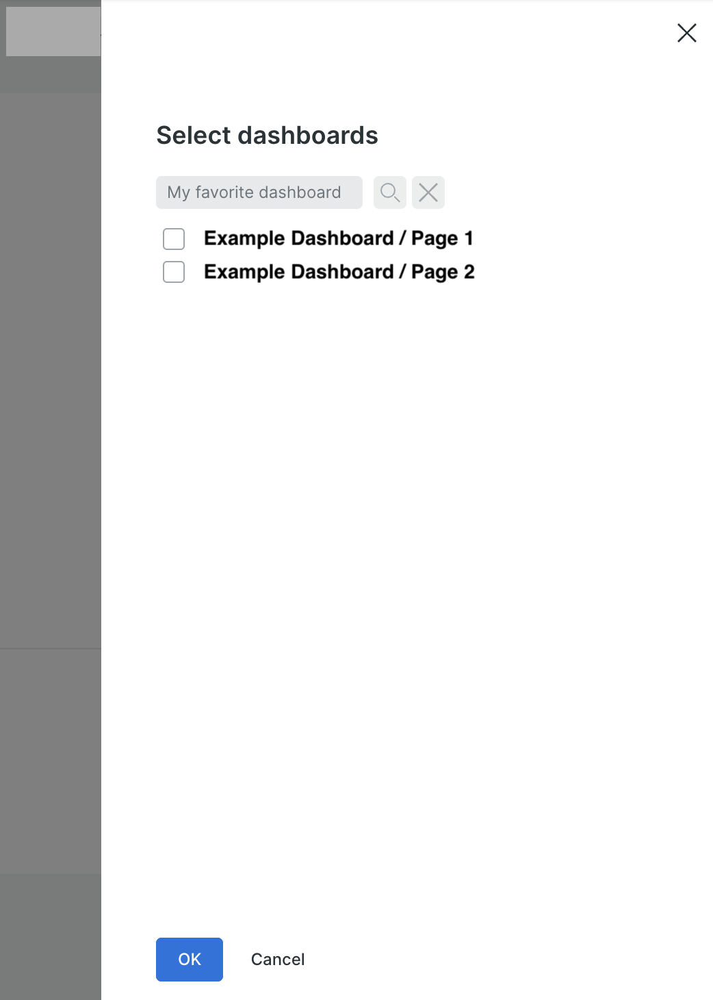

[](https://opensource.newrelic.com/oss-category/#new-relic-community)


# New Relic Reports

New Relic Reports is a full scheduled report solution for use with the New Relic
One platform.

## Table of Contents

* [Overview](#overview)
  * [Report Generation](#report-generation)
  * [Report Delivery](#report-delivery)
  * [Running Reports](#running-reports)
* [Prerequisites](#prerequisites)
* [Getting Started](#getting-started)
* [Usage](#usage)
  * [Reports](#reports)
    * [Template Reports **deprecated**](#template-reports)
    * [Dashboard Reports](#dashboard-reports)
    * [Query Reports](#query-reports)
    * [Report Execution Context](#report-execution-context)
    * [Report Output](#report-output)
    * [Publish Configurations](#publish-configurations)
    * [Channels](#channels)
    * [Manifest Files](#manifest-file)
  * [Using the CLI](#using-the-cli)
  * [Using the CLI image](#using-the-cli-image)
  * [Using the CRON image](#using-the-cron-image)
  * [Using the AWS Lambda function](#using-the-aws-lambda-function)
  * [Using the AWS Scheduler Lambda function](#using-the-aws-scheduler-lambda-function)
  * [Using the Reports Builder](#using-the-reports-builder)
  * [Using the New Relic Reports AWS Stack](#using-the-new-relic-reports-aws-stack)

## Overview

New Relic Reports is a scheduled reporting solution for use with New Relic. It
consists of two separate components: a reporting engine for generating and
delivering reports and a New Relic One application for building reports.

The New Relic Reports engine can be run from the command line as a [Node.js](https://nodejs.org/en)
application, run using a [Docker](https://www.docker.com/) image, or run as an
[AWS Lambda function](https://aws.amazon.com/lambda/). See the section
[Running Reports](#running-reports) for more details.

The New Relic Reports Builder is a [New Relic One application ](https://docs.newrelic.com/docs/new-relic-solutions/build-nr-ui/build-nr-app/)
that can be run from directly within the New Relic One platform. It provides a
user interface for defining [dashboard](#dashboard-reports) and [query](#query-reports)
reports and schedules that specify when reports should be run together with the
email settings used to send the reports.

When used together with the provided [New Relic Reports AWS Stack](#using-the-new-relic-reports-aws-stack),
a scheduling component is also provided that automates the process of running
and delivering reports on specific schedules, providing a full end-to-end
reporting solution.

### Report Generation

The New Relic Reports engine provides support for generating reports in several
ways.

#### Template Reports

**NOTE:** As of v3.0.0, template reports have been **_deprecated_** due to the
potential security issues involved with running user defined templates. No
replacement for this functionality is planned. The documentation for building
and running template reports has been moved [here](./docs/TEMPLATES.md).

#### Dashboard Reports

Dashboard reports use [Nerdgraph](https://docs.newrelic.com/docs/apis/nerdgraph/get-started/introduction-new-relic-nerdgraph/)
to collect snapshot URLs from one or more user specified dashboard GUIDs.
Snapshot URLs are downloaded as PDFs. When more than one dashboard is specified,
the PDFs can optionally be concatenated into a single PDF.

**NOTE:** Dashboard reports can only be generated for single page dashboards or
for a single page of a multi-page dashboard.

#### Query Reports

Query reports provide a mechanism to export the results of running a
NRQL query by simply specifying a query and one or more account IDs to run the
query against. No additional configuration is required. By default, query
results are exported to CSV but can also be exported as HTML or JSON.

**NOTE:** Formatting results using a [Nunjucks](https://mozilla.github.io/nunjucks/)
template is deprecated.

### Report Delivery

A variety of mechanisms are supported for delivering report output. These
mechanisms are referred to as channels. The following types of channels are
supported.

* File: Report output is saved to a file and copied to a destination directory
  on the local filesystem. Mostly meant for development and testing purposes.
* Email: Report output is included inline or as attachments to an email using a
  user defined email template and sent via SMTP.
* S3: Report output is saved to a file and uploaded to an S3 bucket.
* Slack: Report output is posted to a Slack channel via a
  [Slack webhook](https://api.slack.com/messaging/webhooks).
* Webhook: Report output is posted to a custom Webhook.

### Running Reports

There are three ways to run reports.

1. As part of the [New Relic Reports AWS Stack](./nr-reports-scheduler/deploy/cf-template.yaml) (recommended)

   The recommended way to run reports is using the [New Relic Reports AWS Stack](#using-the-new-relic-reports-aws-stack)
   along with the New Relic Reports Builder that together provide a full
   scheduled reporting solution. See the section ["Using the New Relic Reports AWS Stack"](#using-the-new-relic-reports-aws-stack)
   for more details.

1. Packaged as a Docker image

   `Dockerfile`s are provided to package the reporting engine, along with your
   [manifest files](#manifest-file) as a docker image that runs reports on a
   schedule using `CRON` or as a docker image with a CLI based `ENTRYPOINT`
   that can be run via external scheduled task mechanisms such as
   [AWS ECS Scheduled Tasks](https://docs.aws.amazon.com/AmazonECS/latest/developerguide/scheduled_tasks.html).
   Both of these can be used in conjuction with the appropriate environment
   variables to run reports built using the New Relic Reports builder to provide
   a full scheduled reporting solution.

1. Packaged as an AWS Lambda function

   [A Dockerfile](./nr-reports-lambda/Dockerfile) is provided to package the
   reporting engine, along with your [manifest files](#manifest-file) as an AWS
   Lambda function. The Lambda can be deployed with [the provided CloudFormation template](./nr-reports-lambda/cf-template.yaml)
   and [the provided helper scripts](./nr-reports-lambda/scripts).

1. Using the command line interface (CLI)

   Reports can be run directly from a command line after cloning or
   downloading the repository and installing dependencies. This is useful
   primarily for testing and debugging reports.

## Prerequisites

To build and deploy the [New Relic Reports AWS Stack](./nr-reports-scheduler/deploy/cf-template.yaml)
or the Lambda based images, you will need the following.

* Docker
* An ECS repository
* The AWS CLI
* AWS credentials

To build and deploy CRON based images, you will need the following.

* Docker
* A Docker repository

To develop reports and run them locally, you will need the following.

* Node >= 14.0.0
* A terminal application that supports Bash scripts
* Your favorite IDE
* For the [email channel](#email-channel), SMTP server settings (for testing locally try [Mailhog](https://github.com/mailhog/MailHog))
* For the [S3 channel](#s3-channel), AWS credentials and an S3 bucket
* For the [Slack channel](#slack-channel), an [Incoming Webhook](https://api.slack.com/messaging/webhooks)
  URL.
* For the [webhook channel](#webhook-channel), the Webhook URL, any required
  custom header details, and the payload format.

## Getting Started

This tutorial will walk you through how to generate a dashboard and query
report.

**NOTE:** For this simple tutorial, we will be generating reports manually from
the [command line](#using-the-cli) and the results will be saved to the local
file system. While this is convenient for development and testing, it is _not_
the recommended way to generate and deliver reports. It is used below for
edification purposes only.

### Before you begin

If you haven't already, make sure you have checked [the prerequisites](#prerequisites)
for running reports locally. You will also need a
[New Relic User key](https://docs.newrelic.com/docs/apis/intro-apis/new-relic-api-keys/#user-api-key)
to test with.

To install New Relic Reports locally, perform the following commands.

```bash
git clone git@github.com:newrelic/nr-reports.git
cd nr-reports
npm install
```

Then open a terminal that supports Bash scripts and execute the following
commands, making sure to replace `path/to/nr-reports` with the path to the
directory where you cloned the `nr-reports` repository AND `YOUR_USER_KEY`
with your New Relic User key.

```bash
cd path/to/nr-reports
export NEW_RELIC_API_KEY="[YOUR USER KEY]"
```

### Run a template report

**NOTE:** As of v3.0.0, template reports have been **_deprecated_** due to the
potential security issues involved with running user defined templates. No
replacement for this functionality is planned. The documentation for building
and running template reports has been moved [here](./docs/TEMPLATES.md). See
[the following section](./docs/TEMPLATES.md#getting-started) for the content
from previous versions of this section.

### Run a dashboard report

Dashboard reports are generated by specifying one or more dashboard GUIDs. The
reporting engine will use [Nerdgraph](https://docs.newrelic.com/docs/apis/nerdgraph/get-started/introduction-new-relic-nerdgraph/)
to download a dashboard snapshot PDF for each dashboard and optionally combine
multiple snapshots in a single PDF.

Here's how you run a dashboard report.

### Find your dashboard GUID(s)

The easiest way to find the GUID for a single-page dashboard is via the NR1 UI.

1. Navigate to your dashboard
2. Locate the dashboard name above the filter bar
3. On one side of the dashboard name, locate the box that labeled "Metadata".
   Click anywhere in the box.
4. In the "drawer" that slides out from the side of the screen, locate the
   label "Entity guid" followed by a long string of numbers and letters (this is
   the dashboard GUID).
5. Hover over the string of numbers and letters and click on the clipboard icon
   that appears. The dashboard GUID will now be copied in the clipboard.

To find the GUID of a page within a multi-page dashboard, it is necessary to
use the [Nerdgraph API Explorer](https://api.newrelic.com/graphiql).

1. Navigate to the [Nerdgraph API Explorer](https://api.newrelic.com/graphiql).
2. In the text box labeled "User key", enter your New Relic User key.
3. Paste the following text into the GraphQL source editor box. Make sure to
   replace the text "My dashboard" with the full name of the dashboard that
   _contains_ the page you want to use (not the name of the page itself).

```graphql
{
  actor {
    entitySearch(queryBuilder: {type: DASHBOARD, name: "My dashboard"}) {
      results {
        entities {
          guid
          name
        }
      }
    }
  }
}
```

4. Hit the "Play" button or type `Ctrl-Enter` to execute the query.
5. In the results text box, locate the entity that contains the name of the
   page you want to use in the `name` property.
6. Copy the value or the `guid` property shown just above the `name` property.

### Run the dashboard report

Now run the report using the following command, replacing the string
`ABCDEF123456` with your dashboard GUID.

```bash
./nr-reports-cli/bin/nr-reports.sh -d ABCDEF123456
```

Now there should be a new PDF file in the current directory called
`dashboard-[DASHBOARD_GUID].pdf` where `[DASHBOARD_GUID]` is the GUID of your
dashboard. Open it up and you should see a snapshot of your dashboard.

### Run a query report

Now let's see how to run a query report. Query reports are generated by
specifying a single [NRQL](https://docs.newrelic.com/docs/nrql/get-started/introduction-nrql-new-relics-query-language/)
query. The reporting engine will automatically run the query and, by default,
write the results to a CSV file.

Let's see how that works by running a simple query report to show the average
latency of all APM services in your account grouped by application name and URL
using the following NRQL.

```sql
SELECT average(duration) as 'Duration' FROM Transaction FACET appName as 'Application Name', request.uri AS 'URL'
```

To do that, run the following command, replacing the string `1234567` with your
account ID.

```bash
./nr-reports-cli/bin/nr-reports.sh -a 1234567 -q "SELECT average(duration) as 'Duration' FROM Transaction FACET appName as 'Application Name', request.uri AS 'URL'"
```

Now there should be a new CSV file in the current directory called
`query-report.csv`. Open it up in a text editor and you should see something
like the following.

```csv
Application Name,URL,Duration
Shop Service,/api/v1/checkout,1.5191369267857142
Shop Service,/api/v1/products,1.5092493357575756
Shop Service,/api/v1/products/1234,1.4948035056074764
```

### Summary

Here's what we just did.

1. Used the CLI script to run a report at the command line using a dashboard
   entity GUID. This generated a PDF file in the current directory.
1. Used the CLI script to run a query report at the command line using a simple
   NRQL query. This generated a CSV file in the current directory.

Though useful during template development, in most cases, you won't be
generating reports by running the CLI directly. Instead, you will use one of the
provided mechanisms for automating the generation and delivery of reports. See
[the usage section](#usage) for more details.

## Usage

### Reports

The New Relic Reports reporting engine generates reports using report
generators. There are three types of report generators: the
[template report (**deprecated**)](#template-reports-1) generator, the
[dashboard report](#dashboard-reports-1) generator, and the [query report generator](#query-reports-1).

Each report generator interacts with one or more New Relic APIs to generate
[report output](#report-output). Report output is distributed to destinations by
[selecting](#publish-configuration-selection) a [publish configuration](#publish-configurations)
which specifies a set of [channels](#channels) that are used to route the
report output to the destination.

The entire process is governed by a set of configuration parameters that can be
specified at the [command line](#cli-usage), in environment variables, or in a
[manifest file](#manifest-file).

#### Template Reports

**NOTE:** As of v3.0.0, template reports have been **_deprecated_** due to the
potential security issues involved with running user defined templates. No
replacement for this functionality is planned. The documentation for building
and running template reports has been moved [here](./docs/TEMPLATES.md).

#### Dashboard Reports

Dashboard reports provide a way to easily capture PDFs of one or more
dashboards. When more than one dashboard GUID is specified, each dashboard is
captured as a separate PDF file. These files can optionally be combined into a
single file.

The following YAML shows an example of a basic dashboard report definition in a
[manifest file](#manifest-file).

```yaml
reports:
- id: example-dashboard-report
  name: Example dashboard report
  dashboards:
  - DASHBOARD_GUID_1
```

When the reporting engine runs this report, it will execute the
`dashboardCreateSnapshotUrl` [Nerdgraph](https://docs.newrelic.com/docs/apis/nerdgraph/get-started/introduction-new-relic-nerdgraph/)
mutation with the GUID `DASHBOARD_GUID_1` in order to create a URL to download a
PDF snapshot of the dashboard with the given GUID. It will then download the PDF
to a file named `dashboard-DASHBOARD_GUID_1.pdf` since no [`outputFileName`](#output-file-name)
is specified. The PDF file will be copied to the current working directory since
the default channel is the [`file`](#file-channel) channel and no `destDir`
channel parameter is set.

See the section [Dashboard Report Properties](#dashboard-report-properties) for
more information on the available dashboard report properties.

#### Query Reports

Query reports provide a simple way to run a NRQL query and export the results of
the query to a file. By default, the results are exported to a CSV file.

The following YAML shows an example of a query report definition in a
[manifest file](#manifest-file) that will run the example query from the
section [Run a query report](#run-a-query-report) in the
[Getting Started](#getting-started) tutorial.

```yaml
reports:
- id: example-query-report
  query: "SELECT average(duration) as 'Duration' FROM Transaction FACET appName as 'Application Name', request.uri"
  accountIds:
  - 1234567
  timeout: 10
```

When the reporting engine runs this report, it will execute the following
[Nerdgraph](https://docs.newrelic.com/docs/apis/nerdgraph/get-started/introduction-new-relic-nerdgraph/)
query using the given [NRQL](https://docs.newrelic.com/docs/nrql/get-started/introduction-nrql-new-relics-query-language/)
query for the `$query` argument, the given account ID (in a 1 member array) for
the `$accountIds` argument, and the given timeout for the `$timeout` argument.

```graphql
{
   actor {
      nrql(accounts: $accountIds, query: $query, timeout: $timeout) {
         results
         metadata {
            facets
            eventTypes
         }
      }
   }
}
```

The results will be tabulated into a CSV file where the rows in the CSV file
correspond to the each item in the returned `results` array and the columns in
the CSV file correspond to the facets in the query (in this case
`Application Name` and `URL`) followed by the fields selected by the query
(in this case `Duration`), just like you'd see in a `TABLE` widget on a
dashboard. Following is an example CSV that might be generated from this query.

```csv
Application Name,URL,Duration
Shop Service,/api/v1/checkout,1.5191369267857142
Shop Service,/api/v1/products,1.5092493357575756
Shop Service,/api/v1/products/1234,1.4948035056074764
```

**NOTE:** Queries for [query reports](#query-reports) are always run
synchronously. [Asynchronous queries](https://docs.newrelic.com/docs/apis/nerdgraph/examples/async-queries-nrql-tutorial/)
are not supported.

##### Multi-account Queries

Multiple account IDs can be specified for a query report. The reporting engine
supports three different modes for executing queries against multiple accounts.
The query mode is specified using the `multiAccountMode` option in a query
report definition in the [manifest](#manifest-file). Specifying the
multi-account mode at the CLI is not supported and therefore will always use
the default multi-account mode [`cross-account`](#cross-account-queries).

##### Cross-account Queries

By default, a multi-account query will be run using a
[cross-account query](https://docs.newrelic.com/docs/apis/nerdgraph/examples/nerdgraph-nrql-tutorial/#cross-account-query).
With cross-account queries, a query is run against each of the accounts (up to a
maximum of 5) using a query like the following.

```graphql
{
  actor {
    nrql(
      accounts: [ACCOUNT_ID_1, ACCOUNT_ID_2, ACCOUNT_ID_3]
      options: {}
      query: "NRQL_QUERY"
      timeout: 70
    ) {
      results
    }
  }
}
```

The results are aggregated and returned as a single set of results.

To specify that the reporting engine should run a multi-account query using a
cross-account query, either set the `multiAccountMode` option in the [manifest](#manifest-file)
to `cross-account` or leave it out entirely, as `cross-account` is the default.

##### Per-account Queries

Sometimes you may want to run a query individually against multiple accounts
and get each set of results individually rather than aggregating the set of
results across all accounts. For example, if you want to find the top 5
transactions of each of 5 different accounts and export them to a CSV file with
each row including the account ID, using a cross-account query won't suffice. To
account for this, the reporting engine provides two multi-account modes that
execute queries separately against each account: `per-account` and
`per-account-concurrent`.

In the `per-account` case, a single GraphQL query is run that utilizes
[GraphQL aliases](https://graphql.org/learn/queries/#aliases) to run multiple
GraphQL queries in a single GraphQL call, as in the following example.

```graphql
{
   NrqlQuery1: {
      actor {
         nrql(
            accounts: [ACCOUNT_ID_1]
            options: {}
            query: "NRQL_QUERY"
            timeout: 70
         ) {
            results
         }
      }
   }
   NrqlQuery2: {
      actor {
         nrql(
            accounts: [ACCOUNT_ID_2]
            options: {}
            query: "NRQL_QUERY"
            timeout: 70
         ) {
            results
         }
      }
   }
}
```

In the `per-account-concurrent` case, multiple GraphQL queries are run
concurrently, one query per account.

**NOTE:**
The `per-account` and `per-account-concurrent` modes are not "native" query
types like `cross-account`. Rather, they are implemented in the reporting
engine.

#### Report Execution Context

The reporting engine creates an "execution context" each time it runs a report.
The execution context is a collection of properties that can be used by the
components that generate the report. When the execution context is created, the
reporting engine populates it as follows.

* If a [manifest file](#manifest-file) is specified:
   * Add all properties from the `variables` section at the top-level
   * Add properties from the `report` definition
* If no [manifest file](#manifest-file) is specified:
   * Add the report id and the [`outputFileName`](#output-file-name) if one is
     specified
   * If the report is a [template report](#template-reports) (**deprecated**),
     add a property named `templateName` containing the specified template
     name
   * If the report is a [dashboard report](#dashboard-reports), add an array
     property named `dashboards` containing all dashboard GUIDs
   * If the report is a [query report](#query-reports) add a property named
     `query` containing the specified NRQL query

In addition, prior to being passed to any [channel](#channels) implementation,
the [publish configuration](#publish-configurations) ID and the [channel](#channels)
ID are added to the execution context. If a [manifest file](#manifest-file) is
specified, all properties from the [selected](#publish-configuration-selection)
[publish configuration](#publish-configurations) and all
[channel configuration parameters](#channel-parameters) are also added.

**NOTE:**
When populating the context, if two properties with the same name are added by
different steps, the later property will overwrite the earlier property.

#### Report Output

Every report produces output. The output can either be a file stored in the
temporary work directory created when the reporting engine starts or data that
can be rendered to produce text-based content.

The type of output depends on the type of report.

| Report Type | Output Type |
| --- | --- |
| [Template Report](#template-reports-1) (default / `render` == `true`) (**deprecated**)| File |
| [Template Report](#template-reports-1) (`render` == `false`) (**deprecated**)| template engine output |
| [Dashboard Report](#dashboard-reports-1) | File |
| [Query Report](#query-reports-1) | query results |

The report output, whether file or renderable data, is passed to the [channel](#channels)
implementations for delivery. When the report output is provided as renderable
data, a renderer is also sent to the [channel](#channels) implementations that
can be used to render the data into text-based content.

There are two types of renderers. The [template report renderer](#template-report-output)
renderer is used to render [template reports](#template-reports-1) (**deprecated**).
The [query report renderer](#query-report-output) is used to render [query reports](#query-reports-1).
[Dashboard reports](#dashboard-reports-1) do not have an associated renderer
since they only produce file output.

**NOTE:** The type of output generated for a given report type is not always the
same as the format used to send the output via a particular [channel](#channels).
For example, the default output of a [query report](#query-reports) is a set of
NRQL row data. But this data can be sent via the [email channel](#email-channel)
as an HTML table in the body of the email _or_ in a file attached to the email.

##### Template Report Output

**NOTE:** As of v3.0.0, template reports have been **_deprecated_** due to the
potential security issues involved with running user defined templates. No
replacement for this functionality is planned. The documentation for building
and running template reports has been moved [here](./docs/TEMPLATES.md). See
[the following section](./docs/TEMPLATES.md#template-report-output) for more
details on template report output.

##### Dashboard Report Output

[Dashboard reports](#dashboard-reports-1) always produce one or more PDF files.

##### Query Report Output

By default, a [query report](#query-reports-1) produces a set of rows, one for
each row returned in the NRQL query result. The results are passed along to the
[channel](#channels) implementations along with a renderer that, by default,
generates CSV content from the rows.

The output format may be changed using the `queryResultsFormat`
[channel configuration parameter](#channel-parameters) or the
`QUERY_RESULTS_FORMAT` environment variable. When set to `html`, the query
renderer will generate an HTML `<table>` element instead of CSV. When set to
`json`, the query renderer will generate a JSON string for an array of objects,
where each row of the query results is mapped to an object which contains a
property for each column in the query results where the value of the property
is the value of the corresponding row and column in the query results.

Additionally, when the output format is set to `html`, the
`queryResultsHtmlMaxRows` [channel configuration parameter](#channel-parameters)
or the `QUERY_RESULTS_HTML_MAX_ROWS` environment variable can be used to control
the number of rows to include in the generated HTML. By default, 25 rows will be
included.

The following shows an example of the same set of results formatted using each
output format.

**CSV:**

```csv
Application Name,URL,Duration
Shop Service,/api/v1/checkout,1.5191369267857142
Shop Service,/api/v1/products,1.5092493357575756
```

**HTML (formatted for display purposes only):**
```html
<table border="1">
  <thead>
    <tr>
      <th>Application Name</th>
      <th>URL</th>
      <th>Duration</th>
    </tr>
    <tr>
      <td>Shop Service</td>
      <td>/api/v1/checkout</td>
      <td>1.5191369267857142</td>
    </tr>
    <tr>
      <td>Shop Service</td>
      <td>/api/v1/products</td>
      <td>1.5092493357575756</td>
    </tr>
</table>
```

**JSON (formatted for display purposes only):**

```json
[
  {
    "Application Name": "Shop Service",
    "URL": "/api/v1/checkout",
    "Duration": 1.5191369267857142,
  },
  {
    "Application Name": "Shop Service",
    "URL": "/api/v1/products",
    "Duration": 1.5092493357575756,
  }
]
```

#### Publish Configurations

Each report can have one or more publish configurations. Publish configurations
tie a report to a set of [channels](#channels) that are used to distribute
[report output](#report-output). After a report has been run, the reporting
engine [selects a publish configuration](#publish-configuration-selection) to
use and distributes the [report output](#report-output) via the [channels](#channels)
specified in the selected publish configuration.

Publish configurations are defined in a [manifest file](#manifest-file) and
consist of a required `id`, a `name`, an `enabled` flag, a set of [channels](#channels)
and an optional [`schedule` expression](#publish-configuration-schedule-expression).
For example, the following [report definition](#report-definitions) defines
three publish configurations. The `default` publish configuration uses a
[`file` channel](#file-channel) to copy the [report output](#report-output) to
the `/tmp` directory on the local machine. The `copy-to-s3` publish
configuration uses an [`s3` channel](#s3-channel) to copy the [report output](#report-output)
to an S3 bucket named `Daily Report`.  The `send-email` publish configuration
uses an [`email` channel](#email-channel) to send the [report output](#report-output)
to the set of recipients specified in the `to` and `cc` [channel parameters](#channel-parameters).

```yaml
reports:
- id: example-dashboard-report
  name: Example dashboard report
  dashboards:
  - DASHBOARD_GUID_1
  publishConfigs:
  - id: default
    name: Copy file
    channels:
    - id: copy-file-to-tmp
      name: Copy file to /tmp
      type: file
      destDir: "/tmp"
  - id: copy-pdf-to-s3
    name: Copy dashboard PDF to S3 bucket
    channels:
    - id: copy-file
      name: Copy to S3
      type: s3
      bucket: "Daily Report"
  - id: email-pdf
    name: Email dashboard PDF
    channels:
    - id: send-email
      name: Email PDF report to leadership
      type: email
      subject: Average transaction duration by application and URI
      from: noreply@numbers.local
      to: one@numbers.local, two@numbers.local
      cc: three@numbers.local, four@numbers.local
```

**NOTE:** In the absence of a [manifest file](#manifest-file) or if the current
[report definition](#report-definitions) does not include any publish
configurations, a default publish configuration with the id `default` is always
created with the list of channels constructed by the engine or with the default
channel. For example, if no channel IDs are specified at all when [using the CLI](#using-the-cli),
a publish configuration named `default` will automatically be added with the
default [`file` channel](#file-channel). Similarly, if no channel IDs are
specified when [using the AWS Lambda](#using-the-aws-lambda-function), a publish
configuration named `default` will automatically be added with the default
[`s3` channel](#s3-channel).

##### Publish configuration selection

The reporting engine chooses the publish configuration to use via the following
process.

1. Inspect the following sources in the following order for a comma-delimited
   string specifying a list of candidate publish configuration IDs.
  1. When [using the CLI](#using-the-cli), the `-u` option.
  1. When [using the AWS Lambda function](#using-the-aws-lambda-function), the
    `publishConfigIds` parameter specified in the `options` element of the
    [AWS Lambda event](https://docs.aws.amazon.com/lambda/latest/dg/gettingstarted-concepts.html#gettingstarted-concepts-event).
  1. The `PUBLISH_CONFIG_IDS` environment variable
1. Add the default publish configuration ID `default` to the end of the list of
   candidate publish configuration IDs.
1. For each candidate publish configuration ID, search the [report definition](#report-definitions)
   for a publish configuration with a matching ID. The first publish
   configuration with a matching ID will be used.

##### Publish configuration schedule expression

Each publish configuration can have an optional schedule expression. The
schedule expression is a [CRON](https://manpages.debian.org/unstable/cron/cron.8.en.html)
expression. The schedule expression is meant for use by components which can
manage (create, update, delete) schedules in an external scheduling system like
[AWS EventBridge](https://docs.aws.amazon.com/eventbridge/latest/userguide/eb-what-is.html).
Currently, the [New Relic Reports Scheduler Lambda](#using-the-aws-scheduler-lambda-function)
provided with the [New Relic Reports AWS Stack](#using-the-new-relic-reports-aws-stack)
is the only such component. To develop custom components which integrate with
other scheduling mechanisms, see the [New Relic Reports Scheduler Lambda source](./nr-reports-scheduler/lambda.js)
as an example.

**NOTE:** The schedule expression is _ignored_ by the engine itself. That is,
the engine has no built-in scheduling capabilities on it's own.

#### Channels

Channels are used to specify how [report output](#report-output) should be
distributed. Each [publish configuration](#publish-configurations) can specify
one or more channels to use when the [publish configuration](#publish-configurations)
is [selected](#publish-configuration-selection). Channels are defined together
with the [publish configuration](#publish-configurations) in a [manifest file](#manifest-file)
and consist of a required `id`, a name, a type, and a set of [channel parameters](#channel-parameters)
that are specific to the channel type.

The following channel types are supported:

* [File](#file-channel) (the default when running [from the CLI](#using-the-cli))
* [Email](#email-channel)
* [S3](#s3-channel) (the default when running [from the AWS Lambda](#using-the-aws-lambda-function))
* [Slack](#slack-channel)
* [Webhook](#webhook-channel)

**NOTE:** In the absence of a [manifest file](#manifest-file) or if a
[publish configuration](#publish-configuration) does not include any channels,
a default channel with the id `${report.id}.${publishConfig.id}.${channelType}`
is always created using the default channel type appropriate to the execution
environment used to invoke the engine. For example, when [using the CLI](#using-the-cli),
if no channel is specified for a given [publish configuration](#publish-configurations),
the default [`file` channel](#file-channel) will be used automatically.
Similarly, when [using the AWS Lambda](#using-the-aws-lambda-function), if no
channel is specified for a given [publish configuration](#publish-configurations)
the default [`s3` channel](#s3-channel) will be used automatically.

##### Channel parameters

All channel types support configuration parameters that govern how reports are
distributed when using that channel type. For example, the [file channel](#file-channel)
type supports a `destDir` configuration parameter that specifies the destination
directory that the report outputs should be copied into. The [email channel](#email-channel)
type supports configuration parameters that specify the subject of the email,
the list of recipients, and so on.

Channel configuration parameters are specified via [a manifest file](#manifest-file),
or using environment variables. Most parameters can be specified using either
method. For example, when using the [email channel](#email-channel) type, the
subject can be specified using the `EMAIL_SUBJECT` environment variable or using
the `subject` channel configuration parameter in the channel definition of
[a manifest file](#manifest-file) as shown below.

```yaml
reports:
- id: example-dashboard-report
  name: Example dashboard report
  dashboards:
  - DASHBOARD_GUID_1
  publishConfigs:
  - id: default
    name: Email dashboard PDF
    channels:
    - id: send-email
      name: Email PDF report to leadership
      type: email
      subject: Average transaction duration by application and URI
      from: noreply@numbers.local
      to: one@numbers.local, two@numbers.local
      cc: three@numbers.local, four@numbers.local
```

Except for a few cases, channel configuration parameters defined in a manifest
file can be specified directly at the `channel` level or at the enclosing
[`publishConfiguration`](#publish-configurations) level or [`report`](#report-definitions)
level or in the global `variables` element. This is possible because the channel
implementations lookup most channel configuration parameters via the
[report execution context](#report-execution-context). This behavior makes it
possible to "share" channel configuration parameters between channels. For
instance, in the example below, the email `subject` configuration parameter is
defined at the [`report`](#report-definitions) level and the email `from`
configuration parameter is defined in the global `variables` element. In this
case, both the `send-email-1` channel and the `send-email-2` channel will use
the same `subject` value and the same `from` value.

```yaml
variables:
  from: noreply@numbers.local
reports:
- id: example-dashboard-report
  name: Example dashboard report
  dashboards:
  - DASHBOARD_GUID_1
  subject: Average transaction duration by application and URI
  publishConfigs:
  - id: default
    name: Email dashboard PDF
    channels:
    - id: send-email-1
      name: Email PDF report to leadership
      type: email
      to: one@numbers.local
    - id: send-email-2
      name: Email PDF report to team
      type: email
      to: two@numbers.local
```

Some channel configuration parameters can _only_ be specified via environment
variables as they hold sensitive information. For example, to specify the SMTP
user password when using the [email channel](#email-channel) type, the
environment variable `EMAIL_SMTP_PASS` must be used.

##### Channel parameter scoping

When using a manifest file to specify channel parameters, parameters are
implicitly scoped to the channel where they are defined. In contrast, most
environment variables apply "globally" to all channels. Except in
a few cases, they can not be scoped to a specific channel. For example, there is
no way to specify different email subjects for different channels using the
`EMAIL_SUBJECT` environment variable. For this reason, it is recommended to use
a [manifest file](#manifest-file) for those channel parameters that support it.

For channel configuration parameters that can _only_ be specified via
environment variables, a "namespacing" mechanism is supported for scoping these
parameters to a specific channel. Using this mechanism, a channel configuration
parameter can be scoped to a specific channel, [publish configuration](#publish-configurations)
or [report](#reports) by prefixing the configuration parameter environment
variable name with the ID of the corresponding channel, [publish configuration](#publish-configurations),
or [report](#reports), in upper-case, with all non-alphanumeric characters
replaced with the `_` character.

For example, to scope the `EMAIL_SMTP_PASS` to a channel with the ID
`send-mail`, use an environment variable with the name
`SEND_MAIL_EMAIL_SMTP_PASS`.

##### Channel parameter interpolation

**NOTE:** Channel parameter interpolation uses the templating engine. As of
v3.0.0, template reports and components which use the templating engine have
been **_deprecated_** due to the potential security issues involved with running
user defined templates. Channel parameter interpolation will be replaced with
a more secure mechanism in future releases.

Some channel parameters support [template parameter](./docs/TEMPLATES.md#template-parameters)
interpolation. That is, the value of the channel parameter is interpolated
using the template engine prior to being used by the channel implementation.
The interpolated string may reference any channel configuration parameter as
well as any report parameter. For example, the "Subject" property of the
[email channel](#email-channel) is interpolated prior to passing it to the
[Nodemailer](https://nodemailer.com/about/) transport. Consequently, the `from`
channel parameter could be included in the "Subject" property by setting the
`subject` channel parameter to `Report generated for {{ from }}`. If the value
of the `from` channel parameter was `one@numbers.local`, the resulting subject
would be `Report generated for one@numbers.local`.

##### Specifying channels

When the reporting engine is run using a [manifest file](#manifest-file), the
channels to use for a given report are part of the channel definition of the
[selected](#publish-configuration-selection) [publish configuration](#publish-configurations)
for the report as specified in the manifest file.

If the reporting engine is run without a [manifest file](#manifest-file), the
channels to use are determined as follows.

* If the reporting engine was run [from the CLI](#using-the-cli), the value of
  the `-c` option will be used.
* If the reporting engine was run [using the AWS Lambda](#using-the-aws-lambda-function),
  the value of the `channelIds` parameter specified in the `options` element of
  the [AWS Lambda event](https://docs.aws.amazon.com/lambda/latest/dg/gettingstarted-concepts.html#gettingstarted-concepts-event)
  will be used.
* In either case, if no channel IDs are found, the reporting engine will use the
  value of the `CHANNEL_IDS` environment variable.

In all cases, if a non-empty value is found, it is interpreted as a
comma-separated list of channel IDs. For example, the value `s3,email` specifies
that the [report output(s)](#report-output) should be published to the [S3](#s3-channel)
and [Email](#email-channel) channels.

If no channel is specified using any of the above mechanisms, report output(s)
will be published to the [file channel](#file-channel) when running
[from the CLI](#using-the-cli) or the [s3 channel](#s3-channel) when running
[using the AWS Lambda](#using-the-aws-lambda-function)

As an example, the CLI command used in the [run a query report](#run-a-query-report)
section could have explicitly specified the file channel as follows.

```bash
./nr-reports-cli/bin/nr-reports.sh -a 1234567 -q "SELECT average(duration) as 'Duration' FROM Transaction FACET appName as 'Application Name', request.uri AS 'URL'" -c file
```

This is not necessary since the [file channel](#file-channel) is the default.
However, to use the [email channel](#email-channel) instead, it would be
specified as follows.

```bash
./nr-reports-cli/bin/nr-reports.sh -a 1234567 -q "SELECT average(duration) as 'Duration' FROM Transaction FACET appName as 'Application Name', request.uri AS 'URL'" -c email
```

**NOTE:** [Channel parameters](#channel-parameters) can not be specified when
using the `CHANNEL_IDS` environment variable, the `-c` CLI option, or the
`channelIds` option to the [AWS Lambda function](#using-the-aws-lambda-function),
or when using the default `file` or `s3` channels. In these cases, the
respective channel implementation will attempt to locate the configuration
parameters it needs in the environment (where supported) and will default any
optional parameters.

##### Output File Name

For report types that produce file output, file names are calculated as follows.

* For [template reports](#template-reports) (**deprecated**) where the `render`
  parameter is not set or is set to `true`, the rendered page will be saved to a
  file named `<REPORTID>.pdf`. If a [manifest file](#manifest-file) is used to
  run the report, `<REPORTID>` will be the value of the `id` attribute of
  the [report definition](#report-definitions). Otherwise, `<REPORTID>` will be
  the same as the name of the template minus any extension, i.e. if the template
  name is `hello-world.html`, `<REPORTID>` will be `hello-world`.
* For [dashboard reports](#dashboard-reports) where the `combinePdfs` is not set
  or set to `false`, the snapshot for each dashboard GUID specified in the
  [report definition](#report-definitions) will be saved to a file named
  `dashboard-<GUID>.pdf`.
* For [dashboard reports](#dashboard-reports) where the `combinePdfs` is set to
  `true`, the snapshots for all dashboards will be saved in a file named
  `consolidated_dashboards.pdf`.

For report types that produce text output, most of the channel implementations
support the option to save the output to a file and to use the file in place of
or in conjuction with the assets published by the channel. For example, in
addition to being able to copy file(s) from report types that produce file(s),
the [file channel](#file-channel) supports the ability to save text data to a
file from report types that produce text.

In such cases, the name of the file to which the text data is written is
determined as follows.

* If a property named `outputFileName` exists in the
  [report execution context](#report-execution-context), it will be used as the
  file name.
* Otherwise, the file name will be set to `<REPORTID>.<EXT>`, calculated as
  follows:
   * If a [manifest file](#manifest-file) is used to run the
     report, `<REPORTID>` will be the value of the `id` attribute of the
     [report definition](#report-definitions). Otherwise, for
     [template reports](#template-reports) (**deprecated**), `<REPORTID>` will
     be the same as the name of the template minus any extension. For
     [query reports](#query-reports), `<REPORTID>` will be `query-report`.
   * `<EXT>` will be set to the value of the property named `fileExtension` in
     the [report execution context](#report-execution-context). If no such
     property exists, it will be set to the value of the `FILE_EXTENSION`
     environment variable. If no value is specified for the `FILE_EXTENSION`
     environment variable, the extension `csv` will be used for [query reports](#query-reports)
     without the `passThrough` option set on the [report definition](#report-definitions)
     and the extension `txt` will be used in all other cases.

##### File Channel

The `file` channel type writes generated [report output](#report-output) to a
destination directory on the local filesystem. It is mostly meant for
development and testing although it could be used to copy reports to volumes
locally attached to a Docker container.

For report types that produce file output, all generated files are moved from
the temporary work directory created when the reporting engine starts into the
destination directory.

For report types that produce text, the text will be written to a file. The file
name will be calculated as specified in the section [Output File Name](#output-file-name).
If the calculated file name is absolute, the file will be written at the
specified location. Otherwise, the file will be written to the destination
directory. Any intermediate directories along the path to the destination
directory will be automatically created if they do not exist.

The following [channel parameters](#channel-parameters) are supported for the
`file` channel type.

| Name | Environment Variable | Description | Required | Default |
| --- | --- | --- | --- | --- |
| `destDir` | `FILE_DEST_DIR` | Output destination directory | N | `.` (current working directory) |

Here is an example of specifying a file channel configuration in a
[manifest file](#manifest-file).

```yaml
reports:
- id: example-dashboard-report
  name: Example dashboard report
  dashboards:
  - DASHBOARD_GUID_1
  publishConfigs:
  - id: default
    name: Copy file
    channels:
    - id: copy-file-to-tmp
      name: Copy file to /tmp
      type: file
      destDir: "/tmp"
```

**NOTE:** The `file` channel type is the default channel when running
[from the CLI](#using-the-cli).

#### Email Channel

The `email` channel type delivers [report output](#report-output) via email.

Messages are sent over SMTP using the [Nodemailer](https://nodemailer.com/about/)
module.

Messages are constructed based on the [report output type](#report-output) and
[channel configuration parameters](#channel-parameters) using the following
process.

* A new message is created using the Recipient(s), Sender, Cc, and Subject
  values specified in the current [report execution context](#report-execution-context)
  or the corresponding environment variables. Prior to being set,
  [channel parameter interpolation](#channel-parameter-interpolation) is applied
  to the Subject using the current [report execution context](#report-execution-context).
* If the report type produces file output:
   * All generated files are added to the message as attachments.
   * The body of the message is generated by processing a template with the
     template engine using the current [report execution context](#report-execution-context).
     The template used to generate the message body may either be specified
     _inline_ in the `emailTemplate` parameter in the channel configuration
     or via a template file using the `emailTemplateName` parameter in the
     channel configuration or the `EMAIL_TEMPLATE` environment variable. If no
     template was specified, the [default attachments template](./templates/email/message-attachments.html)
     is used.
* If the report type produces text:
   * If the `attachOutput` channel configuration parameter is set to `true`,
     the text will be rendered using the format determined by the report type.
     For example, by default the text output from a query report will be
     rendered as CSV. The resulting output is written to a file. The file name
     will be calculated as specified in the section [Output File Name](#output-file-name).
     The file name must *NOT* be absolute. Message construction will continue as
     if the report type produces file output with the generated file as the
     output, with _one exception_. If the `passThrough` parameter in the channel
     configuration is set to `true`, the message body will be generated by
     re-rendering the text as HTML regardless of the format determined by the
     report type.
   * If the `passThrough` parameter in the channel configuration is set to
     `true`, the message body will be generated by rendering the text as HTML
     regardless of the format determined by the report type.
   * Otherwise, the text will be rendered using the format determined by the
     report type and added to the [report execution context](#report-execution-context)
     with the property name `result`. The body of the message is then generated
     by processing a template with the template engine using the current
     [report execution context](#report-execution-context). The template used to
     generate the message body may either be specified _inline_ in the
     `emailTemplate` parameter in the channel configuration or via a template
     file using the `emailTemplateName` parameter in the channel configuration
     or the `EMAIL_TEMPLATE` environment variable. If no template was specified,
     the [default message template](./templates/email/message.html) is used.
* The content type for the message is set using the `format` parameter in the
  channel configuration. If no format was specified, the content type is set to
  `html` by default. If the `format` parameter is set but is anything other
  than `html` or `text`, an error is raised.

**NOTE:** Email templates are currently processed using the templating engine.
As of v3.0.0, template reports and components which use the templating engine
have been **_deprecated_** due to the potential security issues involved with
running user defined templates. Email template processing will be replaced with
a more secure mechanism in future releases.

The following [channel parameters](#channel-parameters) are supported for the
`email` channel type.

| Name | Environment Variable | Description | Required | Default |
| --- | --- | --- | --- | --- |
| `to` | `EMAIL_TO` | Recipient emails; Multiple email addresses can be specified separated by commas. | Y | |
| `cc` | `EMAIL_CC` | CC recipient emails; Multiple email addresses can be specified separated by commas. | N | |
| `from` | `EMAIL_FROM` | Sender email | Y | |
| `subject` | `EMAIL_SUBJECT` | Subject line | N | `''` |
| `emailSmtpServer` | `EMAIL_SMTP_SERVER` | SMTP server hostname | Y | |
| `emailSmtpPort` | `EMAIL_SMTP_PORT` | SMTP server port | N | `587` |
| `emailSmtpSecure` | `EMAIL_SMTP_SECURE` | SMTP TLS option; `true`/`yes`/`on`/`1` forces TLS, anything else defaults to no TLS unless the server upgrades with `STARTTLS` | N | `true` |
| `emailTemplate` | N/a | Inline email template for generating body | N | |
| `emailTemplateName` | `EMAIL_TEMPLATE` | Template name for generating body; [Resolved](./docs/TEMPLATES.md#template-resolution) against the template path at run time. | N | [default message template](./templates/email/message.html) if report type produces text, [default attachments template](./templates/email/message-attachments.html) if the report type produces file output |
| N/a | `EMAIL_SMTP_USER` | Username for SMTP authentication | N | |
| N/a | `EMAIL_SMTP_PASS` | Password for SMTP authentication; only used if `EMAIL_SMTP_USER` is also specified | N | |
| `format` | N/a | Email format; `html`/`text` | N | `html` |
| `passThrough` | N/a | Flag to enable rendering text report output as HTML (see above for more details) | N | |
| `attachOutput` | N/a | Flag to enable attaching rendered text report output as a file | N | |

**NOTE:** When using a [manifest file](#manifest-file) to specify the inline
email template or the template name, the `emailTemplate` and `emailTemplateName`
parameters can _only_ be specified in the `channel` element and not at the
enclosing `publishConfiguration` or `report` level or in the global `variables`
element. Likewise, the `format`, `passThrough`, and `attachOutput` parameters
can _only_ be specified in the `channel` element.

**NOTE:** All `EMAIL_SMTP_*` environment variables support [channel parameter scoping](#channel-parameter-scoping).

Here is an example of specifying an email channel configuration in a
[manifest file](#manifest-file).

```yaml
reports:
- id: example-dashboard-report
  name: Example dashboard report
  dashboards:
  - DASHBOARD_GUID_1
  publishConfigs:
  - id: default
    name: Email dashboard PDF
    channels:
    - id: send-email
      name: Email PDF report to leadership
      type: email
      subject: Average transaction duration by application and URI
      from: noreply@numbers.local
      to: one@numbers.local, two@numbers.local
      cc: three@numbers.local, four@numbers.local
```

Here is an example of specifying an email channel configuration in a
[manifest file](#manifest-file) that specifies the email template inline.

```yaml
reports:
- id: example-dashboard-report
  name: Example dashboard report
  dashboards:
  - DASHBOARD_GUID_1
  publishConfigs:
  - id: default
    name: Email dashboard PDF
    channels:
    - id: send-email
      name: Email PDF report to leadership
      type: email
      subject: Average transaction duration by application and URI
      from: noreply@numbers.local
      to: one@numbers.local, two@numbers.local
      cc: three@numbers.local, four@numbers.local
      emailTemplate: |
        {{ subject }}

        Please find the attached report which shows average transaction duration
        by application.
```

Because why not? Everyone needs more email.

#### S3 Channel

The `s3` channel type uploads generated [report output](#report-output) to an S3
bucket.

For report types that produce file output, all generated files are uploaded from
the temporary work directory created when the reporting engine starts into the
S3 bucket.

For report types that produce text, the text will be rendered using the format
determined by the report type. The resulting output will be uploaded to the S3
bucket as an S3 object. The key for the object will be calculated as specified
in the section [Output File Name](#output-file-name). **NOTE:** The calculated
file name _must_ be a valid S3 key name.

The following [channel parameters](#channel-parameters) are supported for the
`s3` channel type.

| Name | Environment Variable | Description | Required | Default |
| --- | --- | --- | --- | --- |
| `bucket` | `S3_DEST_BUCKET` | Destination S3 bucket | Y | |

**NOTE:** The `S3_DEST_BUCKET` environment variable supports [channel parameter scoping](#channel-parameter-scoping).

Here is an example of specifying an s3 channel configuration in a
[manifest file](#manifest-file).

```yaml
reports:
- id: example-dashboard-report
  name: Example dashboard report
  dashboards:
  - DASHBOARD_GUID_1
  publishConfigs:
  - id: default
    name: Copy dashboard PDF to S3 bucket
    channels:
    - id: copy-file
      name: Copy to S3
      type: s3
      bucket: "Daily Report"
```

The `s3` channel type is the default channel when running [from a Lambda](#using-the-aws-lambda-function).

#### Slack Channel

The `slack` channel type posts [report output](#report-output) to a Slack channel
via a [Slack webhook](https://api.slack.com/messaging/webhooks). A Slack webhook
URL _must_ be specified using the `SLACK_WEBHOOK_URL` environment variable.

Because Slack webhooks do not support transferring files, the `slack` channel
type only supports report types that produce text. Specifying a `slack` channel
type for a report type that produces file output will cause a warning message to
be logged.

Messages are constructed using the following process.

* If the `passThrough` parameter in the channel configuration is set to
  `true`, the body of the message is set to the raw [report output](#report-output).
  In this case, the [report output](#report-output) _must_ be a JSON string that
  conforms to the [Incoming Webhook JSON payload format](https://api.slack.com/messaging/webhooks#posting_with_webhooks).
  This method can be used to send messages containing [BlockKit](https://api.slack.com/block-kit)
  visual components.
* Otherwise, the body of the message is set to a JSON object with a single
  property named `text` with the text output as it's value. The text output is
  automatically escaped so that it may safely include
  [all mrkdwn formatting options](https://api.slack.com/reference/surfaces/formatting).

The following [channel parameters](#channel-parameters) are supported for the
`slack` channel type.

| Name | Environment Variable | Description | Required | Default |
| --- | --- | --- | --- | --- |
| N/a | `SLACK_WEBHOOK_URL` | Slack Webhook URL | Y | |
| `passThrough` | N/a | Flag to enable sending raw [report output](#report-output) | N | `false` |

**NOTE:** When using a [manifest file](#manifest-file) the `passThrough`
parameter can _only_ be specified in the `channel` element.

**NOTE:** The `SLACK_WEBHOOK_URL` environment variable supports
[channel parameter scoping](#channel-parameter-scoping).

Here is an example of specifying a Slack channel configuration in a
[manifest file](#manifest-file).

```yaml
reports:
- id: example-query-report
  query: "SELECT average(duration) as 'Duration' FROM Transaction FACET appName as 'Application Name', request.uri"
  accountIds:
  - 1234567
  timeout: 10
  publishConfigs:
  - id: slack
    name: Post to Slack
    channels:
    - id: post-slack
      name: Post query results to Slack
      type: slack
```

#### Webhook Channel

The `webhook` channel type sends [report output](#report-output) to any Webhook
endpoint by including the [report output](#report-output) in a Webhook `payload`
or using the [report output](#report-output) as the payload itself. A webhookURL
must be specified using the `WEBHOOK_URL` environment variable. The `webhook`
channel type supports specifying the HTTP method, custom HTTP headers, and HTTP
basic user-password authentication. In addition, the `webhook` channel type
supports a mechanism for customizing the webhook payload using [substitution variables](#webhook-substitution-variables)
that can be specified both as [channel parameters](#channel-parameters) or
environment variables.

The `webhook` channel type only supports report types that produce text.
Specifying a `webhook` channel type for a report type that produces file output
will cause a warning message to be logged.

Webhook payloads are constructed using the following process.

* If the `passThrough` parameter in the channel configuration is set to
  `true`, the body of the message is set to the raw [report output](#report-output)
  The [report output](#report-output) _must_ be in a valid format that the
  Webhook endpoint will accept (often JSON).
* Otherwise, the body of the message is set to the value of the `payload`
  [channel parameter](#channel-parameters) after applying [substitutions](#webhook-substitution-variables).
  The value of the `payload` [channel parameter](#channel-parameters) with the
  applied substitutions _must_ be in a valid format that the Webhook endpoint
  will accept (often JSON).

Webhook payloads are sent using the following process.

* Build the webhook payload per the process above.
* Build the request headers using the following process.
  * If an HTTP Basic username and password are set, compute the HTTP Basic
    credentials string and add an `Authorization` header with the computed
    value.
  * Given the parameter names `webhookHeaderN` or environment variable names
    `WEBHOOK_HEADER_N` where N is the number 1-5, if a parameter or environment
    environment variable exists with the given name with a value of the form
    `header-name: value`, add a header with the name `header-name` and the value
    `value` after applying [substitutions](#webhook-substitution-variables).
* Make an HTTP request with the HTTP method specified in the parameter
  `webhookHttpMethod`, the environment variable `WEBHOOK_HTTP_METHOD`, or using
  the value `POST` to the URL specified in the parameter `webhookUrl` or the
  environment variable `WEBHOOK_URL` using the set of headers and payload built
  in the previous steps.

The following [channel parameters](#channel-parameters) are supported for the
`webhook` channel type.

| Name | Environment Variable | Description | Required | Default |
| --- | --- | --- | --- | --- |
| `webhookUrl` | `WEBHOOK_URL` | Webhook URL endpoint | Y | |
| `webhookHttpMethod` | `WEBHOOK_HTTP_METHOD` | Webhook HTTP Method; `GET`/`POST`/`PUT` | N | `POST` |
| N/a | `WEBHOOK_HTTP_BASIC_USER` | Webhook HTTP Basic authentication username | N | |
| N/a | `WEBHOOK_HTTP_BASIC_PASS` | Webhook HTTP Basic authentication password | N | |
| `webhookHeaderN` | `WEBHOOK_HEADER_N` | [Custom webhook HTTP header](#custom-webhook-http-headers) where N is the number 1-5 and the value is of the form `header-name: value` | N |
| `payload` | N/a | Webhook payload | N | |
| `passThrough` | N/a | Flag to enable sending raw [report output](#report-output) | N | `false` |
| `contextVars` | N/a | List of context variables to expose as [substitution variables](#webhook-substitution-variables) | N | |
| `envVars` | N/a | List of environment variables to expose as [substitution variables](#webhook-substitution-variables) | N | |

**NOTE:** When using a [manifest file](#manifest-file) the `payload`,
`passThrough`, `contextVars`, and `envVars` parameters can _only_ be specified
in the `channel` element.

**NOTE:** All `WEBHOOK_*` environment variables support [channel parameter scoping](#channel-parameter-scoping).

Here is an example of specifying a webhook channel configuration in a
[manifest file](#manifest-file).

```yaml
reports:
- id: example-query-report
  query: "SELECT average(duration) as 'Duration' FROM Transaction FACET appName as 'Application Name', request.uri"
  accountIds:
  - 1234567
  timeout: 10
  publishConfigs:
  - id: external-webhook
    name: Post to external webhook
    channels:
    - id: post-webhook
      name: Post query results to webhook
      type: webhook
      webhookHeader1: "X-Foo: bar"
      payload: |
        {
          "reportId": "{{ REPORT_ID }}",
          "reportName": "{{ REPORT_NAME }}",
          "publishConfigId": "{{ PUBLISH_CONFIG_ID }}",
          "publishConfigName": "{{ PUBLISH_CONFIG_NAME }}",
          "channelId": "{{ CHANNEL_ID }}",
          "channelName": "{{ CHANNEL_NAME }}",
          "results": {{ RESULTS }}
        }
```

##### Custom webhook HTTP headers

The webhook channel type supports sending custom HTTP headers on the Webhook
HTTP request. Up to 5 custom HTTP headers may be specified. Headers may be
specified as [channel parameters](#channel-parameters) in the [manifest file](#manifest-file)
or as environment variables. To specify the custom HTTP headers in the [manifest file](#manifest-file),
use the parameter name `webhookHeaderN`, where the `N` is the number 1-5. For
example, `webhookHeader1`, `webhookHeader2`, and so on. To specify custom HTTP
headers as environment variables, use the environment variable name
`WEBHOOK_HEADER_N`, where `N` is the number 1-5. For example,
`WEBHOOK_HEADER_1`, `WEBHOOK_HEADER_2`, and so on.

The value of each custom header must be specified using the format
`header-name: value` where `header-name` is the name of the custom HTTP header
to add and `value` is the value to send for the custom HTTP header. For example,
to specify a header named `X-Foo` with the value `bar`, the value for the
[channel parameter](#channel-parameters) would be `X-Foo: bar`.

##### Webhook substitution variables

The webhook payload and custom HTTP header values can contain substitution
variable references of the form `{{ variableName }}`. At publish time, these
references will be replaced by substituting the reference with the value of the
substitution variable named `variableName` from the list of substitution
variables. If no variable exists with the name `variableName`, the reference
will be replaced with the name of the variable itself. For example, to include
the report ID in the payload, use the value `{{ REPORT_ID }}`.

The following variables are predefined.

| Name | Description |
| --- | --- |
| `REPORT_ID` | The ID of the report being run |
| `REPORT_NAME` | The name of the report being run |
| `PUBLISH_CONFIG_ID` | The ID of the publish configuration containing the webhook channel where this reference occurs |
| `PUBLISH_CONFIG_NAME` | The name of the publish configuration containing the webhook channel where this reference occurs |
| `CHANNEL_ID` | The ID of the webhook channel where this reference occurs |
| `CHANNEL_NAME` | The name of the webhook channel where this reference occurs |
| `TIMESTAMP` | The current time in milliseconds since the epoch |
| `DATETIME` | A string containing the current date and time in the form `${year}-${month}-${day}_${hour}${minutes}${seconds}` |
| `RESULTS` | When used in the payload, the [report output](#report-output) as a JSON string |

In addition to the predefined variables, the `contextVars` and `envVars`
[channel parameters](#channel-parameters) may be used to add substitution
variables from the current [report execution context](#report-execution-context)
or from environment variables. For example, in the following channel definition,
the property named `foo` from the [report execution context](#report-execution-context)
and the environment variable named `BEEP` would be added as substitution
variables.

```yaml
    - id: post-webhook
      name: Post query results to webhook
      type: webhook
      contextVars:
      - foo
      envVars:
      - BEEP
      payload: "{ ... }"
```

The additional substitution variables would be referenced as `{{ foo }}` and
`{{ BEEP }}` in the webhook payload or in a custom HTTP header.

### Manifest File

A manifest file is a [JSON](https://www.json.org/json-en.html) or
[YAML](https://yaml.org/) file with the following format.

#### Manifest File Format

A manifest file contains a single top-level object with the following
properties.

| Property Name | Description | Type | Required | Default |
| --- | --- | --- | --- | --- |
| variables | A map of "global" properties that are added to the [report execution context](#report-execution-context) of all reports. | object | N | {} |
| reports | An array of [report definitions](#report-definitions). | array | N | [] |

A full YAML example is shown below.

```yaml
variables:
  subject: Average transaction duration by application and URI
reports:
- id: example-dashboard-report
  name: Example dashboard report
  dashboards:
  - DASHBOARD_GUID_1
  publishConfigs:
  - id: default
    name: Copy file
    channels:
    - id: copy-file-to-tmp
      name: Copy file to /tmp
      type: file
      destDir: "/tmp"
  - id: copy-pdf-to-s3
    name: Copy dashboard PDF to S3 bucket
    channels:
    - id: copy-file
      name: Copy to S3
      type: s3
      bucket: "Daily Report"
  - id: email-pdf
    name: Email dashboard PDF
    channels:
    - id: send-email
      name: Email PDF report to leadership
      type: email
      subject: Average transaction duration by application and URI
      from: noreply@numbers.local
      to: one@numbers.local, two@numbers.local
      cc: three@numbers.local, four@numbers.local
- id: example-query-report
  query: "SELECT average(duration) as 'Duration' FROM Transaction FACET appName as 'Application Name', request.uri"
  accountIds:
  - 1234567
  timeout: 10
  publishConfigs:
  - id: slack
    name: Post to Slack
    channels:
    - id: post-slack
      name: Post query results to Slack
      type: slack
  - id: external-webhook
    name: Post to external webhook
    channels:
    - id: post-webhook
      name: Post query results to webhook
      type: webhook
      webhookHeader1: "X-Foo: bar"
      payload: |
        {
          "reportId": "{{ REPORT_ID }}",
          "reportName": "{{ REPORT_NAME }}",
          "publishConfigId": "{{ PUBLISH_CONFIG_ID }}",
          "publishConfigName": "{{ PUBLISH_CONFIG_NAME }}",
          "channelId": "{{ CHANNEL_ID }}",
          "channelName": "{{ CHANNEL_NAME }}",
          "results": {{ RESULTS }}
        }
```

The `variables` map can contain any properties. These properties are added to
the [report execution context](#report-execution-context) for all reports.

The `reports` array contains a list of [report definitions](#report-definitions).

#### Report Definitions

A report definition is an object with a set of common properties and one or more
additional properties that are particular to the [report type](#reports). The
following sections show the supported common properties and the properties
supported by each [report type](#reports).

An example manifest file is provided in the [`examples` directory](./examples)
in both [JSON](./examples/manifest.json) and [YAML](.//examples/manifest.yaml)
format.

##### Common Properties

The following properties are common to all report types.

| Property Name | Description | Type | Required | Default |
| --- | --- | --- | --- | --- |
| id | The report identifier | string | Y | |
| name | The report name | string | N | |
| publishConfigs | The list of [publish configurations](#publish-configurations) for the report | array | N | (see [publish configurations](#publish-configurations)) |

##### Template Report Properties

**NOTE:** As of v3.0.0, template reports have been **_deprecated_** due to the
potential security issues involved with running user defined templates. No
replacement for this functionality is planned. The documentation for building
and running template reports has been moved [here](./docs/TEMPLATES.md). See
[the following section](./docs/TEMPLATES.md#template-report-properties) for the
content from the previous version of this section.

##### Dashboard Report Properties

| Property Name | Description | Type | Required | Default |
| --- | --- | --- | --- | --- |
| dashboards | An array of dashboard entity GUIDs | array | Y | |
| combinePdfs | `true` to combine all PDFs whan more than one dashboard is specified or `false` to use separate PDFs. | boolean | N | `false` |

##### Query Report Properties

| Property Name | Description | Type | Required | Default |
| --- | --- | --- | --- | --- |
| accountId | An account ID to run the query with. One of the this property or the `accountIds` property must be specified. | number | Y if `accountIds` is not specified | |
| accountIds | A list of account IDs to run the query with. A maximum of 5 account IDs is allowed if `multiAccountMode` is set to `cross-account`. One of the this property or the `accountId` property must be specified. | array | Y if `accountId` is not specified | |
| query | The NRQL query to run. | string | Y | |
| multiAccountMode | The method used to query multiple accounts when multiple account IDs are specified. Valid values are `cross-account`, `per-account`, and `per-account-concurrent`. | string | N | `cross-account` |
| timeout | The query timeout in seconds. Must be between 5 and 120 seconds. | number | N | `5` |

### Values File

**NOTE:** Values files are used with [template reports](#template-reports). As
of v3.0.0, template reports have been **_deprecated_** due to the potential
security issues involved with running user defined templates. No replacement for
this functionality is planned. The documentation for building and running
template reports has been moved [here](./docs/TEMPLATES.md). See
[the following section](./docs/TEMPLATES.md#values-file) for the content from
the previous version of this section.

### Engine Options

The reporting engine supports several options which control various aspects of
it's behavior. When running [from the CLI](#using-the-cli), these options can be
specified using the CLI options. When running [from a Lambda](#using-the-aws-lambda-function),
these options can be specified in the `options` object in the `event` object
(or `event.body` object) passed to the handler function. In both cases, these
options can also be specified via environment variables. Options specified via
CLI options or the event payload take precedence over environment variables.

The following options are supported. For more information on the CLI options,
see the section [Using the CLI](#using-the-cli). For more information on the
Lambda options, see the section [Using the AWS Lambda Function](#using-the-aws-lambda-function).

| Option | Description | CLI Option | Lambda Option | Environment Variable |
| --- | --- | --- | --- | --- |
| Manifest file | Path to a manifest file | `-f` | `manifestFilePath` | `MANIFEST_FILE_PATH` |
| Report IDs | List of report IDs to run. Multiple report IDs can be specified separated by commas. Ignored if a manifest file is not specified. | `-r` | `reportIds` | `REPORT_IDS` |
| Publish Configuration IDs | List of [publish configuration](#publish-configurations) IDs used during [publish configuration selection](#publish-configuration-selection). Ignored if a manifest file is not specified. | `-u` | `publishConfigIds` | `PUBLISH_CONFIG_IDS` |
| Template name | A [template](#template-reports) name. Ignored if a manifest file is specified. **deprecated** | `-n` | `templateName` | `TEMPLATE_NAME` |
| Values file | Path to a [values file](#values-file). Ignored if a manifest file is specified. **deprecated** | `-v` | `valuesFilePath` | `VALUES_FILE_PATH` |
| Template path | Additional paths to search during [template resolution](./docs/TEMPLATES.md#template-resolution) **deprecated**  | `-p` | `templatePath` | `TEMPLATE_PATH` |
| Skip render | Skip rendering when running a [template report](#template-reports). Ignored if a manifest file is specified. **deprecated** | `--skip-render` | `noRender` | n/a |
| Dashboard IDs | List of dashboard entity GUIDs.  Multiple dashboard entity GUIDs can be specified separated by commas. Ignored if a manifest file or template name is specified. | `-d` | `dashboardIds` | `DASHBOARD_IDS` |
| NRQL Query | An NRQL query. Ignored if a manifest file, template name, or dashboard IDs are specified. | `-q` | `nrqlQuery` | `NRQL_QUERY` |
| Account IDs | List of account IDs to use with a query report. Multiple account IDs can be specified separated by commas (see note below). Required if a NRQL query is specified. | `-a` | `accountId` | `NEW_RELIC_ACCOUNT_ID` |
| Channel IDs | List of channel IDs. Multiple channel IDs can be specified separated by commas. Ignored if a manifest file is specified. | `-c` | `channelIds` | `CHANNEL_IDS` |
| Output file name | [Output file name](#output-file-name) to use for the output file when running a template report or CSV file when running a query report with the [`file`](#file-channel) or [`s3`](#s3-channel) channels.  Ignored if a manifest file is specified. | `-o` | `outputFileName` | n/a |
| Verbose mode | Enable verbose logging mode | `--verbose` | n/a | Set `LOG_LEVEL` to `verbose` |
| Debug mode | Enable debug (very verbose) logging mode | `--debug` | n/a | Set `LOG_LEVEL` to `debug` |
| S3 Source Bucket | Name of S3 bucket to read manifest file/template from. | _Not supported_ | `sourceBucket` | `SOURCE_BUCKET` |

**NOTE:** As mentioned above, multiple account IDs can be specified via the `-a`
CLI option and the `accountId` Lambda option by separating each ID with a `,`.
You should _not_ do this with the `NEW_RELIC_ACCOUNT_ID` environment variable
when running [using the AWS Lambda function](#using-the-aws-lambda-function)
as this value is also used by the New Relic Lambda extension.

### Using the CLI

The New Relic Reports CLI runs reports using the New Relic Reports engine. It is
used by [the CLI image](#using-the-cli-image) and by [the CRON image](#using-the-cron-image).
Reports can also be run directly from the command line using
[the provided wrapper script](nr-reports-cli/bin/nr-reports.sh). However, usage
at the command line is mostly meant to be used locally for development and
testing purposes.

The reports to run can be specified via the CLI options or environment variables.
When the engine starts, it resolves the set of reports to process in the
following order of precedence.

* The `-f` option or `MANIFEST_FILE_PATH` environment variable
* The `-n` option or `TEMPLATE_NAME` environment variable
* The `-d` option or `DASHBOARD_IDS` environment variable
* The `-q` option or `NRQL_QUERY` environment variable

If none of the options or environment variables are specified, the engine will
attempt to load a manifest file at the path `include/manifest.json`.

Refer to [the Options section](#cli-options) or for additional options and
details.

#### CLI Usage

```
nr-reports-cli/bin/nr-reports.sh -f <manifest-file>
nr-reports-cli/bin/nr-reports.sh -n <name> [-v <values-file>] [-p <template-path>] [--skip-render] [-c <channel-ids>] [-o <output-file>]
nr-reports-cli/bin/nr-reports.sh -d <dashboard-ids> [-c <channel-ids>]
nr-reports-cli/bin/nr-reports.sh -q <nrql-query> -a <account-id> [-c <channel-ids>] [-o <output-file>]
```

#### CLI Options

* `--help`

  Show help
* `--version`

  Show version number
* `-f, --manifest`

  Run all reports defined in the [manifest file](#manifest-file)
  `<manifest-file>`. Takes precedence over `-n`, `-d`, and `-q` and their
  corresponding environment variables.

  The `MANIFEST_FILE_PATH` environment variable may also be used to specify a
  [manifest file](#manifest-file). If both are specified, the `-f` option takes
  precedence.
* `-r, --report-name`

  Run only the reports with report _IDs_ listed in `<report-ids>`. Report IDs
  are separated by commas. Ignored if a [manifest file](#manifest-file) is not
  specified.

  The `REPORT_IDS` environment variable may also be used to specify report
  _IDs_. If both are specified, the `-r` option takes precedence.

  **NOTE:** This option refers to report _names_ for historical reasons.
  However, as of v3.0 this option takes report _IDs_.
* `-u, --publish-config-ids`

  Publish report outputs using the first [publish configuration](#publish-configurations)
  with an ID that matches an ID in the list `<publish-config-ids>` for each
  report. Publish configuration IDs are separated by commas. If no match is
  found the [publish configuration](#publish-configurations) with the ID
  `default` is used. Ignored if a [manifest file](#manifest-file) is not
  specified.

  The `PUBLISH_CONFIG_IDS` environment variable may also be used to specify
  [publish configuration](#publish-configurations) IDs. If both are specified,
  the `-u` option takes precedence.
* `-n, --template-name`

  **deprecated**

  Run a [template report](#template-reports) using the template named `<name>`.
  Takes precedence over `-d` and `-a` and their corresponding environment
  variables. Ignored if a [manifest file](#manifest-file) is specified.

  The `TEMPLATE_NAME` environment variable may also be used to specify a
  template name. If both are specified, the `-n` option takes precedence.
* `-v, --values-file`

  **deprecated**

  Use the [template parameters](./docs/TEMPLATES.md#template-parameters) defined
  in `<values-file>` when running a [template report](#template-reports). The
  `VALUES_FILE_PATH` environment variable may also be used to specify a
  [values file](#values-file).
* `-p, --template-path`

  **deprecated**

  Include paths in `<template-path>` on the template search path when running a
  [template report](#template-reports). Multiple paths are separated by the OS
  path separator character.

  The `TEMPLATE_PATH` environment variable may also be used to specify the
  template search path.
* `--skip-render`

  **deprecated**

  Skip template rendering when running a [template report](#template-reports).

  When specified, the raw [report output](#report-output) of the [template report](#template-reports)
  will be passed through to the channels. The engine will not launch a headless
  Chrome instance and will not render a PDF using the browser.
* `-d, --dashboard-ids`

  Run a [dashboard report](#dashboard-reports) with the dashboard GUIDs listed
  in `<dashboard-ids>`. Dashboard GUIDs are separated by commas. Takes
  precedence over `-q`. Ignored if a [manifest file](#manifest-file) or a
  template name is specified.

  The `DASHBOARD_IDS` environment variable may also be used to specify the
  dashboard GUIDs. If both are specified, the `-d` option takes precedence.
* `-q, --nrql-query`

  Run a [query report](#query-reports) with the NRQL query `<nrql-query>`.
  Requires `-a`. Ignored if a [manifest file](#manifest-file), template name, or
  a dashboard GUID string is specified.

  The `NRQL_QUERY` environment variable may also be used to specify the a NRQL
  query. If both are specified, the `-q` option takes precedence.
* `-a, --account-id`

  Use the account `<account-id>` when running a [query report](#query-reports)
  with `-q`. Multiple account IDs are separated by commas. Required with `-q`.
* `-c, --channel-ids`

  Publish report output to the [channels](#channels) listed in `<channel-ids>`.
  Channel IDs are separated by commas. Ignored if a manifest file is specified.
* `-o, --output-file`

  Use `<output-file>` as the name of the PDF file when running a [template report](#template-reports)
  and `--skip-render` is not specified or when saving output to a file when
  using the [`file`](#file-channel) or [`s3`](#s3-channel) [channels](#channels).
  Ignored if a manifest file or dashboard GUID string is specified.
* `--verbose`

  Enable verbose mode.
* `--debug`

  Enable debug mode (be very verbose).
* `--full-chrome`

  Don't launch Chromium in headless mode. Use only for testing purposes when
  rendering a template report with `-n`.

#### CLI Examples

The examples shown below use the `./nr-reports-cli/bin/nr-reports.sh` wrapper.

* Run a [template report](#template-reports) using the template named
  `chart.html` and save it to a file.

  ```bash
  ./nr-reports-cli/bin/nr-reports.sh -n chart.html
  ```

  In this example, the reporting engine will process the template using the
  template engine, render the output using the browser, export the rendered
  output as a PDF, and publish the PDF to the default [file channel](#file-channel).
  The file channel will copy the PDF to the current working directory as a file
  named `chart.pdf`.

* Run a [template report](#template-reports) using the template named
  `chart.html` and the template parameters specified in the [values file](#values-file)
  `chart-values.json` and save it to a file.

  ```bash
  ./nr-reports-cli/bin/nr-reports.sh -n chart.html -v chart-values.json
  ```

  In this example the reporting engine proceeds the same as the above except
  that the template engine will pass the template parameters defined in the
  `chart-values.json` file when it processes the template.

* Run a [template report](#template-reports) using the template named
  `chart.html` and the template path `/tmp/templates` and save it to a file.

  ```bash
  ./nr-reports-cli/bin/nr-reports.sh -n chart.html -p /tmp/templates
  ```

  This example proceeds the same as the first except that the template engine
  will search for templates in the directory `/tmp/templates` in addition to
  the default directories.

* Run a [template report](#template-reports) using the template named
  `errors.csv` and the template parameters specified in the [values file](#values-file)
  `apps.json` and save the raw template output to a file.

  ```bash
  ./nr-reports-cli/bin/nr-reports.sh -n errors.csv -v apps.json -o errors-by-app.csv --skip-render
  ```

  In this example, the reporting engine will process the template using the
  template engine passing in the template parameters defined in the `apps.json`
  file and then publish the raw template output directly to the default
  [file channel](#file-channel). The file channel will save the output in a file
  named `errors-by-app.csv` in the current working directory.

* Run a [dashboard report](#dashboard-reports) to export a snapshot of the
  dashboard with the GUID `ABCDEF123456` and save it to a file.

  ```bash
  ./nr-reports-cli/bin/nr-reports.sh -d ABCDEF123456
  ```

  In this example, the reporting engine will export the dashboard snapshot as a
  PDF and publish the PDF to the default [file channel](#file-channel). The file
  channel will copy the PDF to the current working directory as a file named
  `dashboard-ABCDEF123456.pdf`.

* Run a [query report](#query-reports) that executes the specified NRQL query
  against account `12345` and saves the query result in a CSV file.

  ```bash
  ./nr-reports-cli/bin/nr-reports.sh \
    -a 12345 \
    -q "SELECT average(duration) as 'Duration' FROM Transaction FACET appName as 'Application Name', request.uri"
  ```

  In this example, the reporting engine will run the given NRQL query against
  account `12345`, convert the query result to CSV data and publish the CSV data
  to the default [file channel](#file-channel). The file channel will copy the
  CSV file to the current working directory as a file named `query-report.csv`.

* Run all reports specified in the given [manifest file](#manifest-file).

  ```bash
  ./nr-reports-cli/bin/nr-reports.sh -f /tmp/manifest.yaml
  ```

  In this example, the reporting engine will read all
  [report definitions](#report-definitions) from the specified
  [manifest file](#manifest-file) and run each report in turn.

### Using the CLI image

A [Dockerfile](./nr-reports-cli/Dockerfile) is provided to build a Docker
image that provides an `ENTRYPOINT` that runs the CLI with no arguments.
Arguments can be passed to the the CLI via arguments to the `docker run`
command. [Engine options](#engine-options) can also be specified as environment
variables. This image is meant to be used in conjuction with external scheduled
task mechanisms such as [AWS ECS Scheduled Tasks](https://docs.aws.amazon.com/AmazonECS/latest/developerguide/scheduled_tasks.html)
to run reports on a schedule without the need to keep the CRON image running
all the time, since most reports likely run infrequently. It can also be used
as a base image. It _can_ also be used as a way to test and debug reports
locally without needing to have everything required to run the CLI available on
the local machnine. This can be more inconvenient than running the CLI directly
on the local machine but has the benefit that it will produce reports in the
exact environment they will be run when the image is deployed.

As mentioned in the section [template-resolution](./docs/TEMPLATES.md#template-resolution), all
files in the[`include`](./include) directory are copied into the application
root of the image (`/app/nr-reports-cli/include`).

#### Building the CLI image

In addition to the CLI `Dockerfile`, the [`build.sh`](./nr-reports-cli/scripts/build.sh)
script is provided to simplify building the CLI image. It supports the
following options.

| Option | Description | Example |
| --- | --- | --- |
| `--image-repo image-repository` | The repository to use when tagging the image. Defaults to `nr-reports`. | `--image-repo nr-reports` |
| `--image-tag image-tag` | The tag to use when tagging the image. Defaults to `latest`. | `--image-tag 1.0` |

You can either run the script directly or use the `npm run build` command while
in the `./nr-reports-cli` directory.

Here are a few examples.

* Build an image using all the defaults. The image will be tagged with
  `nr-reports:latest` in the local Docker registry.

  ```bash
  cd ./nr-reports-cli
  npm run build
  ```

* Build an image with a custom image name. The image will be tagged with
  `my-great-reports:1.1` in the local Docker registry.

  ```bash
  cd ./nr-reports-cli
  npm run build -- --image-repo my-great-reports --image-tag 1.1
  ```

#### Running the CLI image

The following examples show how you can run reports using the CLI image. Though
the image is intended to be used in conjuction with a scheduled task mechanism,
it can be helpful for testing and debugging reports in the exact environment
they will be run when the image is deployed rather than running in a local
environment which may not be consistent with the deployed image.

**NOTE:** The Docker option `--cap-add=SYS_ADMIN` is used in the examples below
to work around [the `Error: Failed to launch the browser process!` message](#error-failed-to-launch-the-browser-process).
This option would only be necessary if you are running [template reports](#template-reports)
(**deprecated**) and you encounter this error message. The option should be used
_carefully_ as it provides **_`root`_** access to the underlying host OS. In
general it should only be used locally when testing and developing templates.

**NOTE:** In the examples below, the [AWS configuration and credential files](https://docs.aws.amazon.com/cli/latest/userguide/cli-configure-files.html)
in the local `.aws` directory are mounted into the home directory of the
`pptruser` in the container so that the [AWS SDK for Node.js](https://docs.aws.amazon.com/sdk-for-javascript/v3/developer-guide/getting-started-nodejs.html)
has access to the AWS configuration and credentials without having to pass those
via arguments on the command line. This is only done for example purposes and
in general should only be used locally when testing and developing reports.

##### Running a report using a template name with the CLI image

The example below uses the [`email`](#email-channel) and [`s3`](#s3-channel)
channels. The example specifies the channel IDs [engine option](#engine-options)
and the [channel parmeters](#channel-parameters) via environment variables and
runs a simple [template report](#template-reports) that does not use a
[manifest file](#manifest-file) and assumes the template `hello-world.html` is
available on [the template path](./docs/TEMPLATES.md#template-resolution).

```bash
docker run --rm -e NEW_RELIC_API_KEY='[YOUR_USER_API_KEY]' \
    --cap-add=SYS_ADMIN \
    --name nr-reports \
    -e CHANNEL_IDS='email,s3' \
    -e EMAIL_SMTP_SERVER='[YOUR_SMTP_SERVER]' \
    -e EMAIL_SMTP_PORT=[YOUR_SMTP_SERVER_PORT] \
    -e EMAIL_SMTP_SECURE='true or false' \
    -e EMAIL_FROM='[YOUR_FROM_EMAIL]' \
    -e EMAIL_TO='[YOUR_TO_EMAIL]' \
    -e S3_DEST_BUCKET='[A_S3_BUCKET_NAME]' \
    -v /path/to/.aws:/home/pptruser/.aws \
    nr-reports -n hello-world.html
```

##### Running a report using the default manifest file with the CLI image

The example below uses the default [manifest file](#manifest-file) located at
`include/manifest.json`. The [channels](#channels) and the [channel parameters](#channel-parameters)
are specified in the [manifest file](#manifest-file), except for those
specified with the `-e` option.

```bash
docker run --rm -e NEW_RELIC_API_KEY='[YOUR_USER_API_KEY]' \
    --cap-add=SYS_ADMIN \
    --name nr-reports \
    -e EMAIL_SMTP_SERVER='[YOUR_SMTP_SERVER]' \
    -e EMAIL_SMTP_PORT=[YOUR_SMTP_SERVER_PORT] \
    -e EMAIL_SMTP_SECURE='true or false' \
    -v /path/to/.aws:/home/pptruser/.aws \
    nr-reports
```

##### Running a report using a custom manifest file with the CLI image

The example below uses a custom [manifest file](#manifest-file) located at
`include/custom-manifest.json`. The [channels](#channels) and the
[channel parameters](#channel-parameters) are specified in the
[manifest file](#manifest-file), except for those specified with the `-e`
option.

```bash
docker run --rm -e NEW_RELIC_API_KEY='[YOUR_USER_API_KEY]' \
    --cap-add=SYS_ADMIN \
    --name nr-reports \
    -e EMAIL_SMTP_SERVER='[YOUR_SMTP_SERVER]' \
    -e EMAIL_SMTP_PORT=[YOUR_SMTP_SERVER_PORT] \
    -e EMAIL_SMTP_SECURE='true or false' \
    -v /path/to/.aws:/home/pptruser/.aws \
    nr-reports -f include/custom-manifest.json
```

### Using the CRON image

The Dockerfile [`Dockerfile-cron`](./nr-reports-cli/Dockerfile-cron) is
provided to build a Docker image that runs [the CLI](#using-the-cli) on a
schedule using `cron`. The containers `CMD` runs `crond` with the `-f` flag to
keep it in the foreground, which keeps the container up and running. Because
of this, arguments can _only_ be passed to the CLI when
[the container is built](#building-the-cron-image). Arguments are specified
by invoking the [`build-cron.sh` script](./nr-reports-cli/scripts/build-cron.sh)
(or `npm run build-cron`) with the `--cli-args` option. If the `--cli-args`
option is not specified, the default [Engine options](#engine-options) are used
when running the container unless overriden by [Engine options](#engine-options)
specified as environment variables.

As mentioned in the section [template-resolution](./docs/TEMPLATES.md#template-resolution),
all files in the[`include`](./include) directory are copied into the application
root of the image (`/app/nr-reports-cli`).

#### Building the CRON image

The [`build-cron.sh`](./nr-reports-cli/scripts/build-cron.sh) script is
provided to simplify building a CRON image. It supports the following options.

| Option | Description | Example |
| --- | --- | --- |
| `--cli-args 'arguments'` | Arguments to pass to the CLI on each invocation by `crond`. Make sure to quote the arguments string.  | `--cli-args '-n hello-world.html'` |
| `--cron-entry crontab-entry` | A cron expression. Defaults to `0 * * * *`. Make sure to quote the entry string. | `--cron-entry "*     *     *     *     *"` |
| `--image-repo image-repository` | The repository to use when tagging the image. Defaults to `nr-reports-cron`. | `--image-repo nr-reports-cron` |
| `--image-tag image-tag` | The tag to use when tagging the image. Defaults to `latest`. | `--image-tag 1.0` |

You can either run the script directly or use the `npm run build-cron` command
while in the `./nr-reports-cli` directory.

Here are a few examples.

* Build an image using all the defaults. The image will be tagged with
  `nr-reports-cron:latest` in the local Docker registry.

  ```bash
  cd ./nr-reports-cli
  npm run build-cron
  ```

* Build an image that will run all reports in the `include/custom-manifest.json`
  every day at 04:00. The image will be tagged with `nr-reports-cron:latest` in
  the local Docker registry.

  ```bash
  cd ./nr-reports-cli
  npm run build-cron -- --cli-args '-f include/custom-manifest.json' --cron-entry "0     4     *     *     *`
  ```

#### Running the CRON image

The following examples show how you can run reports using the CRON image.
Because CLI arguments can be passed to the container when it is _built_, and
because [engine options](#engine-options) specified via CLI options take
precedence over environment variables, the behavior of the reporting engine when
a container is run depends both on the environment variables specified when the
container is launched and the CLI arguments specified to build the image used to
run the container. Use of both could make it difficult to determine what options
are actually being used by the reporting engine. Therefore, in the examples
below, both the way the containers are run and the way the images used by those
containers are built are called out.

**NOTE:** The Docker option `--cap-add=SYS_ADMIN` is used in the examples below
to work around [the `Error: Failed to launch the browser process!` message](#error-failed-to-launch-the-browser-process).
This option would only be necessary if you are running [template reports](#template-reports)
(**deprecated**) and you encounter this error message. The option should be used
_carefully_ as it provides **_`root`_** access to the underlying host OS. In
general it should only be used locally when testing and developing templates.

**NOTE:** In the examples below, the [AWS configuration and credential files](https://docs.aws.amazon.com/cli/latest/userguide/cli-configure-files.html)
in the local `.aws` directory are mounted into the home directory of the
`pptruser` in the container so that the [AWS SDK for Node.js](https://docs.aws.amazon.com/sdk-for-javascript/v3/developer-guide/getting-started-nodejs.html)
has access to the AWS configuration and credentials without having to pass those
via arguments on the command line. This is only done for example purposes and
in general should only be used locally when testing and developing reports.

##### Running a report using a template name with the CRON image - Variation 1

This example runs a simple [template report](#template-reports) that does not
use a [manifest file](#manifest-file). The report is run using an image built
with all defaults. The template name and [channel](#channels) IDs [engine options](#engine-options)
are specified via **environment variables**. The [channel parameters](#channel-parameters)
for both [channel](#channels) are also specified via **environment variables**.
The generated report is published to the [`email`](#email-channel) and [`s3`](#s3-channel)
[channels](#channels). Finally, it assumes that the template `hello-world.html`
is available on [the template path](./docs/TEMPLATES.md#template-resolution).

_Build command:_

```bash
npm run build-cron
```

_Run command:_

```bash
docker run --rm -e NEW_RELIC_API_KEY='[YOUR_USER_API_KEY]' \
    --cap-add=SYS_ADMIN \
    --name nr-reports \
    -e TEMPLATE_NAME='hello-world.html' \
    -e CHANNEL_IDS='email,s3' \
    -e EMAIL_SMTP_SERVER='[YOUR_SMTP_SERVER]' \
    -e EMAIL_SMTP_PORT=[YOUR_SMTP_SERVER_PORT] \
    -e EMAIL_SMTP_SECURE='true or false' \
    -e EMAIL_FROM='[YOUR_FROM_EMAIL]' \
    -e EMAIL_TO='[YOUR_TO_EMAIL]' \
    -e S3_DEST_BUCKET='[A_S3_BUCKET_NAME]' \
    -v /path/to/.aws:/home/pptruser/.aws \
    nr-reports-cron
```

##### Running a report using a template name with the CRON image - Variation 2

This example runs a simple [template report](#template-reports) that does not
use a [manifest file](#manifest-file). The report is run using an image built
with CLI arguments for the template name and [channel](#channels) IDs specified
via the `--cli-args` option. The generated report is published to the [`email`](#email-channel)
and [`s3`](#s3-channel) [channels](#channels). The [channel parmeters](#channel-parameters)
for both [channels](#channels) are specified via **environment variables** since
these cannot be specified at the command line. Finally, it assumes that the
template `hello-world.html` is available on [the template path](./docs/TEMPLATES.md#template-resolution).

_Build command:_

```bash
npm run build-cron -- --cli-args '-n hello-world.html -c email,s3'
```

_Run command:_

```bash
docker run --rm -e NEW_RELIC_API_KEY='[YOUR_USER_API_KEY]' \
    --cap-add=SYS_ADMIN \
    --name nr-reports \
    -e EMAIL_SMTP_SERVER='[YOUR_SMTP_SERVER]' \
    -e EMAIL_SMTP_PORT=[YOUR_SMTP_SERVER_PORT] \
    -e EMAIL_SMTP_SECURE='true or false' \
    -e EMAIL_FROM='[YOUR_FROM_EMAIL]' \
    -e EMAIL_TO='[YOUR_TO_EMAIL]' \
    -e S3_DEST_BUCKET='[A_S3_BUCKET_NAME]' \
    -v /path/to/.aws:/home/pptruser/.aws \
    nr-reports-cron
```

##### Running a report using a default manifest file with the CRON image

There are no major differences between CRON images and CLI images built to run
reports using the default manifest file. This is because no option or
environment variable is needed to run the CLI with the default manifest file.

##### Running a report using a custom manifest file with the CRON image - Variation 1

This example runs reports using a custom [manifest file](#manifest-file) located
at `include/custom-manifest.json`. Reports are run using an image built with all
defaults. The [manifest file](#manifest-file) is specified via an
**environment variables**. All other values are specified in the [manifest file](#manifest-file),
except for those specified with the `-e` option.


_Build command:_

```bash
npm run build-cron
```

_Run command:_

```bash
docker run --rm -e NEW_RELIC_API_KEY='[YOUR_USER_API_KEY]' \
    --cap-add=SYS_ADMIN \
    --name nr-reports \
    -e MANIFEST_FILE='include/custom-manifest.json' \
    -e EMAIL_SMTP_SERVER='[YOUR_SMTP_SERVER]' \
    -e EMAIL_SMTP_PORT=[YOUR_SMTP_SERVER_PORT] \
    -e EMAIL_SMTP_SECURE='true or false' \
    -v /path/to/.aws:/home/pptruser/.aws \
    nr-reports-cron
```

##### Running a report using a custom manifest file with the CRON image - Variation 2

This example runs reports using a custom [manifest file](#manifest-file) located
at `include/custom-manifest.json`. Reports are run using an image that is built
using the `--cli-args` option to specify the [manifest file](#manifest-file).
All other values are specified in the [manifest file](#manifest-file), except
for those specified with the `-e` option.

_Build command:_

```bash
npm run build-cron -- --cli-args '-f include/custom-manifest.json'
```

_Run command:_

```bash
docker run --rm -e NEW_RELIC_API_KEY='[YOUR_USER_API_KEY]' \
    --cap-add=SYS_ADMIN \
    --name nr-reports \
    -e EMAIL_SMTP_SERVER='[YOUR_SMTP_SERVER]' \
    -e EMAIL_SMTP_PORT=[YOUR_SMTP_SERVER_PORT] \
    -e EMAIL_SMTP_SECURE='true or false' \
    -v /path/to/.aws:/home/pptruser/.aws \
    nr-reports-cron
```

### Using the AWS Lambda function

The reporting engine can be also be deployed as an [AWS Lambda](https://docs.aws.amazon.com/lambda/latest/dg/welcome.html)
function. The Lambda function can be combined with other AWS services to trigger
report generation in a variety of ways. For example, an [AWS EventBridge](https://docs.aws.amazon.com/eventbridge/latest/userguide/eb-what-is.html)
trigger can be used to run reports on a schedule. Or, an [Application Load Balancer](https://docs.aws.amazon.com/elasticloadbalancing/latest/application/introduction.html)
trigger can be used to expose an HTTP endpoint for generating reports on demand
by making a request to the endpoint.

**NOTE:** While the reporting engine can be deployed as a Lambda function
individually, the recommended way to deploy and run the reporting engine is
[using the New Relic Reports AWS Stack](#using-the-new-relic-reports-aws-stack) along
with the [New Relic Reports Builder](#using-the-report-builder) for a complete
end-to-end scheduled reporting solution.

#### The AWS Lambda function and S3

The Lambda function supports reading [manifest](#manifest-file), [template](./docs/TEMPLATES.md#templates),
and [values files](#values-file) from [Amazon S3](https://docs.aws.amazon.com/AmazonS3/latest/userguide/Welcome.html)
if the `sourceBucket` [engine option](#engine-options) is set. For example, if
the `sourceBucket` option is set to `my-in-bucket` and the `manifestFile` option
is set to `my-manifest.json`, the AWS Lambda function will load the object with
the key `my-manifest.json` in the S3 bucket `my-in-bucket`.

In addition, if a source bucket is specified and no channel is specified for a
report, the default being `s3`, or `s3` is specified as a channel without a
destination bucket, the AWS Lambda function will default the destination bucket
to the source bucket.

#### Preparing to work with the AWS Lambda function

Prior to working with the Lambda function you will need to perform the following
steps.

1. Create an [Amazon ECR](https://docs.aws.amazon.com/AmazonECR/latest/userguide/what-is-ecr.html)
   repository to host the [Lambda container image](#build-the-lambda-container-image).
1. Install the [AWS CLI](https://docs.aws.amazon.com/cli/latest/userguide/cli-chap-welcome.html)
   on the build machine.
1. Configure the AWS region used by the [AWS CLI](https://docs.aws.amazon.com/cli/latest/userguide/cli-chap-welcome.html)
   in the [AWS CLI configuration file](https://docs.aws.amazon.com/cli/latest/userguide/cli-configure-files.html#cli-configure-files-where)
   or using the `AWS_REGION` [environment variable](https://docs.aws.amazon.com/cli/latest/userguide/cli-configure-envvars.html).
1. Configure [AWS credentials for programmatic access](https://docs.aws.amazon.com/cli/latest/userguide/cli-chap-authentication.html)
   by the [AWS CLI](https://docs.aws.amazon.com/cli/latest/userguide/cli-chap-welcome.html)
   appropriately.
1. Copy the file [`cf-params-sample.json`](./nr-reports-lambda/deploy/cf-params-sample.json)
   to a file named `cf-params.deploy.json` in the [`./nr-reports-lambda/deploy`](./nr-reports-lambda/deploy)
   directory.
1. Replace the `ParameterValue` for the `RunnerECRImageRepo` parameter with the
   URI of the [Amazon ECR](https://docs.aws.amazon.com/AmazonECR/latest/userguide/what-is-ecr.html)
   repository.
1. Replace the `ParameterValue` for the `RunnerECRImageTag` parameter with a
   value to use to tag the image in the [Amazon ECR](https://docs.aws.amazon.com/AmazonECR/latest/userguide/what-is-ecr.html)
   repository.

#### Build the Lambda container image

When deploying the reporting engine as a Lambda function, the engine is designed
to be packaged as a [Lambda container image](https://docs.aws.amazon.com/lambda/latest/dg/nodejs-image.html)
and pushed to a repository hosted in [Amazon ECR](https://docs.aws.amazon.com/AmazonECR/latest/userguide/what-is-ecr.html).
Whether deploying the Lambda function individually or deploying it as part of
the [New Relic Reports AWS Stack](#using-the-new-relic-reports-aws-stack), the process
to build and push the Lambda container image is the same.

##### Building and pushing the Lambda container image

A Dockerfile [`Dockerfile`](./nr-reports-lambda/deploy/Dockerfile) is
provided to build a Docker image that can be
[deployed as a Lambda container image](https://docs.aws.amazon.com/lambda/latest/dg/nodejs-image.html).
The image is built from an [AWS base image for Node.js](https://docs.aws.amazon.com/lambda/latest/dg/nodejs-image.html#nodejs-image-base).
By default, [version 20](public.ecr.aws/lambda/nodejs:20) is used but this can
be customized by specifying the `AWS_LAMBDA_VER` argument when building the
image. The image automatically includes the [New Relic AWS Lambda Extension Layer](https://github.com/newrelic/newrelic-lambda-extension)
corresponding to the version of the base image that is specified. Like the
[CLI image](#using-the-cli-image) and the [CRON image](#using-the-cron-image),
all files in the[`include`](./include) directory are also included in the Lambda
container image.

The [`build.sh`](./deploy/lambda/build.sh) script is provided to simplify
building the Lambda container image. It supports the following options.

| Option | Description | Example |
| --- | --- | --- |
| `-t image-name` | The image name used to tag the image in your local Docker registry. Defaults to `nr-reports-lambda` when the [`build.sh`](./deploy/lambda/build.sh) is run directly or `nr-reports-lambda:$package_json_version` when run using `npm run build`. | `-t nr-reports-lambda-test:3.2.0` |
| `--full` | Download and include the latest [New Relic AWS Lambda Extension Layer](https://github.com/newrelic/newrelic-lambda-extension). Defaults to `false`. | `--full` |
| `--push` | Push the image to the [ECR](https://docs.aws.amazon.com/AmazonECR/latest/userguide/what-is-ecr.html) repository specified in the `RunnerECRImageRepo` parameter defined in the `deploy/cf-params.deploy.json` file. Defaults to `false`. | `--push` |
| `-p prefix` | The prefix to use when looking up environment variables. This option should _always_ be specified with the value `RUNNER` when using the [`build.sh`](./deploy/lambda/build.sh) script directly. | `-p RUNNER` |

You can either run the script directly or use the `npm run build` command
while in the `./nr-reports-lambda` directory. For example, once you have met the
[prerequisites](#preparing-to-work-with-the-aws-lambda-function) to build and
push the Lambda container image, to perform a full build of the image using the
default image name and version number and automatically push it to the
[ECR](https://docs.aws.amazon.com/AmazonECR/latest/userguide/what-is-ecr.html)
repository specified in the `./deploy/cf-params.deploy.json` using the NPM
script, run the following command.

```bash
npm run build -- --full --push
```

Upon successful completion, output similar to the following will be displayed.

```
Pushing image...

The push refers to repository [12345.dkr.ecr.aws_region.amazonaws.com/example-repo-name/nr-reports-lambda]
************: Pushed
************: Pushed
************: Pushed
************: Pushed
************: Pushed
************: Pushed
************: Layer already exists
************: Layer already exists
************: Layer already exists
************: Layer already exists
************: Layer already exists
************: Layer already exists
X.Y.Z: digest: sha256:**************************************************************** size: 2840
Done.
```

**NOTE:** While the build step _can_ be run individually, it can automatically
be run when the Lambda function is [deployed](#deploy-the-lambda-function)
or [updated](#update-the-lambda-function).

#### Deploy the Lambda function

The Lambda function is deployed and managed as a
[CloudFormation stack](https://docs.aws.amazon.com/AWSCloudFormation/latest/UserGuide/stacks.html)
using the provided [CloudFormation template](./nr-reports-lambda/deploy/cf-template.yaml)
and the CloudFormation parameters file `./nr-reports-lambda/deploy/cf-params.deploy.yml`
created when [preparing to work with the AWS Lambda function](#preparing-to-work-with-the-aws-lambda-function).

##### Preparing to deploy or update the AWS Lambda function

Prior to deploying or updating the Lambda function, you will need to perform the
following steps.

1. Perform all steps required to [work with the AWS Lambda function](#preparing-to-work-with-the-aws-lambda-function).
1. Identify or create a [function execution role](https://docs.aws.amazon.com/lambda/latest/dg/lambda-intro-execution-role.html)
   that the Lambda service will assume to invoke the function.
1. Optionally create an [AWS Secrets Manager](https://docs.aws.amazon.com/secretsmanager/latest/userguide/intro.html)
   secret in which to store the New Relic license key used by the
   [New Relic AWS Lambda Extension](https://github.com/newrelic/newrelic-lambda-extension).

   This secret should have a single key-value pair with the key `LicenseKey` and
   your [New Relic License Key](https://docs.newrelic.com/docs/apis/intro-apis/new-relic-api-keys/#overview-keys)
   as the value. Replace the `ParameterValue` for the `NRLicenseKeySecret`
   parameter in the `cf-params.deploy.json` file with the ARN of the secret.

   **NOTE:** You may also choose to specify the [New Relic License Key](https://docs.newrelic.com/docs/apis/intro-apis/new-relic-api-keys/#overview-keys)
   as a Lambda environment variable by replacing the `ParameterValue` for the
   `NRLicenseKey` parameter in the `cf-params.deploy.json` file with your
   [New Relic License Key](https://docs.newrelic.com/docs/apis/intro-apis/new-relic-api-keys/#overview-keys).
   However, this is not recommended for security purposes.
1. Optionally create an [AWS Secrets Manager](https://docs.aws.amazon.com/secretsmanager/latest/userguide/intro.html)
   secret in which to store the New Relic User API key used by the Lambda
   function.

   If you do not intend to use the Lambda function with the
   [New Relic AWS Scheduler Lambda](#using-the-aws-scheduler-lambda-function),
   this secret should have a single key-value pair with the key `UserApiKey` and
   your [New Relic User API key](https://docs.newrelic.com/docs/apis/intro-apis/new-relic-api-keys/#overview-keys)
   as the value. Replace the `ParameterValue` for the `UserApiKeySecret`
   parameter in the `cf-params.deploy.json` file with the ARN of the secret.

   If you intend to use the Lambda function with the
   [New Relic AWS Scheduler Lambda](#using-the-aws-scheduler-lambda-function),
   see [the scheduler Lambda Secret](#the-scheduler-lambda-secret) section for
   details needed to create the appropriate secret and replace the
   `ParameterValue` for the `SecretName` parameter in the
   `cf-params.deploy.json` file with the ARN of the secret.

   **NOTE:** If you do not intend to use the Lambda function with the
   [New Relic AWS Scheduler Lambda](#using-the-aws-scheduler-lambda-function),
   you may also choose to specify the [New Relic User API key](https://docs.newrelic.com/docs/apis/intro-apis/new-relic-api-keys/#overview-keys)
   as a Lambda environment variable by replacing the `ParameterValue` for the
   `UserApiKey` parameter in the `cf-params.deploy.json` file with your
   [New Relic User API key](https://docs.newrelic.com/docs/apis/intro-apis/new-relic-api-keys/#overview-keys).
   However, this is not recommended for security purposes.

Additionally, update the CloudFormation parameters file `./nr-reports-lambda/deploy/cf-params.deploy.yml`
created when [preparing to work with the AWS Lambda function](#preparing-to-work-with-the-aws-lambda-function).
Documentation for each parameter in the CloudFormation parameters file is
provided inline in [the CloudFormation template](./nr-reports-lambda/deploy/cf-template.yaml)
as comments. For example, below is the documentation for the `UserApiKeySecret`
parameter.

```yaml
  #
  # Name or ARN of an AWS Secrets Manager secret containing a New Relic User API
  # key used for GraphQL Nerdstorage queries and mutations. By default, the
  # secret must contain a 'UserApiKey' property for the API key. A different key
  # can be specified by the UserApiKeySecretKey parameter.
  #
  UserApiKeySecret:
    Type: String
    Description: ID (name or ARN) of a Secret containing the New Relic User API key.
    AllowedPattern: '(^$)|(^arn:(aws[a-zA-Z-]*)?:secretsmanager:.+:\d{12}:secret:[a-zA-Z0-9/_+=\.@\-]+$)'
    Default: ''
```

##### Deploying the Lambda function

[The `deploy.sh` script](./deploy/lambda/deploy.sh) is used to deploy the
[CloudFormation stack](https://docs.aws.amazon.com/AWSCloudFormation/latest/UserGuide/stacks.html)
for the Lambda function. It supports the following options.

| Option | Description | Example |
| --- | --- | --- |
| `-n stack-name` | The name to use for the [CloudFormation stack](https://docs.aws.amazon.com/AWSCloudFormation/latest/UserGuide/stacks.html). Defaults to `nr-reports-lambda`. | `-n nr-reports-lambda-stack` |
| `-t image-name` | The image name used to tag the image in your local Docker registry. Defaults to `nr-reports-lambda` when the [`deploy.sh`](./deploy/lambda/deploy.sh) is run directly or `nr-reports-lambda:$package_json_version` when run using `npm run deploy`. | `-t nr-reports-lambda-test:3.2.0` |
| `-p prefix` | The prefix to use when looking up environment variables. This option should _always_ be specified with the value `RUNNER` when using the [`deploy.sh`](./deploy/lambda/deploy.sh) script directly. | `-p RUNNER` |
| `--no-build` | Do not invoke [the `build.sh` script](./deploy/lambda/build.sh) script before deploying. Defaults to `false`. | `--no-build` |

[The `deploy.sh` script](./deploy/lambda/deploy.sh) will first invoke [the `build.sh` script](./deploy/lambda/build.sh)
to build and push the Lambda container image as outlined in the section
[Building and pushing the Lambda container image](#building-and-pushing-the-lambda-container-image).
[The `build.sh` script](./deploy/lambda/build.sh) will be invoked with the
`--full` and `--push` flags. The `-t` option specified when the [`deploy.sh` script](./deploy/lambda/deploy.sh)
was invoked will be passed through as well as the `-p` option.

[The `deploy.sh` script](./deploy/lambda/deploy.sh) will then use the
`aws cloudformation deploy` command to create the stack using
[the CloudFormation template](./nr-reports-lambda/deploy/cf-template.yaml) and the
CloudFormation parameters file `./nr-reports-lambda/deploy/cf-params.deploy.yml`.

You can either run the script directly or use the `npm run deploy` command
while in the `./nr-reports-lambda` directory. For example, to build, push, and
deploy the Lambda function using the NPM script using the default image name and
version number and the default stack name, run the following command.

```bash
npm run deploy
```

Upon successful completion, output similar to the following will be displayed.

```
Deploying stack nr-reports-lambda...

Waiting for changeset to be created..
Waiting for stack create/update to complete
Successfully created/updated stack - nr-reports-lambda
Done.
```

#### Update the Lambda function

[The `update.sh` script](./deploy/lambda/update.sh) is used to update the
Lambda function to a new version of the [container image](#build-the-lambda-container-image).
It supports the following options.

| Option | Description | Example |
| --- | --- | --- |
| `-n function-name` | The name of the function that was specified for the `RunnerFunctionName` parameter in the CloudFormation parameters file when the Lambda function was [deployed](#deploy-the-lambda-function). | `-n RunNewRelicReport` |
| `-t image-name` | The image name used to tag the image in your local Docker registry. Defaults to `nr-reports-lambda` when the [`update.sh`](./deploy/lambda/update.sh) is run directly or `nr-reports-lambda:$package_json_version` when run using `npm run update`. Only used then the `--build` option is specified. | `-t nr-reports-lambda-test:3.2.0` |
| `-p prefix` | The prefix to use when looking up environment variables. This option should _always_ be specified with the value `RUNNER` when using the [`update.sh`](./deploy/lambda/update.sh) directly. | `-p RUNNER` |
| `--build` | Invoke [the `build.sh` script](./deploy/lambda/build.sh) script before updating. Defaults to `false`. | `--build` |

[The `update.sh` script](./deploy/lambda/update.sh) uses the
`aws lambda update-function-code` command to notify the Lambda function with the
name specified using the `-n` option that its image has been updated and that it
needs to be refreshed. The `function-name` specified using the `-n` option
should be the name of the function that was specified for the
`RunnerFunctionName` parameter in the CloudFormation parameters file when the
Lambda function was [deployed](#deploy-the-lambda-function).

Additionally if the `--build` option is specified, [the `update.sh` script](./deploy/lambda/update.sh)
will first invoke [the `build.sh` script](./deploy/lambda/build.sh) to build and
push the Lambda container image as outlined in the section
[Building and pushing the Lambda container image](#building-and-pushing-the-lambda-container-image).
[The `build.sh` script](./deploy/lambda/build.sh) will be invoked with the
`--full` and `--push` flags. The `-t` option specified when the [`update.sh` script](./deploy/lambda/update.sh)
was invoked will be passed through as well as the `-p` option.

You can either run the script directly or use the `npm run update` command
while in the `./nr-reports-lambda` directory. For example, if the name of the
function specified in the `RunnerFunctionName` parameter when the Lambda
function was [deployed](#deploy-the-lambda-function) was `RunNewRelicReport`, to
build, push, and update the Lambda function using the NPM script using the
default image name and version number, run the following command.

```bash
npm run update -- -n RunNewRelicReport --build
```

**NOTE:** As some of the environment variables used by the Lambda function may
contain secrets (license key, user API key, and/or other sensitive data) and
since the output from the `aws lambda update-function-code` command displays the
value of all environment variables, _no_ output will be displayed after the
`UPDATE` command header.

**NOTE:** When updating the Lambda function, you may need to increment the value
of the `RunnerECRImageTag` parameter specified in the
`./nr-reports-lambda/deploy/cf-params.deploy.json` file.

#### Delete the Lambda function

[The `delete.sh` script](./deploy/lambda/delete.sh) is used to delete the
[CloudFormation stack](https://docs.aws.amazon.com/AWSCloudFormation/latest/UserGuide/stacks.html)
for the Lambda function. It supports the following options.

| Option | Description | Example |
| --- | --- | --- |
| `-n stack-name` | The name of the [CloudFormation stack](https://docs.aws.amazon.com/AWSCloudFormation/latest/UserGuide/stacks.html). Defaults to `nr-reports-lambda`. | `-n nr-reports-lambda-stack` |

You can either run the script directly or use the `npm run delete` command
while in the `./nr-reports-lambda` directory. For example, to delete the Lambda
function using the NPM script using the default stack name, run the following
command.

```bash
npm run delete
```

Upon successful completion, output similar to the following will be displayed.

```
Deleting stack nr-reports-lambda...
Waiting for stack delete to complete...
Done.
```

### Using the AWS Scheduler Lambda Function

The New Relic Reports Scheduler [AWS Lambda](https://docs.aws.amazon.com/lambda/latest/dg/welcome.html)
function is a key component of the end-to-end scheduled reporting solution
provided by the [New Relic Reports AWS Stack](#using-the-new-relic-reports-aws-stack).
The scheduler monitors the reports defined in an instance of the [New Relic Reports Builder](#using-the-report-builder)
and automatically creates, updates, and deletes [AWS EventBridge Cron-based schedules](https://docs.aws.amazon.com/scheduler/latest/UserGuide/schedule-types.html#cron-based)
to trigger the [AWS Lambda function](#using-the-aws-lambda-function) to run each
report based on the schedule defined for it in the [New Relic Reports Builder](#using-the-report-builder).

**NOTE:** While the scheduler can be deployed as a Lambda function individually,
the recommended way to deploy and run the scheduler is [using the New Relic Reports AWS Stack](#using-the-new-relic-reports-aws-stack)
along with the [New Relic Reports Builder](#using-the-report-builder) for a complete
end-to-end scheduled reporting solution.

#### Preparing to work with the AWS Scheduler Lambda function

Prior to working with the scheduler Lambda function you will need to perform the
following steps.

1. Create an [Amazon ECR](https://docs.aws.amazon.com/AmazonECR/latest/userguide/what-is-ecr.html)
   repository to host the [scheduler Lambda container image](#build-the-scheduler-lambda-container-image).
1. Install the [AWS CLI](https://docs.aws.amazon.com/cli/latest/userguide/cli-chap-welcome.html)
   on the build machine.
1. Configure the AWS region used by the [AWS CLI](https://docs.aws.amazon.com/cli/latest/userguide/cli-chap-welcome.html)
   in the [AWS CLI configuration file](https://docs.aws.amazon.com/cli/latest/userguide/cli-configure-files.html#cli-configure-files-where)
   or using the `AWS_REGION` [environment variable](https://docs.aws.amazon.com/cli/latest/userguide/cli-configure-envvars.html).
1. Configure [AWS credentials for programmatic access](https://docs.aws.amazon.com/cli/latest/userguide/cli-chap-authentication.html)
   by the [AWS CLI](https://docs.aws.amazon.com/cli/latest/userguide/cli-chap-welcome.html)
   appropriately.
1. Copy the file [`cf-params-sample.json`](./nr-reports-scheduler/deploy/cf-params-sample.json)
   to a file named `cf-params.deploy.json` in the [`./nr-reports-scheduler/deploy`](./nr-reports-scheduler/deploy)
   directory.
1. Replace the `ParameterValue` for the `SchedulerECRImageRepo` parameter with the
   URI of the [Amazon ECR](https://docs.aws.amazon.com/AmazonECR/latest/userguide/what-is-ecr.html)
   repository.
1. Replace the `ParameterValue` for the `SchedulerECRImageTag` parameter with a
   value to use to tag the image in the [Amazon ECR](https://docs.aws.amazon.com/AmazonECR/latest/userguide/what-is-ecr.html)
   repository.

#### Build the Scheduler Lambda container image

When deploying the scheduler Lambda function, the scheduler is designed to be
packaged as a [Lambda container image](https://docs.aws.amazon.com/lambda/latest/dg/nodejs-image.html)
and pushed to a repository hosted in [Amazon ECR](https://docs.aws.amazon.com/AmazonECR/latest/userguide/what-is-ecr.html).
Whether deploying the scheduler Lambda function individually or deploying it as
part of the [New Relic Reports AWS Stack](#using-the-new-relic-reports-aws-stack), the
process to build and push the scheduler Lambda container image is the same.

##### Building and pushing the scheduler Lambda container image

A Dockerfile [`Dockerfile`](./nr-reports-scheduler/deploy/Dockerfile) is
provided to build a Docker image that can be
[deployed as a Lambda container image](https://docs.aws.amazon.com/lambda/latest/dg/nodejs-image.html).
The image is built from an [AWS base image for Node.js](https://docs.aws.amazon.com/lambda/latest/dg/nodejs-image.html#nodejs-image-base).
By default, [version 20](public.ecr.aws/lambda/nodejs:20) is used but this can
be customized by specifying the `AWS_LAMBDA_VER` argument when building the
image. The image automatically includes the [New Relic AWS Lambda Extension Layer](https://github.com/newrelic/newrelic-lambda-extension)
corresponding to the version of the base image that is specified.

The [`build.sh`](./deploy/lambda/build.sh) script is provided to simplify
building the scheduler Lambda container image. It supports the following options.

| Option | Description | Example |
| --- | --- | --- |
| `-t image-name` | The image name used to tag the image in your local Docker registry. Defaults to `nr-reports-scheduler` when the [`build.sh`](./deploy/lambda/build.sh) is run directly or `nr-reports-scheduler:$package_json_version` when run using `npm run build`. | `-t nr-reports-scheduler-test:3.2.0` |
| `--full` | Download and include the latest [New Relic AWS Lambda Extension Layer](https://github.com/newrelic/newrelic-lambda-extension). Defaults to `false`. | `--full` |
| `--push` | Push the image to the [ECR](https://docs.aws.amazon.com/AmazonECR/latest/userguide/what-is-ecr.html) repository specified in the `SchedulerECRImageRepo` parameter defined in the `deploy/cf-params.deploy.json` file. Defaults to `false`. | `--push` |
| `-p prefix` | The prefix to use when looking up environment variables. This option should _always_ be specified with the value `SCHEDULER` when using the [`build.sh`](./deploy/lambda/build.sh) script directly. | `-p SCHEDULER` |

You can either run the script directly or use the `npm run build` command
while in the `./nr-reports-scheduler` directory. For example, once you have met
the [prerequisites](#preparing-to-work-with-the-aws-scheduler-lambda-function)
to build and push the scheduler Lambda container image, to perform a full build
of the image using the default image name and version number and automatically
push it to the [ECR](https://docs.aws.amazon.com/AmazonECR/latest/userguide/what-is-ecr.html)
repository specified in the `./deploy/cf-params.deploy.json` using the NPM
script, run the following command.

```bash
npm run build -- --full --push
```

Upon successful completion, output similar to the following will be displayed.

```
Pushing image...

The push refers to repository [12345.dkr.ecr.aws_region.amazonaws.com/example-repo-name/nr-reports-scheduler]
************: Pushed
************: Pushed
************: Pushed
************: Pushed
************: Pushed
************: Pushed
************: Layer already exists
************: Layer already exists
************: Layer already exists
************: Layer already exists
************: Layer already exists
************: Layer already exists
X.Y.Z: digest: sha256:**************************************************************** size: 2840
Done.
```

**NOTE:** While the build step _can_ be run individually, it can automatically
be run when the scheduler Lambda function is [deployed](#deploy-the-scheduler-lambda-function)
or [updated](#update-the-lambda-function).

#### Deploy the Scheduler Lambda function

The scheduler Lambda function is deployed and managed as a
[CloudFormation stack](https://docs.aws.amazon.com/AWSCloudFormation/latest/UserGuide/stacks.html)
using the provided [CloudFormation template](./nr-reports-scheduler/deploy/cf-template.yaml)
and the CloudFormation parameters file `./nr-reports-scheduler/deploy/cf-params.deploy.yml`
created when [preparing to work with the AWS Scheduler Lambda function](#preparing-to-work-with-the-aws-scheduler-lambda-function).

##### Preparing to deploy or update the AWS scheduler Lambda function

Prior to deploying or updating the scheduler Lambda function, you will need to perform the
following steps.

1. Perform all steps required to [work with the AWS scheduler Lambda function](#preparing-to-work-with-the-aws-scheduler-lambda-function).
1. Identify or create a [function execution role](https://docs.aws.amazon.com/lambda/latest/dg/lambda-intro-execution-role.html)
   that the Lambda service will assume to invoke the function.
1. Create the [scheduler Lambda secret](#the-scheduler-lambda-secret) with the
   required key-value pairs.
1. Optionally create an [AWS Secrets Manager](https://docs.aws.amazon.com/secretsmanager/latest/userguide/intro.html)
   secret in which to store the New Relic license key used by the
   [New Relic AWS Lambda Extension](https://github.com/newrelic/newrelic-lambda-extension).

   This secret should have a single key-value pair with the key `LicenseKey` and
   your [New Relic License Key](https://docs.newrelic.com/docs/apis/intro-apis/new-relic-api-keys/#overview-keys)
   as the value. Replace the `ParameterValue` for the `NRLicenseKeySecret`
   parameter in the `cf-params.deploy.json` file with the ARN of the secret.

   **NOTE:** You may also choose to specify the [New Relic License Key](https://docs.newrelic.com/docs/apis/intro-apis/new-relic-api-keys/#overview-keys)
   as a Lambda environment variable by replacing the `ParameterValue` for the
   `NRLicenseKey` parameter in the `cf-params.deploy.json` file with your
   [New Relic License Key](https://docs.newrelic.com/docs/apis/intro-apis/new-relic-api-keys/#overview-keys).
   However, this is not recommended for security purposes.

Additionally, update the CloudFormation parameters file `./nr-reports-scheduler/deploy/cf-params.deploy.yml`
created when [preparing to work with the AWS scheduler Lambda function](#preparing-to-work-with-the-aws-scheduler-lambda-function).
Documentation for each parameter in the CloudFormation parameters file is
provided inline in [the CloudFormation template](./nr-reports-scheduler/deploy/cf-template.yaml)
as comments. For example, below is the documentation for the `ScheduleGroupName`
parameter.

```yaml
  #
  # The schedule group name of the schedule group the scheduler will use to
  # create report schedules.
  #
  ScheduleGroupName:
    Type: String
    Description: The schedule group name of the schedule group the scheduler will use to create report schedules.
    Default: ScheduleGroup
```

##### The scheduler Lambda secret

The scheduler Lambda uses an [AWS Secrets Manager](https://docs.aws.amazon.com/secretsmanager/latest/userguide/intro.html)
secret to store the sensitive information that it needs to query the instance of
the [New Relic Reports Builder](#using-the-report-builder) it is associated
with. The secret must include the following key-value pairs.

| Key | Value |
| --- | --- |
| `apiKey` | Your [New Relic User API key](https://docs.newrelic.com/docs/apis/intro-apis/new-relic-api-keys/#overview-keys) |
| `sourceNerdletId` | The Nerdpack ID of the [New Relic Reports Builder](#using-the-reports-builder) instance to query |
| `accountId` | The [New Relic account ID](https://docs.newrelic.com/docs/accounts/accounts-billing/account-structure/account-id/) where schedules will be stored. Multiple accounts IDs may be specified separated by commas. |

**NOTE:**

* The specified [New Relic User API key](https://docs.newrelic.com/docs/apis/intro-apis/new-relic-api-keys/#overview-keys)
  _must_ have access to the account that the nerdpack with the specified
  Nerdpack ID is deployed to. This account is determined by the account that the
  specified [New Relic User API key](https://docs.newrelic.com/docs/apis/intro-apis/new-relic-api-keys/#overview-keys)
  is linked to (the account the key was created from).
* The `accountId` value may contain multiple [New Relic account IDs](https://docs.newrelic.com/docs/accounts/accounts-billing/account-structure/account-id/)
  separated by commas. The scheduler Lambda will query for schedules in each
  account when it polls the associated instance of the [New Relic Reports Builder](#using-the-report-builder).
  However, the specified user associated with the [New Relic User API key](https://docs.newrelic.com/docs/apis/intro-apis/new-relic-api-keys/#overview-keys)
  _must_ have access to each account in order for scheduler Lambda to query
  each account successfully.
* The [New Relic Reports AWS Stack](#using-the-new-relic-reports-aws-stack) will
  automatically create the scheduler Lambda secret using the values specified
  in the `nr-reports-stack/deploy/cf-params.deploy.json` when it is deployed.
  When [deploying the scheduler Lambda](#deploy-the-scheduler-lambda-function)
  separately, the scheduler Lambda secret must be [created manually](https://docs.aws.amazon.com/secretsmanager/latest/userguide/create_secret.html)
  with the above key-value pairs.

##### Deploying the scheduler Lambda function

[The `deploy.sh` script](./deploy/lambda/deploy.sh) is used to deploy the
[CloudFormation stack](https://docs.aws.amazon.com/AWSCloudFormation/latest/UserGuide/stacks.html)
for the scheduler Lambda function. It supports the following options.

| Option | Description | Example |
| --- | --- | --- |
| `-n stack-name` | The name to use for the [CloudFormation stack](https://docs.aws.amazon.com/AWSCloudFormation/latest/UserGuide/stacks.html). Defaults to `nr-reports-scheduler`. | `-n nr-reports-scheduler-stack` |
| `-t image-name` | The image name used to tag the image in your local Docker registry. Defaults to `nr-reports-scheduler` when the [`deploy.sh`](./deploy/lambda/deploy.sh) is run directly or `nr-reports-scheduler:$package_json_version` when run using `npm run deploy`. | `-t nr-reports-scheduler-test:3.2.0` |
| `-p prefix` | The prefix to use when looking up environment variables. This option should _always_ be specified with the value `SCHEDULER` when using the [`deploy.sh`](./deploy/lambda/deploy.sh) script directly. | `-p SCHEDULER` |
| `--no-build` | Do not invoke [the `build.sh` script](./deploy/lambda/build.sh) script before deploying. Defaults to `false`. | `--no-build` |

[The `deploy.sh` script](./deploy/lambda/deploy.sh) will first invoke [the `build.sh` script](./deploy/lambda/build.sh)
to build and push the scheduler Lambda container image as outlined in the
section [Building and pushing the scheduler Lambda container image](#building-and-pushing-the-scheduler-lambda-container-image).
[The `build.sh` script](./deploy/lambda/build.sh) will be invoked with the
`--full` and `--push` flags. The `-t` option specified when the [`deploy.sh` script](./deploy/lambda/deploy.sh)
was invoked will be passed through as well as the `-p` option.

[The `deploy.sh` script](./deploy/lambda/deploy.sh) will then use the
`aws cloudformation deploy` command to create the stack using
[the CloudFormation template](./nr-reports-scheduler/deploy/cf-template.yaml)
and the CloudFormation parameters file `./nr-reports-scheduler/deploy/cf-params.deploy.yml`.

You can either run the script directly or use the `npm run deploy` command
while in the `./nr-reports-scheduler` directory. For example, to build, push,
and deploy the scheduler Lambda function using the NPM script using the default
image name and version number and the default stack name, run the following
command.

```bash
npm run deploy
```

Upon successful completion, output similar to the following will be displayed.

```
Deploying stack nr-reports-scheduler...

Waiting for changeset to be created..
Waiting for stack create/update to complete
Successfully created/updated stack - nr-reports-scheduler
Done.
```

#### Update the Lambda function

[The `update.sh` script](./deploy/lambda/update.sh) is used to update the
scheduler Lambda function to a new version of the [container image](#build-the-scheduler-lambda-container-image).
It supports the following options.

| Option | Description | Example |
| --- | --- | --- |
| `-n function-name` | The name of the function that was specified for the `SchedulerFunctionName` parameter in the CloudFormation parameters file when the scheduler Lambda function was [deployed](#deploy-the-scheduler-lambda-function). | `-n NewRelicReportScheduler` |
| `-t image-name` | The image name used to tag the image in your local Docker registry. Defaults to `nr-reports-scheduler` when the [`update.sh`](./deploy/lambda/update.sh) is run directly or `nr-reports-scheduler:$package_json_version` when run using `npm run update`. Only used when the `--build` option is specified. | `-t nr-reports-scheduler-test:3.2.0` |
| `-p prefix` | The prefix to use when looking up environment variables. This option should _always_ be specified with the value `SCHEDULER` when using the [`update.sh`](./deploy/lambda/update.sh) directly. | `-p SCHEDULER` |
| `--build` | Invoke [the `build.sh` script](./deploy/lambda/build.sh) script before updating. Defaults to `false`. | `--build` |

[The `update.sh` script](./deploy/lambda/update.sh) uses the
`aws lambda update-function-code` command to notify the scheduler Lambda
function with the name specified using the `-n` option that its image has been
updated and that it needs to be refreshed. The `function-name` specified using
the `-n` option should be the name of the function that was specified for the
`SchedulerFunctionName` parameter in the CloudFormation parameters file when the
scheduler Lambda function was [deployed](#deploy-the-scheduler-lambda-function).

Additionally if the `--build` option is specified, [the `update.sh` script](./deploy/lambda/update.sh)
will first invoke [the `build.sh` script](./deploy/lambda/build.sh) to build and
push the scheduler Lambda container image as outlined in the section
[Building and pushing the scheduler Lambda container image](#building-and-pushing-the-scheduler-lambda-container-image).
[The `build.sh` script](./deploy/lambda/build.sh) will be invoked with the
`--full` and `--push` flags. The `-t` option specified when the [`update.sh` script](./deploy/lambda/update.sh)
was invoked will be passed through as well as the `-p` option.

You can either run the script directly or use the `npm run update` command
while in the `./nr-reports-scheduler` directory. For example, if the name of the
function specified in the `SchedulerFunctionName` parameter when the scheduler
Lambda function was [deployed](#deploy-the-scheduler-lambda-function) was
`NewRelicReportScheduler`, to build, push, and update the scheduler Lambda
function using the NPM script using the default image name and version number,
run the following command.

```bash
npm run update -- -n NewRelicReportScheduler --build
```

**NOTE:** As some of the environment variables used by the scheduler Lambda
function may contain secrets (license key, user API key, and/or other sensitive
data) and since the output from the `aws lambda update-function-code` command
displays the value of all environment variables, _no_ output will be displayed
after the `UPDATE` command header.

**NOTE:** When updating the scheduler Lambda function, you may need to increment
the value of the `SchedulerECRImageTag` parameter specified in the
`./nr-reports-scheduler/deploy/cf-params.deploy.json` file.

#### Delete the Lambda function

[The `delete.sh` script](./deploy/lambda/delete.sh) is used to delete the
[CloudFormation stack](https://docs.aws.amazon.com/AWSCloudFormation/latest/UserGuide/stacks.html)
for the scheduler Lambda function. It supports the following options.

| Option | Description | Example |
| --- | --- | --- |
| `-n stack-name` | The name of the [CloudFormation stack](https://docs.aws.amazon.com/AWSCloudFormation/latest/UserGuide/stacks.html). Defaults to `nr-reports-scheduler`. | `-n nr-reports-scheduler-stack` |

You can either run the script directly or use the `npm run delete` command
while in the `./nr-reports-scheduler` directory. For example, to delete the
scheduler Lambda function using the NPM script using the default stack name, run
the following command.

```bash
npm run delete
```

Upon successful completion, output similar to the following will be displayed.

```
Deleting stack nr-reports-scheduler...
Waiting for stack delete to complete...
Done.
```

### Using the Reports Builder

The New Relic Reports Builder is a custom [New Relic application](https://docs.newrelic.com/docs/new-relic-solutions/build-nr-ui/build-nr-app/)
that is designed to work with the [New Relic Reports Scheduler Lambda](#using-the-aws-scheduler-lambda-function)
to provide a full end-to-end scheduled reporting solution. It is built with the
[New Relic One SDK](https://docs.newrelic.com/docs/new-relic-solutions/build-nr-ui/sdk-component/intro-to-sdk/)
to provide a user interface running in the New Relic UI that allows you to
build [dashboard](#dashboard-reports-1) and [query](#query-reports-1) reports
and configure schedules and [channels](#channels) all without the need to
manually build and maintain [manifest files](#manifest-file).

#### Installing the New Relic Reports Builder

The New Relic Reports Builder is installed and updated using the
[New Relic One CLI](https://docs.newrelic.com/docs/new-relic-solutions/build-nr-ui/nr1-cli/nr1-common/).
To install the New Relic Reports Builder, perform the following steps.

1. Complete the setup steps in the ["Before you begin](https://docs.newrelic.com/docs/new-relic-solutions/tutorials/build-hello-world-app/#before-you-begin)
   section of the ["Hello, world!" example](https://docs.newrelic.com/docs/new-relic-solutions/tutorials/build-hello-world-app/).
1. Complete the setup steps in the ["Before you begin"](#before-you-begin) section.
1. Open a terminal and execute the following commands, making sure to replace
   `path/to/nr-reports` with the path to the directory where you cloned the
   `nr-reports` repository.

   ```bash
   cd path/to/nr-reports
   ```

1. Ensure that you are using the correct profile by listing the profiles using
   the command `nr1 profiles:list` and verifying that the desired profile has
   the string `(default)` listed next to it. If it does not, set the desired
   profile to the default using the following command, making sure to substitute
   `<profile-name>` with the name of the desired profile.

   ```bash
   nr1 profiles:default -n <profile-name>
   ```

   Alternately, you can use the option `--profile=<profile-name>` in the `nr1`
   commands listed below to specify the profile that the command should use,
   for example, `nr1 nerdpack:publish --profile=<profile-name>`.

1. Run the following commands

   ```bash
   cd nr-reports-builder-nerdpack
   nr1 nerdpack:uuid -f -g
   nr1 nerdpack:publish
   ```

1. Verify the Reports Builder installed successfully by looking for the success
   output shown in the ["Publish your Nerdpack"](https://docs.newrelic.com/docs/new-relic-solutions/new-relic-one/build-nr-apps/publish/#publish-your-nerdpack)
   section. At this time, it is **important** to note the Nerdpack's ID. The ID
   will be displayed as the `<ID>` in the message
   `Tagged <ID> version <version> as STABLE.` This value will be needed when
   [preparing to work with the New Relic Reports AWS stack](#preparing-to-work-with-the-new-relic-reports-aws-stack).

   If the `nerdpack:publish` command failed, perform the following steps.

   1. Verify that you have completed the setup steps in the ["Before you begin"](https://docs.newrelic.com/docs/new-relic-solutions/tutorials/build-hello-world-app/#before-you-begin)
      section of the ["Hello, World!" example](https://docs.newrelic.com/docs/new-relic-solutions/tutorials/build-hello-world-app/).
   1. Verify that you have completed the setup steps in the ["Before you begin"](#before-you-begin) section
   1. [Check your local profile](https://docs.newrelic.com/docs/new-relic-solutions/new-relic-one/build-nr-apps/publish/#check-your-local-profile)
   1. [Reveal the Nerdpack information for the New Relic Reports Builder application](https://docs.newrelic.com/docs/new-relic-solutions/new-relic-one/build-nr-apps/publish/#reveal-your-published-nerdpack-information)
   1. Review the section ["Resolve issues with accessing your published Nerdpack"](https://docs.newrelic.com/docs/new-relic-solutions/new-relic-one/build-nr-apps/publish/#resolve-issues-with-accessing-your-published-nerdpack)

   If the problem persists, [contact New Relic support](https://docs.newrelic.com/docs/new-relic-solutions/solve-common-issues/find-help-get-support/).

1. Setup access to the New Relic Reports Builder application by [subscribing accounts to the application](https://docs.newrelic.com/docs/new-relic-solutions/new-relic-one/build-nr-apps/subscribe/#subscribe-to-a-nerdpack).
   To learn about what users on your account have the ability to subscribe, read
   our [permissions documentation](https://docs.newrelic.com/docs/new-relic-solutions/tutorials/manage-app-permissions/).

#### Accessing the New Relic Reports Builder

Once the New Relic Reports Builder is published to the New Relic One platform
and subscribed to the appropriate accounts, it can be accessed by performing the
following steps.

1. From within the New Relic UI, navigate to the "Apps" page.
1. Expand the section labeled "Your apps" if it is not already expanded.
1. Locate the application tile named "New Relic Reports Builder" and click on
   it to launch the New Relic Reports Builder.
1. Optionally select an account from the top right account picker.

#### New Relic Reports Builder and New Relic accounts

The New Relic Reports Builder stores reports, schedules, and channels at the
account scope. This means that the reports, schedules, and channels accessible
in the New Relic Reports Builder are dependent on the account selected in the
top right account picker at any given time. If you do not see the expected
reports, schedules, or channels, check that the desired account is selected in
the top right account picker.

#### Reports Builder Home Screen

When the New Relic Reports Builder is launched, the Home screen is displayed.
The Home screen has three tabs: the "Reports" tab, the "Schedules" tab, and the
"Channels" tab. The "Reports" tab displays the [report list](#reports-builder-report-list),
the "Schedules" tab displays the [schedule list](#reports-builder-schedule-list),
and the "Channels" tab displays the [channel list](#reports-builder-channel-list).

#### Reports Builder Report List

The report list displays the list of all reports defined for the account
currently selected in the top right account picker. Each item in the report list
shows the following information.

* The report name
* The type of report (["Dashboard"](#dashboard-reports-1) or ["Query"](#query-reports-1))
* A flag indicating whether or not the report is enabled
* The last date and time the report was modified
* The last date and time the report was run
* A button with the ellipsis icon (`...`) to open the report context menu

From this screen, the following actions are available.

* To create a new report, click on the button labeled ["Create new report"](#reports-builder-edit-report-screen).
* To [edit a report](#reports-builder-edit-report-screen), click on the report name.
* To delete a report, click on the the ellipsis icon (`...`) at the end of the
  row for that report in the report list to open the report context menu and
  then click on "Delete".
* To view the [history list](#reports-builder-report-history-list) for a report,
  click on the the ellipsis icon (`...`) at the end of the row for that report
  in the report list to open the report context menu and then click on
  "View history".


#### Reports Builder Schedule List

The schedule list displays the list of all schedules defined for the account
currently selected in the top right account picker. Each schedule has a
schedule field that defines the frequency at which associated reports run and a
list of associated [channels](#channels) that define how [report outputs](#report-output)
will be distributed.

Like reports, schedules are defined at the account level. This allows schedules
to be shared between reports so that different reports can run on the same
schedule and be distributed to the channels associated with that schedule
without the need to redefine the schedule for every report.

Schedules can be created directly from the schedule list using the button in the
top right labeled "Create new schedule" or when defining a report. All new
schedules created while defining a report are automatically saved at the account
level and will appear in the schedule list.

The following information is shown for each schedule in the schedule list.

* The schedule name
* A short human-readable description of the schedule frequency, for example
  "Every day at 12:00 AM UTC"
* A flag indicating whether or not the schedule is enabled
* The number of [channels](#channels) associated with the schedule
* A button with the ellipsis icon (`...`) to open the schedule context menu

To [edit a schedule](#reports-builder-edit-schedule-screen), click on the
schedule name. To remove a schedule, click on the the ellipsis icon (`...`) at
the end of the row for that schedule in the schedule list to open the schedule
context menu and then click on "Delete".

**NOTE:** Deleting a schedule will automatically remove the schedule from all
reports it is associated with. There is no need to manually remove the schedule
from all reports. Likewise, updating a schedule will automatically update the
schedule for all reports it is associated with. Associated reports will
automatically be rescheduled if the frequency in the schedule is changed and
changes to the list of channels associated with the schedule or the settings of
those channels will automatically be picked up on the next scheduled run.


#### Reports Builder Channel List

The channel list displays the list of all channels defined for the account
currently selected in the top right account picker. Each channel has a type and
a set of fields specific to the type.

Like reports and schedules, channels are defined at the account level. This
allows channels to be shared between schedules so that different schedules can
publish to the same channels without the need to redefine the channel for every
schedule.

Similar to schedules, channels can be created directly from the channel list
using the button in the top right labeled "Create new channel" or when defining
a schedule, whether directly or while defining a report. All new channels
created will defining a schedule or report are automatically saved at the
account level and will appear in the channel list.

The following information is shown for each channel in the channel list.

* The channel name
* The channel type
* A button with the ellipsis icon (`...`) to open the channel context menu

To [edit a channel](#reports-builder-edit-channel-screen), click on the
channel name. To remove a channel, click on the the ellipsis icon (`...`) at
the end of the row for that channel in the channel list to open the channel
context menu and then click on "Delete".

**NOTE:** Deleting a channel will automatically remove the channel from all
schedules it is associated with. There is no need to manually remove the channel
from all schedules. Reports associated with schedules that use the channel will
not be published to the channel on subsequent runs. Likewise, updating a channel
will automatically update the channel for all schedules it is associated with.
Reports associated with schedules that use the channel will pick up the changes
to the channel on the next run.


#### Reports Builder Edit Report Screen

The Edit Report Screen is used when creating or editing a report. It is accessed
by clicking on a report name from the [report list](#reports-builder-report-list)
and provides the following fields.

* The report name text field

  Use this field to enter the name of the report. There are no restrictions on
  the characters that can be used in the report name and report names do not
  need to be unique.

* The report enabled checkbox

  Use this checkbox to enable or disable an entire report. When disabled, the
  report will not be run at the scheduled time(s).

* The report type menu

  Use this menu to select the type of report to be run. Both [dashboard](#dashboard-reports-1)
  and [query](#query-reports-1) reports are supported. The type of report
  selected will determine the fields shown below the menu.

* The dashboard table

  When the report type menu is set to ["Dashboard"](#dashboard-reports-1), a
  table will be displayed that shows the title and GUID for each dashboard that
  will be included in the report.

  The dashboard table provides checkboxes at the beginning of each row as well
  as one in the table header row. These checkboxes can be used to quickly
  remove dashboards from reports without needing to open up the [dashboard picker](#reports-builder-dashboard-picker).
  Simply select the appropriate checkboxes and click the button labeled "Remove"
  that appears in the table header over top of the column label for the "GUID"
  column.

  Additionally, below the table, a button labeled "Select dashboards" is
  provided that opens the [dashboard picker](#reports-builder-dashboard-picker)
  which is used to choose the dashboards that will be included in the report.

* The query account picker and NRQL query fields

  When the report type menu is set to ["Query"](#query-reports-1), the query
  account picker field and the NRQL query field are displayed.

  The query account picker field is used to select up to 5 accounts to use when
  the query in the NRQL query field is run. When more than one account is
  selected, a [multi-account query](#multi-account-queries) will be run using
  the [cross account](#cross-account-queries) query mode. To select accounts,
  click anywhere in the field and use the checkboxes to select the desired
  accounts from the popup menu.

  The NRQL query field is used to enter the NRQL query to run. Note that this
  field does _not_ have the same capabilities as the [query builder](https://docs.newrelic.com/docs/query-your-data/explore-query-data/query-builder/introduction-query-builder/).
  It has some basic syntax highlighting capabilities but does not have features
  such as autocompletion and does not recognize all NRQL query syntax. For this
  reason, it is recommended to develop your query in the [query builder](https://docs.newrelic.com/docs/query-your-data/explore-query-data/query-builder/introduction-query-builder/)
  and copy and paste it into the NRQL query field.

* The schedule table

  The schedule table displays the list of schedules associated with the report.
  For each schedule in the list, the same information is shown as in the
  [schedule list](#reports-builder-schedule-list).

  Below the table, a button labeled "Add schedule" is provided that opens
  the [Edit Schedule Screen](#reports-builder-edit-schedule-screen) which is
  used to create and edit schedules.

  To [edit a schedule](#reports-builder-edit-schedule-screen), click on the
  schedule name. To add a schedule to the report, click on the button labeled
  "Add schedule". To remove a schedule from the report, click on the the
  ellipsis icon (`...`) at the end of the row for that schedule in the schedule
  list to open the schedule context menu and then click on "Delete".

  **NOTE:** When a schedule is removed from the report, it is _not_ removed from
  the account. It is only disassociated with the report. To permanently delete a
  schedule, navigate to the [schedule list](#reports-builder-schedule-list) and
  use the schedule context menu for the schedule.

The Edit Report Screen also displays the report history in a collapsible panel
on the right side of the screen. This panel shows the same information as the
[report history list](#reports-builder-report-history-list).

From this screen, the following actions are available.

* To save the report, including changes to any schedules and channels made
  through the Edit Report Screen, and return to the [report list](#reports-builder-report-list),
  click on the button labeled "Save".
* To discard changes, including changes to any schedules and channels made
  through the edit report form, and return to the [report list](#reports-builder-report-list),
  click on the button labeled "Cancel".


#### Reports Builder Edit Schedule Screen

The Edit Schedule Screen is used when creating or editing a schedule. It is
accessed by clicking on a schedule name from the schedule table when [editing a report](#reports-builder-edit-report-screen)
or by clicking on a schedule name from the [schedule list](#reports-builder-schedule-list).
The Edit Schedule Screen provides the following fields.

* The new schedule mode choice

  This field only appears when adding a new schedule to a report, that is, when
  clicking the "Add schedule" button from the [Edit Report Screen](#reports-builder-edit-report-screen)
  and when there is at least one other schedule defined in the account. Use this
  field to choose between creating a new schedule or using an existing one.

  When "Use an existing schedule" is selected, the only other field that is
  displayed is the schedule selector menu. Otherwise, the remaining fields
  listed below are displayed.

  **NOTE:** When editing a schedule that has already been added to the report by
  clicking on the schedule name from the [Edit Report Screen](#reports-builder-edit-report-screen),
  this field will not be displayed, even if the new schedule was just added and
  the report has not yet been saved.

* The schedule selector menu

  The schedule selector menu is displayed when adding a new schedule to a report
  and the new schedule mode choice is set to "Use an existing schedule". The
  menu displays the list of existing schedules in the account. Use this menu to
  select an existing schedule to add to the report.

* The schedule name text field

  Use this field to enter the name of the schedule. There are no restrictions on
  the characters that can be used in the schedule name and schedule names do not
  need to be unique.

* The schedule enabled checkbox

  Use this checkbox to enable or disable the schedule. When disabled, reports
  associated with the schedule will not be run on the schedule defined in the
  schedule field.

* The schedule field

  The schedule field is used to define the frequency at which reports associated
  with this schedule will run. The schedule field displays a human-readable
  description of the schedule, for example,
  "Run this report every day on minute 0 of the hour 12 AM UTC", and a button
  labeled "Edit schedule" that is used to open the [schedule picker](#reports-builder-schedule-picker).

* The channel table

  The channel table displays the list of channels associated with the schedule.
  For each channel in the list, the same information is shown as in the
  [channel list](#reports-builder-channel-list).

  Below the table, a button labeled "Add channel" is provided that opens
  the [Edit Channel Screen](#reports-builder-edit-channel-screen) which is used
  to create and edit schedules.

  To [edit a channel](#reports-builder-edit-channel-screen), click on the
  channel name. To add a channel to the schedule, click on the button labeled
  "Add channel". To remove a chanel from the schedule, click on the the
  ellipsis icon (`...`) at the end of the row for that channel in the channel
  list to open the channel context menu and then click on "Delete".

  **NOTE:** When a channel is removed from the schedule, it is _not_ removed
  from the account. It is only disassociated with the schedule. To permanently
  delete a channel, navigate to the [channel list](#reports-builder-channel-list)
  and use the channel context menu.

From this screen, the following actions are available.

* To save the schedule, including changes to any channels made through the edit
  schedule screen, click on the button labeled "Save" (or "OK" when editing the
  schedule through a report). Control will be returned to the [Edit Report Screen](#reports-builder-edit-report-screen)
  if the schedule was being edited through a report or to the [schedule list](#reports-builder-schedule-list).
* To discard changes, including changes to any channels made through the edit
  schedule screen, click on the button labeled "Cancel". Control will be
  returned to the [Edit Report Screen](#reports-builder-edit-report-screen) if
  the schedule was being edited through a report or to the [schedule list](#reports-builder-schedule-list).


#### Reports Builder Edit Channel Screen

The Edit Channel Screen is used when creating or editing a channel. It is
accessed by clicking on a channel name from the channel table when [editing a schedule](#reports-builder-edit-schedule-screen)
or by clicking on a schedule name from the [channel list](#reports-builder-channel-list).
The Edit Channel Screen provides the following fields.

* The new channel mode choice

  This field only appears when adding a new channel to a schedule, that is, when
  clicking the "Add channel" button from the [Edit Schedule Screen](#reports-builder-edit-schedule-screen)
  and when there is at least one other channel defined in the account. Use this
  field to choose between creating a new channel or using an existing one.

  When "Use an existing channel" is selected, the only other field that is
  displayed is the channel selector menu. Otherwise, the channel name field,
  the channel type field, and the set of fields particular to the channel type
  are displayed.

  **NOTE:** When editing a channel that has already been added to the report by
  clicking on the channel name from the [Edit Schedule Screen](#reports-builder-edit-schedule-screen),
  this field will not be displayed, even if the new channel was just added and
  the schedule has not yet been saved.

* The channel selector menu

  The channel selector menu is displayed when adding a new channel to a schedule
  and the new channel mode choice is set to "Use an existing schedule". The
  menu displays the list of existing channels in the account. Use this menu to
  select an existing channel to add to the schedule.

* The channel name text field

  Use this field to enter the name of the channel. There are no restrictions on
  the characters that can be used in the channel name and channel names do not
  need to be unique.

* The channel type menu

  Use this menu to select the channel type from the list of supported channel
  types. The remaining set of fields displayed on the screen are determined by
  the type selected.

  **NOTE:** As of v3.4.0, the only channel type supported by the Reports Builder
  is the [email channel type](#email-channel).

From this screen, the following actions are available.

* To save the channel, click on the button labeled "Save" (or "OK" when editing
  the channel through a schedule). Control will be returned to the [Edit Schedule Screen](#reports-builder-edit-schedule-screen)
  if the channel was being edited through a schedule or to the [channel list](#reports-builder-channel-list).
* To discard changes, click on the button labeled "Cancel". Control will be
  returned to the [Edit Schedule Screen](#reports-builder-edit-schedule-screen)
  if the channel was being edited through a schedule or to the [channel list](#reports-builder-channel-list).

##### Reports Builder email channel type fields

The following fields are displayed on the [Edit Channel Screen](#reports-builder-edit-channel-screen)
when "Email" is selected in the channel type menu.

* The email format choice

  Use the email format choice to select the format of the email message, either
  "HTML" or "Text".

* Attach query report as CSV checkbox

  Use this checkbox to specify that results from query reports that are
  published using this channel should be included in CSV format as a file
  attachment on the email message. This checkbox is checked by default. When
  unchecked, query results from query reports that are published using this
  channel will only be included in HTML format in the body of the email message.

* Maximum number of query results field

  Use this field to indicate the maximum number of results that should be
  included in the HTML table in the body of the email message for query reports
  that are published using this channel.

* Email subject field

  Use this field to enter the subject line of the email.

* Email "To" field

  Use this field to enter the list of recipients that should receive the email.
  Multiple email addresses can be specified separated by commas.

* Email "Cc" field

  Use this field to enter the list of recipients that should receive a copy of
  the email. Multiple email addresses can be specified separated by commas.

* Email message field

  Use this field to specify the body of the message.

  **NOTE:** The email message field is an email template that will be processed
  using the templating engine as discussed in the [Email channel](#email-channel)
  section. However, as of v3.0.0, template reports and components which use the
  templating engine have been **_deprecated_** due to the potential security
  issues involved with running user defined templates. Email template processing
  will be replaced with a more secure mechanism in future releases. Therefore,
  it is recommended to avoid using [template parameters](./docs/TEMPLATES.md#template-parameters)
  in the email message field at this time.


#### Reports Builder Report History List

The history list for a report shows the 100 most recent runs of the report in
the past month. It is accessible from the report context menu on the [Edit Report Screen](#reports-builder-edit-report-screen).

For each run, the date and time of the run is displayed as well as the status of
the run (whether the run was successful or failed) and the name of the schedule
that triggered the report.

**NOTE:** Despite the wording of the label "Report outputs published for the
following schedules", a run is only ever triggered by a single schedule.


#### Reports Builder Dashboard Picker

The dashboard picker is used to select dashboards to include in a [dasboard report](#dashboard-reports-1).
It is displayed when "Dashboard" is selected in the report type menu on the [Edit Report Screen](#reports-builder-edit-report-screen)
and the "Select dashboards" button is clicked.

The dashboard picker displays a search box at the top followed by a list of
dashboards that match the search filter. By default, the search filter is empty
and all accessible dashboards are displayed.

Each item in the list actually represents a unique dashboard
[_page_](https://docs.newrelic.com/docs/query-your-data/explore-query-data/dashboards/manage-your-dashboard/#add-pages),
even for single-page dashboards. This is because the New Relic platform does not
support exporting PDF snapshots of multi-page dashboards. The name of the
dashboard in the list has the form `<dashboard-name> / <page-name>` and is
preceded by a checkbox that indicates whether the dashboard will be included
in the report or not.

To search the list of dashboards, enter a search string in the search box and
click on the search icon. To clear the search string, click on the `X` icon.

To save the current selection of dashboards, click the button labeled "OK". The
dashboard table will be updated to reflect the selected dashboards.

To discard changes, click on the button labeled "Cancel".



#### Reports Builder Schedule Picker

The schedule picker is used to configure the schedule frequency in a schedule.
It is displayed when "Edit schedule" is clicked on the [Edit Schedule Screen](#reports-builder-edit-schedule-screen).

The schedule picker supports building the schedule frequency in two ways: basic
and manual.

In basic mode, the schedule picker displays the following fields that can be
used to create basic schedule frequencies without the need to understand
[quartz CRON syntax](https://www.quartz-scheduler.org/documentation/quartz-2.3.0/tutorials/crontrigger.html).

* The frequency field

  Use this field to choose between a "Daily", "Weekly", or "Monthly" schedule.

* The period field

  Use this field to further refine the frequency when the frequency selected in
  the frequency field is "Daily" or "Weekly".

  When the frequency field is set to "Daily", the period field can be set to
  "Everyday", "Weekdays" or "Weekends".

  When the frequency field is set to "Weekly", the period field displays a
  checkbox for each day of the week. Use the checkboxes to select the days of
  the week on which to run the schedule.

* The day of week and week of month fields

  The "Day of week" and "Week of month" fields are displayed when the frequency
  field is set to "Monthly". Use these fields to pick a specific day of the week
  and week of the month that the schedule should run, for example, "Sunday" on
  "Week two" of the month.

* The time fields

  The time fields are used to select the hour(s), minute(s), AM/PM, and timezone
  at which to run the schedule.

  The hour field can be set to "Every hour" or a specific hour of the day. When
  "Every hour" is selected the AM/PM menu and the timezone menu are disabled.
  When a specific hour is selected, the AM/PM menu and the timezone menu are
  enabled.

  The minute field can be set to "Every minute" or a specific minute of the
  hour, in five minute increments (00, 05, 10, and so on).

  Use the AM/PM menu when a specific hour of the day is selected to indicate
  whether the selected hour is in the AM or PM.

  Use the timezone menu when a specific hour of the day is selected to indicate
  the timezone in which to interpret the hour.

In manual mode, the schedule picker displays a field that can be used to enter
a six-field CRON expression following [Quartz CRON syntax](https://www.quartz-scheduler.org/documentation/quartz-2.3.0/tutorials/crontrigger.html).
This allows for much more advanced schedule frequencies but requires some
knowledge of the [Quartz CRON syntax](https://www.quartz-scheduler.org/documentation/quartz-2.3.0/tutorials/crontrigger.html).

To save the current schedule frequency, click the button labeled "OK". The
schedule field will be updated to reflect the new schedule frequency.

To discard changes, click on the button labeled "Cancel".

**NOTE:** If the schedule frequency is built in basic mode, the Reports Builder
will generate human-readable descriptions of the schedule frequency in the UI,
for example, "Run this report every day on minute 0 of the hour 12 AM UTC". If the
schedule frequency is built in manual mode, the Reports Builder will display a
message indicating that the expression is custom followed by the CRON
expression, for example "This report will run as specified by the custom CRON
expression "*/5 * * * ? *"".


### Using the New Relic Reports AWS Stack

The New Relic Reports AWS Stack is a [CloudFormation Stack](https://docs.aws.amazon.com/AWSCloudFormation/latest/UserGuide/stacks.html)
that creates all the resources necessary to schedule and run reports defined in
an instance of the [New Relic Reports Builder](#using-the-reports-builder).
Used together, these two components implement a full end-to-end scheduled
reporting solution built on AWS and New Relic.

The stack creates the following resources.

* The [scheduler lambda secret](#the-scheduler-lambda-secret)
* An [AWS EventBridge Schedule Group](https://docs.aws.amazon.com/scheduler/latest/UserGuide/managing-schedule-group.html)
  to contain the schedule to run the [AWS Scheduler Lambda function](#using-the-aws-scheduler-lambda-function)
  and the schedules created to run reports
* The [AWS Lambda function](#using-the-aws-lambda-function)
* A [Lamba execution role](https://docs.aws.amazon.com/lambda/latest/dg/lambda-intro-execution-role.html)
  that allows the [AWS Lambda function](#using-the-aws-lambda-function) to read
  the [scheduler Lambda secret](#the-scheduler-lambda-secret) and optionally a
  secret containing your New Relic license key
* The [AWS Scheduler Lambda function](#using-the-aws-scheduler-lambda-function)
* A [Lamba execution role](https://docs.aws.amazon.com/lambda/latest/dg/lambda-intro-execution-role.html)
  that allows the [AWS Scheduler Lambda function](#using-the-aws-scheduler-lambda-function)
  to read the [scheduler Lambda secret](#the-scheduler-lambda-secret) and
  optionally a secret containing your New Relic license key, to list all
  EventBridge schedules, and to create, read, update, delete EventBridge
  schedules in the created schedule group.
* An [IAM role](https://docs.aws.amazon.com/IAM/latest/UserGuide/id_roles.html)
  that allows the [AWS EventBridge Scheduler](https://docs.aws.amazon.com/scheduler/latest/UserGuide/what-is-scheduler.html)
  to invoke both the [AWS Lambda function](#using-the-aws-lambda-function) and
  the [AWS Scheduler Lambda function](#using-the-aws-scheduler-lambda-function).
* An [AWS EventBridge Schedule](https://docs.aws.amazon.com/scheduler/latest/UserGuide/managing-schedule.html)
  that will invoke the [AWS Scheduler Lambda function](#using-the-aws-scheduler-lambda-function)
  every 5 minutes to poll the associated instance of the [New Relic Reports Builder](#using-the-reports-builder).

#### Preparing to work with the New Relic Reports AWS Stack

Prior to working with the New Relic Reports AWS Stack you will need to perform the
following steps.

1. Perform all steps required to [work with the AWS Lambda function](#preparing-to-work-with-the-aws-lambda-function).
1. [Build and push the AWS Lambda container image](#building-and-pushing-the-lambda-container-image)
1. Perform all steps required to [work with the AWS Scheduler Lambda function](#preparing-to-work-with-the-aws-scheduler-lambda-function).
1. [Build and push the AWS Scheduler Lambda container image](#building-and-pushing-the-scheduler-lambda-container-image)
1. [Install the Reports Builder](#installing-the-new-relic-reports-builder),
   making sure to note the Nerdpack ID.
1. Copy the file [`cf-params-sample.json`](./nr-reports-stack/deploy/cf-params-sample.json)
   to a file named `cf-params.deploy.json` in the [`./nr-reports-stack/deploy`](./nr-reports-stack/deploy)
   directory and update all values using the documentation provided inline in
   the [the CloudFormation template](./nr-reports-stack/deploy/cf-template.yaml).

   Make sure to provide values for the parameters `UserApiKey`,
   `NerdletPackageId`, and `NerdletAccountId` parameters. Replace the
   `ParameterValues` for these keys with the values described in the section
   ["The scheduler Lambda secret"](#the-scheduler-lambda-secret), making sure to
   use the Nerdpack ID noted in the previous step.

1. Optionally create an [AWS Secrets Manager](https://docs.aws.amazon.com/secretsmanager/latest/userguide/intro.html)
   secret in which to store the New Relic license key used by the
   [New Relic AWS Lambda Extension](https://github.com/newrelic/newrelic-lambda-extension).

   This secret should have a single key-value pair with the key `LicenseKey` and
   your [New Relic License Key](https://docs.newrelic.com/docs/apis/intro-apis/new-relic-api-keys/#overview-keys)
   as the value. Replace the `ParameterValue` for the `NRLicenseKeySecret`
   parameter in the `cf-params.deploy.json` file with the ARN of the secret.

   **NOTE:** You may also choose to specify the [New Relic License Key](https://docs.newrelic.com/docs/apis/intro-apis/new-relic-api-keys/#overview-keys)
   as a Lambda environment variable by replacing the `ParameterValue` for the
   `NRLicenseKey` parameter in the `cf-params.deploy.json` file with your
   [New Relic License Key](https://docs.newrelic.com/docs/apis/intro-apis/new-relic-api-keys/#overview-keys).
   However, this is not recommended for security purposes.

#### Deploy the AWS Stack

[The `deploy.sh` script](./deploy/lambda/deploy.sh) is used to deploy the New
Relic Reports AWS [CloudFormation stack](https://docs.aws.amazon.com/AWSCloudFormation/latest/UserGuide/stacks.html)
It supports the following options.

| Option | Description | Example |
| --- | --- | --- |
| `-n stack-name` | The name to use for the [CloudFormation stack](https://docs.aws.amazon.com/AWSCloudFormation/latest/UserGuide/stacks.html). Defaults to `nr-reports-stack`. | `-n nr-reports-stack-test` |
| `-t image-name` | Unused when deploying the AWS Stack | N/a |
| `-p prefix` | Unused when deploying the AWS Stack | N/a |
| `--no-build` | Must _always_ be specified when deploying the AWS Stack. | `--no-build` |

[The `deploy.sh` script](./deploy/lambda/deploy.sh) will use the
`aws cloudformation deploy` command to create the stack using
[the CloudFormation template](./nr-reports-stack/deploy/cf-template.yaml)
and the CloudFormation parameters file `./nr-reports-stack/deploy/cf-params.deploy.yml`.
Because the [the CloudFormation template](./nr-reports-stack/deploy/cf-template.yaml)
creates IAM resources, the special capability [`CAPABILITY_NAMED_IAM`](https://docs.aws.amazon.com/AWSCloudFormation/latest/UserGuide/using-iam-template.html#using-iam-capabilities)
needs to be passed to the `aws cloudformation deploy` command. This can be done
using the `AWS_CF_DEPLOY_OPTS` environment variable and can be set directly on
the command line.

For example, to deploy the stack using the default stack name while in the
`./nr-reports-stack` directory, run the following command.

```bash
AWS_CF_DEPLOY_OPTS="--capabilities CAPABILITY_NAMED_IAM" ../deploy/lambda/deploy.sh --no-build
```

Upon successful completion, output similar to the following will be displayed.

```
Deploying stack nr-reports-stack...

Waiting for changeset to be created..
Waiting for stack create/update to complete
Successfully created/updated stack - nr-reports-stack
Done.
```

**NOTE:** As mentioned above, the `--no-build` option _must_ be specified. This
tells the [the `deploy.sh` script](./deploy/lambda/deploy.sh) that there is no
code to build and to skip the build and push steps.

#### Delete the AWS Stack

[The `delete.sh` script](./deploy/lambda/delete.sh) is used to delete the
[CloudFormation stack](https://docs.aws.amazon.com/AWSCloudFormation/latest/UserGuide/stacks.html).
It supports the following options.

| Option | Description | Example |
| --- | --- | --- |
| `-n stack-name` | The name of the [CloudFormation stack](https://docs.aws.amazon.com/AWSCloudFormation/latest/UserGuide/stacks.html). Defaults to `nr-reports-stack`. | `-n nr-reports-stack-test` |

For example, to delete the [CloudFormation stack](https://docs.aws.amazon.com/AWSCloudFormation/latest/UserGuide/stacks.html)
using the default stack name while in the `./nr-reports-stack` directory, run
the following command.

```bash
../deploy/lambda/delete.sh
```

Upon successful completion, output similar to the following will be displayed.

```
Deleting stack nr-reports-stack...
Waiting for stack delete to complete...
Done.
```

## Troubleshooting

### Monitoring

The reporting engine can be monitored using
[the New Relic APM agent for Node.js](https://docs.newrelic.com/docs/apm/agents/nodejs-agent/getting-started/introduction-new-relic-nodejs/)
if you are using [the CLI](#using-the-cli), [the CLI image](#using-the-cli-image),
or [the CRON image](#using-the-cron-image); or using
[Serverless monitoring for AWS Lambda](https://docs.newrelic.com/docs/serverless-function-monitoring/aws-lambda-monitoring/get-started/monitoring-aws-lambda-serverless-monitoring/) if you are using [the AWS Lambda function](#using-the-aws-lambda-function)

To enable the APM agent for the CLI, the CLI image, or the CRON image, simply
update the [Node.js agent configuration](https://docs.newrelic.com/docs/apm/agents/nodejs-agent/installation-configuration/nodejs-agent-configuration/)
just as you would for any other application. If you plan to use the
[agent configuration file method](https://docs.newrelic.com/docs/apm/agents/nodejs-agent/installation-configuration/nodejs-agent-configuration/#config_file),
you can find the agent configuration file at [`nr-reports-cli/newrelic.js`](./nr-reports-cli/newrelic.js).
If you plan to use [environment variables](https://docs.newrelic.com/docs/apm/agents/nodejs-agent/installation-configuration/nodejs-agent-configuration/#environment)
(recommended), refer to the appropriate documentation for setting
environment variables for your runtime environment (shell versus local Docker
image versus container service versus other environments).

To enable serverless monitoring for AWS Lambda, refer to our
[official documentation](https://docs.newrelic.com/docs/serverless-function-monitoring/aws-lambda-monitoring/enable-lambda-monitoring/enable-aws-lambda-monitoring/)
and the [Deploying the AWS Lambda function](#deploying-the-aws-lambda-function)
section of this document.

Once enabled, an APM or Lambda function entity will be created with the name
specified in the agent configuration and the reporting engine performance
metrics, logs, and traces will be collected and associated with the entity.

### `Error: Failed to launch the browser process!`

If you get the error below while running the Docker CLI or CRON image, you
need to ensure that the container has privileged access. Granting the container
privileged access can vary depending on where the container is being run. For
example, on ECS, the container must have the privileged container capability,
i.e. `com.amazonaws.ecs.capability.privileged-container`. When running locally,
you may need to add `--cap-add=SYS_ADMIN`. See
[this documentation](https://github.com/puppeteer/puppeteer/blob/main/docs/troubleshooting.md#running-puppeteer-in-docker)
for more details. Note that this option should be used _carefully_ as it provides
**_`root`_** access to the underlying host OS. In general it should only be used
locally when testing and developing templates.

```bash
Error: Failed to launch the browser process!
Failed to move to new namespace: PID namespaces supported, Network namespace supported, but failed: errno = Operation not permitted
[0311/215738.145277:FATAL:zygote_host_impl_linux.cc(191)] Check failed: ReceiveFixedMessage(fds[0], kZygoteBootMessage, sizeof(kZygoteBootMessage), &boot_pid).
Received signal 6
  r8: 00007ffe9021d000  r9: 00007fc18b8aefdc r10: 0000000000000008 r11: 0000000000000246
 r12: 00007ffe9021d650 r13: 00007ffe9021d56c r14: 00007fc189afbe20 r15: 00000000000000a0
  di: 0000000000000002  si: 00007ffe9021ce90  bp: 00007ffe9021ce90  bx: 0000000000000000
  dx: 0000000000000000  ax: 0000000000000000  cx: 00007fc18e3ef3f2  sp: 00007ffe9021ce88
  ip: 00007fc18e3ef3f2 efl: 0000000000000246 cgf: 002b000000000033 erf: 0000000000000000
 trp: 0000000000000000 msk: 0000000000000000 cr2: 0000000000000000
[end of stack trace]


TROUBLESHOOTING: https://github.com/puppeteer/puppeteer/blob/main/docs/troubleshooting.md

    at onClose (/app/nr-storybook-cli/node_modules/puppeteer/lib/cjs/puppeteer/node/BrowserRunner.js:229:20)
    at ChildProcess.<anonymous> (/app/nr-storybook-cli/node_modules/puppeteer/lib/cjs/puppeteer/node/BrowserRunner.js:220:79)
    at ChildProcess.emit (events.js:412:35)
    at ChildProcess.emit (domain.js:475:12)
    at Process.ChildProcess._handle.onexit (internal/child_process.js:282:12)
```

## Support

New Relic has open-sourced this project. This project is provided AS-IS WITHOUT
WARRANTY OR DEDICATED SUPPORT. Issues and contributions should be reported to
the project here on GitHub.

We encourage you to bring your experiences and questions to the
[Explorers Hub](https://discuss.newrelic.com) where our community members
collaborate on solutions and new ideas.

## Contributing

We encourage your contributions to improve Reports! Keep in mind when you
submit your pull request, you'll need to sign the CLA via the click-through
using CLA-Assistant. You only have to sign the CLA one time per project. If you
have any questions, or to execute our corporate CLA, required if your
contribution is on behalf of a company, please drop us an email at
opensource@newrelic.com.

**A note about vulnerabilities:**

As noted in our [security policy](../../security/policy), New Relic is committed
to the privacy and security of our customers and their data. We believe that
providing coordinated disclosure by security researchers and engaging with the
security community are important means to achieve our security goals.

If you believe you have found a security vulnerability in this project or any
of New Relic's products or websites, we welcome and greatly appreciate you
reporting it to New Relic through [HackerOne](https://hackerone.com/newrelic).

## License

New Relic Reports is licensed under the [Apache 2.0](http://apache.org/licenses/LICENSE-2.0.txt)
License.

New Relic Reports also uses source code from third-party libraries. You can
find full details on which libraries are used and the terms under which they
are licensed in the third-party notices document.
